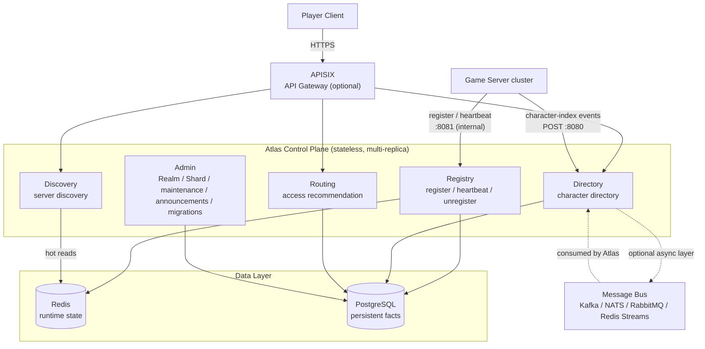
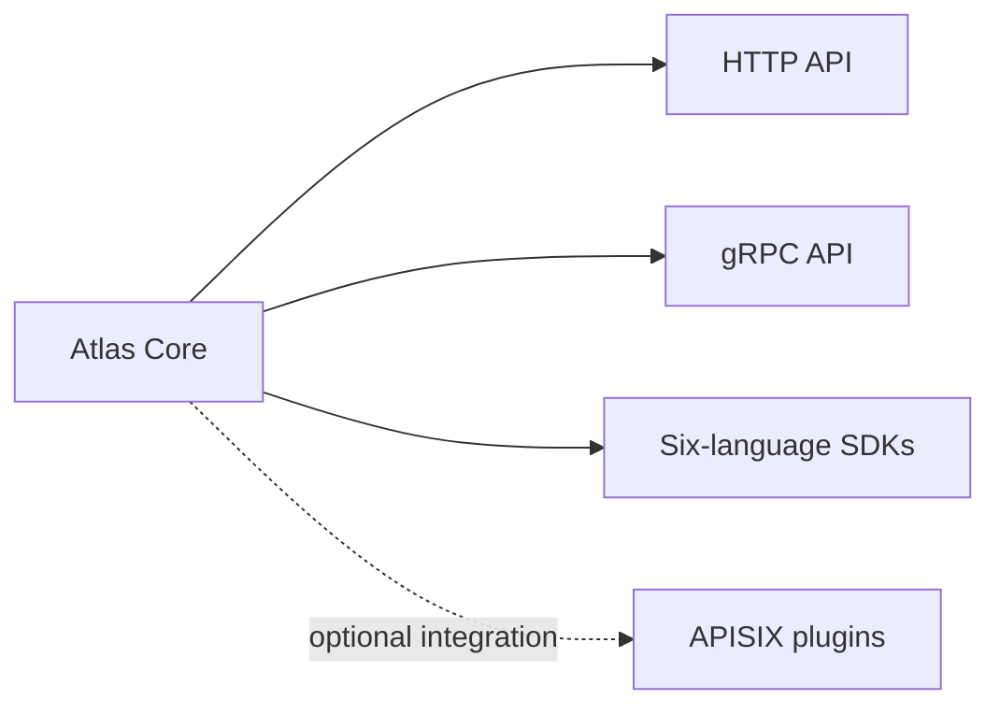

<p align="center">
  
</p>

<h1 align="center">Atlas</h1>
<p align="center">
  <a href="https://github.com/cuihairu/atlas/releases"></a>
  <a href="./LICENSE"></a>
  <a href="https://cuihairu.github.io/atlas/"></a>
  <a href="https://codecov.io/gh/cuihairu/atlas"></a>
</p>
<p align="center">
  <strong>Atlas — Game Infrastructure Directory / Control Plane for Online Games</strong><br/>
  <em>Atlas: infrastructure for server registration, discovery, and the character directory in online games — server registration, discovery, character directory, routing recommendation, lifecycle, and operations coordination.</em>
</p>

<p align="center">
  Atlas is a lightweight control plane for online games, providing game server registration, discovery, health tracking, and account-to-character directory services.<br/>
  Technology foundation: Go 1.27, REST (net/http) plus gRPC dual transport, storage on PostgreSQL (pgx/v5) / MySQL (go-sql-driver) / Redis (go-redis), metrics through the Prometheus client, and event-bus adapters built on the Kafka / NATS / RabbitMQ clients — all built on open-source components; the repository itself is published under Apache-2.0.
</p>

[English](README.md) | [中文](README.zh.md)

---

## Demo Site

**Demo site https://atlas.cuihairu.site/ | demo account `demo` / `demo-ab36cfc2cb77ac66ccd0523512efffbe` (for evaluation; data is reset periodically)**

- The demo account holds the viewer read-only role (a sandbox account that cannot modify any data); the admin key stays on the deployment host and is not published.
- The site is deployed from the main branch by CI (it only goes live when main-branch tests are green; failed deployments roll back automatically). Its data is reset periodically — for evaluation only.
- A demo fleet simulator runs on the site: a set of simulated game servers keeps registering, sending heartbeats, and writing character and cross-server configuration data.

---

## What Atlas Is

Atlas is the **Game Infrastructure Directory** of a game backend, built around four questions:

| Module | Question it answers | Description |
| --- | --- | --- |
| **Registry** | "Who am I?" | A game server registers its identity, topology position, and access endpoint when it comes online |
| **Discovery** | "Who is online?" | Clients and tools query available servers, including health status and load |
| **Directory** | "Where are my characters?" | An account → character cross-server index, so a player sees all of their characters |
| **Routing** | "Which server should I join?" | Recommends an access target from region, version, capacity, and load |

> **Atlas is a standalone service; the gateway layer is optional.**
>
> Atlas can run on its own. APISIX, Kong, Envoy, or Nginx can all act as the access layer, handling TLS, authentication, rate limiting, WAF, and observability. Atlas recommends APISIX (dynamic routing + rate-limiting plugins + an active community in China), but does not constrain the gateway choice.

### Boundary Statement (Control Plane, finalized 2026-10-04)

> **Atlas is a game infrastructure control plane, not a game backend.**
>
> Atlas answers **directory questions**: "Who am I?" "Who is online?" "Where are my characters?" "Which server should I join?"
> It never answers **game-runtime questions**: "Can I get in right now?" "How is this match made?"
> "Where does this instance run?" "What is in my inventory?"
>
> **Atlas NEVER owns**: authoritative character data / match and combat state / player sessions / game economy and leaderboards / account authentication.
> These capabilities can integrate with Atlas (a scheduler reads Discovery's candidate set, a player service writes Directory events),
> but they are **never built in**. The full positioning and module boundaries are in [docs/architecture.md](docs/architecture.md);
> the three-state status model (Desired / Observed / Effective) is in [docs/lifecycle.md](docs/lifecycle.md).

## When You Need Atlas

**When do you need Atlas?** Single-server games, or games whose players never cross servers, do not need it. If any of the following shows up, that is where Atlas fits:

| Scenario | Without Atlas | With Atlas |
| --- | --- | --- |
| **Player login and server choice** | Clients hard-code the server list; a server goes down and players keep clicking it — nobody notices one box getting crushed | Discovery filters online servers in real time by region/version/platform; Routing recommends an access target from load and existing characters |
| **Cross-server character lookup** | A player's characters are scattered across servers; the client polls server by server after login | Directory's account → character cross-server index returns all characters in one query |
| **Planned maintenance** | Ops kicks players by hand, posts a notice in a chat group, and hopes nobody is mid-purchase | Maintenance windows take effect on schedule: `start_at` enters maintenance automatically, `end_at` restores automatically, a warning announcement covers the same window, and clients see it at login |
| **Emergency incident notices** | No unified channel; announcements depend on client hotfixes | One Admin API publishes global or per-server announcements (info / warning / critical) with a controlled effect window |
| **Self-healing after server dropouts** | Half-dead servers keep accepting players; complaints pile up | Heartbeat liveness: 30 s without a heartbeat moves a server to `suspect`, 60 s moves it to `offline` and it is removed automatically; a returning heartbeat or re-registration brings it back online |
| **Server merges / migrations** | Manual database moves, config edits, fleet-wide downtime | Migration orchestration + character-index event replay; `rollback` reverts in one call |
| **Multi-ecosystem / large fleets** | Hundreds of servers with no authoritative registry view | Idempotent Registry registration + sharded storage + Prometheus metrics + ratio alerts — fleet state at a glance |

---

## Architecture



The data layer pairs **PostgreSQL + Redis**: Redis carries high-frequency runtime state (heartbeats, load, online counts), while PostgreSQL carries persistent facts (server records, topology, character index, migration records).

---

## Quick Start

```bash
# Run with in-memory store (no dependencies)
make run

# Run tests
make test
```

## Quick Start with Docker

The official image is on GHCR: **`ghcr.io/cuihairu/atlas`** (`latest` tracks main; `main`, bare short-SHA (e.g. `e3f802d`), and date tags (e.g. `20261002`) also exist; multi-arch amd64 + arm64).

One command brings up the full stack (Atlas + PostgreSQL + Redis, schema created automatically):

```bash
git clone https://github.com/cuihairu/atlas && cd atlas
cp .env.example .env          # adjust image tag / DB password as needed (.env is not committed)
docker compose up -d
curl http://localhost:8080/healthz      # {"status":"ok"} means it is up
```

Four containers come up: `atlas` (the service), `atlas-postgres` (record and index persistence; data lives in the named volume `atlas_pgdata`, removed only by `down -v`), `atlas-redis` (heartbeat runtime state; volatile by design), and a one-shot `migrate` (creates the schema, then exits). Ports out of the box:

| Port | Purpose | Called by |
| --- | --- | --- |
| `8080` | Discovery / Directory / Routing | Player clients, gateway |
| `8081` | Registry register / heartbeat | Game servers |
| `8082` | Admin / audit / `/metrics` | Operators |
| `9090` | gRPC | Optional for the Go SDK |

Walk the main path in 30 seconds:

```bash
# Register a game server and bring it online with a heartbeat
curl -X POST localhost:8081/v1/registry/servers/register -H 'Content-Type: application/json' \
  -d '{"server_id":"game-1001","name":"Zone 1 · Azure Dragon","region":"cn-east","endpoint":{"host":"10.0.1.21","port":30001},"capacity":2000}'
curl -X POST localhost:8081/v1/registry/servers/game-1001/heartbeat -H 'Content-Type: application/json' -d '{"players":843,"load":0.42}'
# Player-side query
curl 'localhost:8080/v1/discovery/servers?status=online'
```

Common configuration lives in `.env` plus compose environment variables: to change the image version, set `ATLAS_IMAGE` (e.g. the bare short SHA `e3f802d` for controlled upgrades); to change the database password, set `ATLAS_PG_PASSWORD` (sensitive values go only into `.env`, which `.gitignore` already excludes); to move character writes onto the message bus, add `ATLAS_EVENT_ADAPTER=redis` to `atlas.environment` in the compose file (this reuses the stack's own Redis — see [Data Sync](https://github.com/cuihairu/atlas/blob/main/docs/sync.md)). Stop and clean up: `docker compose down` (keeps data) / `docker compose down -v` (also removes the data volumes).

> Building from source for development (without the GHCR image)? Use `deployments/docker/docker-compose.yml`. For multi-replica high availability, see `deploy/docker-compose.ha.yaml` and the [high-availability doc](https://github.com/cuihairu/atlas/blob/main/docs/ha.md).

---

## API Quick Reference

Atlas exposes 45 business endpoints (default configuration, audit endpoints included) in six groups (plus the `/healthz` / `/readyz` / `/metrics` system endpoints):

### Registry (server registration)

| Method | Path | Description |
| --- | --- | --- |
| `POST` | `/v1/registry/servers/register` | Register a server coming online (idempotent upsert) |
| `POST` | `/v1/registry/servers/{id}/heartbeat` | Periodic heartbeat report (the response carries the effective status) |
| `POST` | `/v1/registry/servers/{id}/unregister` | Voluntary server shutdown |

### Discovery (server discovery)

| Method | Path | Description |
| --- | --- | --- |
| `GET` | `/v1/discovery/servers` | Filter the server list by region / realm / shard / version / status / platform |
| `GET` | `/v1/discovery/servers/{id}` | Fetch a single server's details |
| `GET` | `/v1/discovery/announcements` | Currently effective announcements (global + per-server; fetched at player login) |

### Directory (character directory)

| Method | Path | Description |
| --- | --- | --- |
| `GET` | `/v1/directory/accounts/{account_id}/characters` | List all characters under an account (cross-server) |
| `GET` | `/v1/directory/characters/{character_id}` | Fetch a single character index |
| `GET` | `/v1/directory/servers/{server_id}/characters` | List the character indexes on a server |
| `POST` | `/v1/directory/characters` | Write a character index (idempotent) |
| `PATCH` | `/v1/directory/characters/{character_id}` | Update a character index |
| `DELETE` | `/v1/directory/characters/{character_id}` | Delete a character index |

### Routing (access recommendation)

| Method | Path | Description |
| --- | --- | --- |
| `GET` | `/v1/routing/recommended` | Recommend an access target from load/capacity/existing characters |

### Cross-Server Config (config center)

| Method | Path | Description |
| --- | --- | --- |
| `GET` | `/v1/crossserver/config` | Game servers pull cross-server config (:8081 is the primary path; :8080 covers setups without a registered gateway; ETag conditional requests are supported) |

### Admin (operations, :8082, RBAC + audit)

| Method | Path | Description |
| --- | --- | --- |
| `POST` | `/v1/admin/servers/{id}/maintenance` · `drain` · `enable` · `disable` | Lifecycle operations |
| `POST/GET/DELETE` | `/v1/admin/servers/{id}/maintenance-window` · `/v1/admin/maintenance-windows…` | Planned maintenance windows (auto-enter maintenance at `start_at`, auto-restore at `end_at`) |
| `POST/GET/DELETE` | `/v1/admin/announcements…` | Announcement management (info / warning / critical) |
| `POST/GET` | `/v1/admin/realms` · `/v1/admin/shards` | Realm / shard management |
| `POST/GET` | `/v1/admin/migrations` · `POST …/rollback` | Server-merge / migration orchestration |
| `GET` | `/v1/admin/stats` · `/v1/admin/audit` | Fleet statistics and audit log |

Full request/response examples are in [docs/api.md](docs/api.md); for a fast walkthrough see [docs/api-quickstart.md](docs/api-quickstart.md).

---

## Project Structure

```text
atlas/
├── cmd/                    service entry points and tools (atlas main service / crossagent / demoagents / reshard)
├── internal/
│   ├── model/              domain models (Server, Character, Status…)
│   ├── store/              storage interfaces
│   │   ├── memory/         in-memory implementation (tests + development)
│   │   ├── postgres/       PostgreSQL implementation
│   │   ├── mysql/          MySQL implementation
│   │   ├── redisstore/     Redis runtime state
│   │   └── sharded/        consistent-hashing shard wrapper
│   ├── registry/           register / heartbeat / unregister
│   ├── discovery/          server discovery
│   ├── directory/          character directory
│   ├── routing/            access recommendation
│   ├── admin/              Admin service (Realm/Shard/migrations/audit…)
│   ├── health/             health monitoring (auto offlining + ratio alerts)
│   ├── event/              event adapters (redis/kafka/nats/rabbitmq)
│   ├── httpapi/            REST API handlers
│   ├── grpc/               gRPC services
│   ├── metrics/            Prometheus metrics
│   ├── tlsutil/            mTLS helpers
│   ├── tracing/            request tracing (X-Request-ID across all three listeners)
│   ├── crossserver/        cross-server config center (publish / subscribe / callback / poll)
│   ├── fleet/              real-time fleet index (load-series / match decisions)
│   ├── serversconfig/      server config file hosting (config-owned records)
│   ├── telemetry/          load and bus series sampling (load-series / bus-series)
│   ├── config/             environment-variable configuration
│   └── version/            version information
├── api/proto/              gRPC proto definitions
├── migrations/             SQL migrations
├── sdk/                    six-language SDKs (go/cpp/python/js/java/csharp)
├── plugins/apisix/         APISIX access plugins
├── dashboard/              built-in admin console (frontend source and build output)
├── examples/               runnable examples per language
├── deploy/                 haproxy / postgres / redis deployment configs
├── deployments/docker/     Dockerfile + docker-compose
├── docs/                   design docs (VitePress site)
├── Makefile
├── .env.example
└── go.mod
```

---

## Core Capabilities

```text
Atlas
│
├── Registry    server register / heartbeat / unregister
├── Discovery   server discovery / query / recommendation
├── Directory   account-character directory (cross-server index)
├── Routing     access recommendation
├── Admin       Realm / Shard management, maintenance windows, announcements, migrations, audit
└── Events      character-index event sync (Redis Streams / Kafka / NATS / RabbitMQ)
```

- **[Registry](docs/api.md#registry)** — server registration at startup, periodic heartbeats, voluntary unregister
- **[Discovery](docs/api.md#discovery)** — filter servers by region / realm / shard / version / status / platform
- **[Directory](docs/api.md#directory)** — a cross-server index of all characters under an account
- **[Routing](docs/api.md#routing)** — access-target recommendation from load and capacity (same-account character stickiness)
- **[Admin](docs/api.md#admin)** — Realm / Shard management, maintenance windows coupled with announcements, migrations, audit log
- **[Event sync](docs/sync.md)** — character-index writes decoupled through Redis Streams / Kafka / NATS / RabbitMQ
- **[Six-language SDKs](docs/sdk-go.md)** — Go / C++ / Python / JS / Java / C#, automatic heartbeats built in
- **[APISIX plugins](docs/apisix.md)** — player-token auth injection + endpoint-group rate limiting
- **[Health alerts](docs/lifecycle.md)** — suspect / offline ratio-threshold alerts + webhook notification
- **[gRPC](docs/api.md#grpc-api)** — five services, 22 RPCs, dual transport (the core surface shares its source with REST; admin extension endpoints are REST-only)

---

## Key Design Principles

**1. The Character Directory is a projection, not a source of truth.**

Atlas stores a character's index fields (`account_id` / `server_id` / `character_id` / `name` / `level` / `class_id` / `last_login_at`) for cross-server lookup and display. The authoritative character data stays in each game server's own character database.

**2. Region / Realm / Shard are optional metadata, not a hard-coded hierarchy.**

Topologies differ widely across genres (MMORPG / MOBA / SLG); Atlas mandates no hierarchy. See [Concepts](docs/concepts.md).

**3. Discovery and Routing are separate at the API layer.**

`GET /v1/discovery/servers` and `GET /v1/routing/recommended` are two different things and remain two endpoints.

**4. Atlas Core is independent of any gateway.**



**5. Routing recommends and locates; it does not schedule or execute.**

Routing answers "which server should I join", never "how to match / where to queue / where to place the instance". Matching, queueing, rooms, and instance placement are a Scheduler's job; such components may read Discovery's candidate set, but Atlas does not build those decisions in.

**6. Server status is three states: Desired / Observed / Effective.**

Operator declarations (maintenance / drain / disable) are Desired; heartbeat observation is Observed; what is advertised is always the synthesis of the two — Effective. They never conflict; each speaks its own truth. See [docs/lifecycle.md](docs/lifecycle.md).

**7. `metadata` is opaque metadata, not a business database.**

The only built-in channel with business-semantic filtering carries nothing beyond "category tag"-level static values. Numeric, dynamic business attributes (combat power, rank, progress…) belong to the game database — Atlas does not understand them and does not pretend to. See [docs/concepts.md](docs/concepts.md).

---

## Documentation

| Doc | Contents |
| --- | --- |
| [docs/architecture.md](docs/architecture.md) | Overall architecture, component responsibilities, boundary with APISIX |
| [docs/concepts.md](docs/concepts.md) | Region / Realm / Shard / Server / Character conceptual model |
| [docs/api.md](docs/api.md) | Complete definition of the five REST groups + gRPC |
| [docs/api-quickstart.md](docs/api-quickstart.md) | API quick-start guide (curl examples) |
| [docs/data-model.md](docs/data-model.md) | PostgreSQL table schemas and Redis key design |
| [docs/lifecycle.md](docs/lifecycle.md) | Server lifecycle state machine |
| [docs/migration.md](docs/migration.md) | Server merges / transfers / migrations |
| [docs/sync.md](docs/sync.md) | Data synchronization from game servers into Atlas |
| [docs/apisix.md](docs/apisix.md) | APISIX access plugins: player-token auth injection + endpoint-group rate limiting |
| [docs/topology.md](docs/topology.md) | Deployment topologies: single box / standard production / large scale |
| [docs/ha.md](docs/ha.md) | High availability: heartbeat fan-in LB and storage redundancy |
| [docs/benchmarks.md](docs/benchmarks.md) | Performance benchmarks and regression guardrails |
| [docs/security.md](docs/security.md) | Security model: authentication, rate limiting, audit |
| [docs/security-audit.md](docs/security-audit.md) | Security audit records and periodic checklist |
| [docs/sdk-go.md](docs/sdk-go.md) | SDK docs (six languages: Go / C++ / Python / JS / [Java](docs/sdk-java.md) / [C#](docs/sdk-csharp.md)) |
| [docs/roadmap.md](docs/roadmap.md) | MVP scope and evolution roadmap |

---

## Roadmap

**The v0.1 series is fully delivered** and published as four releases:

| Release | Contents |
| --- | --- |
| [v0.1.0](https://github.com/cuihairu/atlas/releases/tag/v0.1.0) | MVP: Registry / Discovery / Directory / health monitoring / REST API |
| [v0.1.1](https://github.com/cuihairu/atlas/releases/tag/v0.1.1) | Series close-out: Routing, gRPC dual transport, six-language SDKs, message-bus adapters, Realm/Shard management, maintenance windows and announcements, security hardening (mTLS/RBAC/audit), high availability, character-index sharding |
| [v0.1.2](https://github.com/cuihairu/atlas/releases/tag/v0.1.2) | Cross-server config center (three access tiers, hot updates), server tag system, declarative server configuration, admin-console extensions, Docker image and deployment leg |
| [v0.1.3](https://github.com/cuihairu/atlas/releases/tag/v0.1.3) | Prelude to v0.2: OpenTelemetry tracing (root+child span tree), six-language SDK consolidation (error envelope / heartbeat drain / correlation headers), six inverted indexes + instruction-based write queue in the memory store (tags-filter contract across the three stores), dashboard storage-queue observability (metric family + admin endpoint + console card) |
| [v0.1.4](https://github.com/cuihairu/atlas/releases/tag/v0.1.4) | Second-round source audit: idempotent character-delete event, RabbitMQ requeue backoff, live_runtime in routing diagnose, insecure-default startup warnings, character-read benchmark evidence, bilingual README (20 commits) |

**Explicitly out of scope** (design decisions, not a backlog): Kubernetes Operator, Service Mesh, complex scheduling algorithms, hard gateway lock-in, authoritative character data, matching/queueing/rooms, instance and zone allocation, player sessions, inventory/economy/leaderboard and other game-business data (see the full list in [docs/roadmap.md](docs/roadmap.md)).

Candidate directions for what comes next are in [docs/roadmap.md](docs/roadmap.md).

---

## License

Atlas is open-sourced under the [Apache License 2.0](LICENSE).

You may use, modify, and distribute Atlas freely, including commercially; the only requirement is to keep the copyright and license notices. See the full [LICENSE](LICENSE).

> Third-party dependencies remain under their original licenses (the golang.org/x ecosystem, pgx, go-redis, protobuf, etc.); each dependency's own repository declaration governs.
