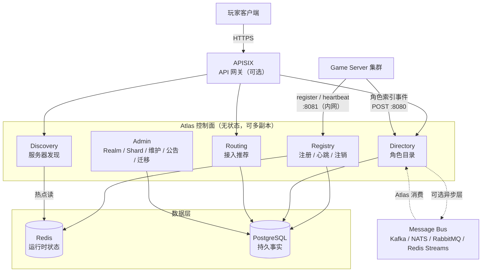
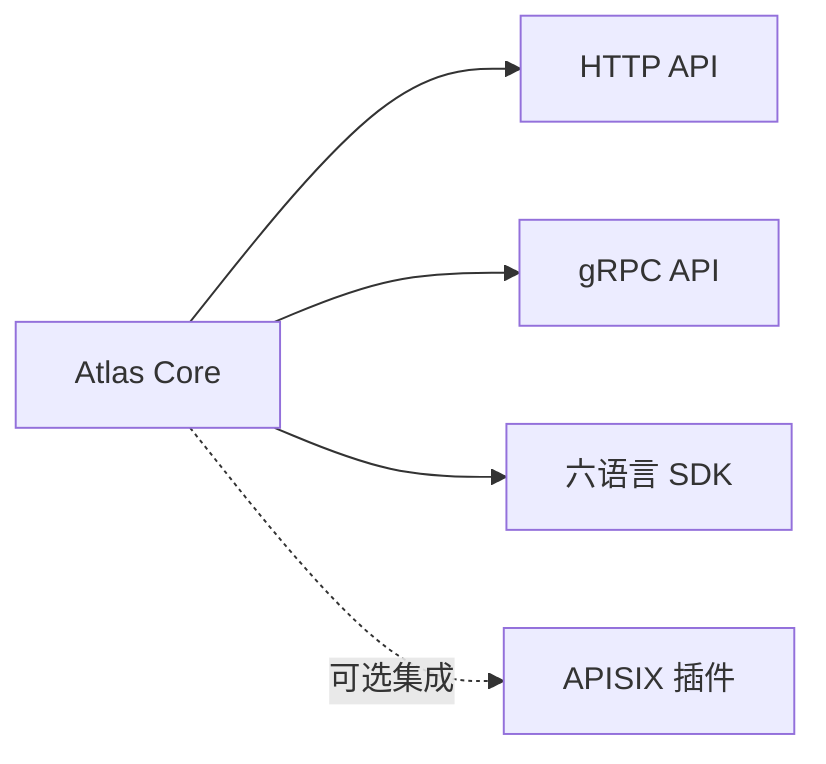

<p align="center">
  
</p>

<h1 align="center">Atlas</h1>

<p align="center">
  <strong>Atlas — Service Discovery and Character Directory for Online Games</strong><br/>
  <em>Atlas：面向在线游戏的服务器注册、发现与角色目录基础设施。</em>
</p>

<p align="center">
  <a href="https://github.com/cuihairu/atlas/releases"></a>
  <a href="./LICENSE"></a>
  <a href="https://cuihairu.github.io/atlas/"></a>
  <a href="https://codecov.io/gh/cuihairu/atlas"></a>
</p>

<p align="center">
  Atlas is a lightweight control plane for online games, providing game server registration, discovery, health tracking, and account-to-character directory services.
</p>

---

## 演示站点

**演示站点 https://atlas.cuihairu.site/ ｜ 演示账号 `demo` / `demo-ab36cfc2cb77ac66ccd0523512efffbe`（体验用，数据定期重置）**

- 演示账号为 viewer 只读角色（沙箱账号，不能改动任何数据）；管理员密钥只在部署机上，不对外。
- 站点由 CI 从 main 分支部署（主分支测试全绿才上线，失败自动回滚），数据会被定期重置，仅供体验。
- 站内跑着演示舰队模拟器：一组模拟游戏服持续注册、心跳、写入角色与跨服配置数据。

---

## 定位

Atlas 的核心目标不是"返回一份服务器列表"，而是建立游戏后端的 **Game Infrastructure Directory**。

它围绕三个问题构建：

| 模块 | 回答的问题 | 说明 |
| --- | --- | --- |
| **Registry** | "我是谁？" | 游戏服务器上线时注册自身身份、拓扑位置与接入端点 |
| **Discovery** | "谁在线？" | 客户端与工具查询可用服务器，含健康状态与负载 |
| **Directory** | "我的角色在哪？" | 账号 → 角色的跨服索引，让玩家看到自己的全部角色 |
| **Routing** | "我应该去哪个服务器？" | 基于区域、版本、容量、负载推荐接入目标 |

> **Atlas 是独立服务，网关层可选。**
>
> Atlas 可以独立运行。APISIX、Kong、Envoy、Nginx 都可以作为接入层，负责 TLS、认证、限流、WAF 与可观测性。Atlas 推荐 APISIX（动态路由 + 限流插件 + 国内社区），但不限制网关选型。

## 使用场景

**什么时候需要 Atlas？** 单台服务器或者玩家从不下跨服务器的游戏用不着它。当你出现以下任一情况，就是 Atlas 的用武之地：

| 场景 | 没有 Atlas 时 | 有 Atlas 时 |
| --- | --- | --- |
| **玩家登录选服** | 客户端硬编码服务器列表，停机了玩家还在点，挤爆一台无人知 | Discovery 按区域/版本/平台实时筛选在线服务器，Routing 按负载与已有角色推荐接入目标 |
| **跨服角色查询** | 玩家在多服的角色散落各处，登录后逐服轮询 | Directory 账号 → 角色跨服索引，一次查询返回全部角色 |
| **计划停机维护** | 运维手动踢人、群里发公告、祈祷没人在这时充值 | 维护窗口定时生效：`start_at` 自动进入维护、`end_at` 自动恢复，同时段自动挂 warning 公告，客户端登录即见 |
| **紧急故障公告** | 没有统一通道，公告靠客户端热更 | Admin 一条 API 发布全局/服务器级公告（info / warning / critical），生效区间可控 |
| **服务器掉线自愈** | 半死不活的服务器继续接玩家，投诉炸锅 | 心跳判活：30s 无心跳进 `suspect`、60s 进 `offline` 自动摘除；恢复心跳或重新注册自动回到线上 |
| **合服 / 迁服** | 人肉搬库、改配置、全服停机 | Migration 编排 + 角色索引事件重放，`rollback` 一键回退 |
| **多生态 / 大规模舰队** | 数百台服务器的注册表没有一个权威视图 | Registry 幂等注册 + 分片存储 + Prometheus 指标 + 占比告警，舰队状态一目了然 |

---

## 架构



数据层采用 **PostgreSQL + Redis** 双存储：Redis 承载高频运行时状态（心跳、负载、在线数），PostgreSQL 承载持久事实（服务器档案、拓扑、角色索引、迁移记录）。

---

## Quick Start

```bash
# Run with in-memory store (no dependencies)
make run

# Run tests
make test
```

## Docker 快速搭建

官方镜像在 GHCR：**`ghcr.io/cuihairu/atlas`**（`latest` 跟随 main 滚动，另有 `main` / 裸短 SHA（如 `e3f802d`） / 日期标签（如 `20261002`）；多架构 amd64 + arm64）。

一条命令起全栈（Atlas + PostgreSQL + Redis，自动建表）：

```bash
git clone https://github.com/cuihairu/atlas && cd atlas
cp .env.example .env          # 按需改镜像 tag / 数据库密码（.env 不入库）
docker compose up -d
curl http://localhost:8080/healthz      # {"status":"ok"} 即成功
```

起来的是四个容器：`atlas`（业务）、`atlas-postgres`（档案/索引持久化，数据在具名卷 `atlas_pgdata`，`down -v` 才会删）、`atlas-redis`（心跳运行时状态，易失属预期）、一次性 `migrate`（建表后退出）。开箱端口：

| 端口 | 用途 | 谁在调 |
| --- | --- | --- |
| `8080` | Discovery / Directory / Routing | 玩家客户端、网关 |
| `8081` | Registry 注册 / 心跳 | 游戏服务器 |
| `8082` | Admin / 审计 / `/metrics` | 运维 |
| `9090` | gRPC | Go SDK 可选 |

30 秒走一遍主链路：

```bash
# 注册一台游戏服务器并心跳上线
curl -X POST localhost:8081/v1/registry/servers/register -H 'Content-Type: application/json' \
  -d '{"server_id":"game-1001","name":"一区·青龙","region":"cn-east","endpoint":{"host":"10.0.1.21","port":30001},"capacity":2000}'
curl -X POST localhost:8081/v1/registry/servers/game-1001/heartbeat -H 'Content-Type: application/json' -d '{"players":843,"load":0.42}'
# 玩家侧查询
curl 'localhost:8080/v1/discovery/servers?status=online'
```

常用配置都在 `.env` + compose 环境变量里改：换镜像版本改 `ATLAS_IMAGE`（如裸短 SHA `e3f802d`，升级可控）；数据库密码改 `ATLAS_PG_PASSWORD`（敏感值只放 `.env`，该文件已被 `.gitignore` 排除）；角色写入切消息总线在 compose 的 `atlas.environment` 加 `ATLAS_EVENT_ADAPTER=redis`（复用本栈 Redis，详见 [数据同步](https://github.com/cuihairu/atlas/blob/main/docs/sync.md)）。停止与清理：`docker compose down`（保留数据）/ `docker compose down -v`（连数据卷一起删）。

> 开发场景想从源码构建（不走 GHCR 镜像）用 `deployments/docker/docker-compose.yml`；多副本高可用见 `deploy/docker-compose.ha.yaml` 与[高可用文档](https://github.com/cuihairu/atlas/blob/main/docs/ha.md)。

---

## API Quick Reference

Atlas v0.1.1 暴露 28 个 REST 端点，分为五组（另有 `/healthz` / `/readyz` / `/metrics` 系统端点）：

### Registry（服务器注册）

| Method | Path | 说明 |
| --- | --- | --- |
| `POST` | `/v1/registry/servers/register` | 服务器上线注册（幂等 upsert） |
| `POST` | `/v1/registry/servers/{id}/heartbeat` | 周期心跳上报（响应含真实生效状态） |
| `POST` | `/v1/registry/servers/{id}/unregister` | 服务器主动下线 |

### Discovery（服务器发现）

| Method | Path | 说明 |
| --- | --- | --- |
| `GET` | `/v1/discovery/servers` | 按 region / realm / shard / 版本 / 状态 / 平台筛选服务器列表 |
| `GET` | `/v1/discovery/servers/{id}` | 获取单个服务器详情 |
| `GET` | `/v1/discovery/announcements` | 当前生效公告（全局 + 服务器级，玩家登录时拉取） |

### Directory（角色目录）

| Method | Path | 说明 |
| --- | --- | --- |
| `GET` | `/v1/directory/accounts/{account_id}/characters` | 查询账号下所有角色（跨服） |
| `GET` | `/v1/directory/characters/{character_id}` | 查询单个角色索引 |
| `GET` | `/v1/directory/servers/{server_id}/characters` | 查询服务器上的角色索引 |
| `POST` | `/v1/directory/characters` | 写入角色索引（幂等） |
| `PATCH` | `/v1/directory/characters/{character_id}` | 更新角色索引 |
| `DELETE` | `/v1/directory/characters/{character_id}` | 删除角色索引 |

### Routing（接入推荐）

| Method | Path | 说明 |
| --- | --- | --- |
| `GET` | `/v1/routing/recommended` | 按负载/容量/已有角色推荐接入目标 |

### Admin（运维管理，:8082，RBAC + 审计）

| Method | Path | 说明 |
| --- | --- | --- |
| `POST` | `/v1/admin/servers/{id}/drain` · `enable` · `disable` | 生命周期操作 |
| `POST/GET/DELETE` | `/v1/admin/servers/{id}/maintenance-window` · `/v1/admin/maintenance-windows…` | 计划维护窗口（到期自动进入维护并恢复） |
| `POST/GET/DELETE` | `/v1/admin/announcements…` | 公告管理（info / warning / critical） |
| `POST/GET` | `/v1/admin/realms` · `/v1/admin/shards` | 大区 / 分片管理 |
| `POST/GET` | `/v1/admin/migrations` · `POST …/rollback` | 合服 / 迁移编排 |
| `GET` | `/v1/admin/stats` · `/v1/admin/audit` | 舰队统计与审计日志 |

完整请求/响应示例见 [docs/api.md](docs/api.md)，快速上手见 [docs/api-quickstart.md](docs/api-quickstart.md)。

---

## Project Structure

```text
atlas/
├── cmd/atlas/              主服务入口
├── internal/
│   ├── model/              领域模型（Server, Character, Status…）
│   ├── store/              存储接口
│   │   ├── memory/         内存实现（测试 + 开发）
│   │   ├── postgres/       PostgreSQL 实现
│   │   ├── mysql/          MySQL 实现
│   │   ├── redisstore/     Redis 运行时状态
│   │   └── sharded/        一致性哈希分片包装
│   ├── registry/           注册 / 心跳 / 注销
│   ├── discovery/          服务器发现
│   ├── directory/          角色目录
│   ├── routing/            接入推荐
│   ├── admin/              Admin 服务（Realm/Shard/迁移/审计…）
│   ├── health/             健康监控（自动掉线 + 占比告警）
│   ├── event/              事件适配器（redis/kafka/nats/rabbitmq）
│   ├── httpapi/            REST API handlers
│   ├── grpc/               gRPC 服务
│   ├── metrics/            Prometheus 指标
│   ├── tlsutil/            mTLS 辅助
│   ├── config/             环境变量配置
│   └── version/            版本信息
├── api/proto/              gRPC proto 定义
├── migrations/             SQL migration
├── sdk/                    六语言 SDK（go/cpp/python/js/java/csharp）
├── plugins/apisix/         APISIX 接入插件
├── examples/               各语言可运行示例
├── deploy/                 haproxy / postgres / redis 部署配置
├── deployments/docker/     Dockerfile + docker-compose
├── docs/                   设计文档（VitePress 站点）
├── Makefile
├── .env.example
└── go.mod
```

---

## 核心能力

```text
Atlas
│
├── Registry    服务器注册 / 心跳 / 注销
├── Discovery   服务器发现 / 查询 / 推荐
├── Directory   账号-角色目录（跨服索引）
├── Routing     接入推荐
├── Admin       Realm / Shard 管理、维护窗口、公告、迁移、审计
└── Events      角色索引事件同步（Redis Streams / Kafka / NATS / RabbitMQ）
```

- **[Registry](docs/api.md#registry)** — 服务器启动注册、周期心跳、主动注销
- **[Discovery](docs/api.md#discovery)** — 按区域 / 大区 / 分片 / 版本 / 状态 / 平台筛选服务器
- **[Directory](docs/api.md#directory)** — 账号下所有角色的跨服索引
- **[Routing](docs/api.md#routing)** — 基于负载与容量推荐接入目标（同账号角色粘滞）
- **[Admin](docs/api.md#admin)** — Realm / Shard 管理、维护窗口与公告联动、迁移、审计日志
- **[事件同步](docs/sync.md)** — 角色索引经 Redis Streams / Kafka / NATS / RabbitMQ 解耦写入
- **[六语言 SDK](docs/sdk-go.md)** — Go / C++ / Python / JS / Java / C#，自动心跳内置
- **[APISIX 插件](docs/apisix.md)** — 玩家 token 鉴权注入 + 端点组限流
- **[健康告警](docs/lifecycle.md)** — suspect / offline 占比阈值告警 + webhook 通知
- **[gRPC](docs/api.md#grpc-api)** — 与 REST 同一 API 面的双传输

---

## 关键设计原则

**1. Character Directory 是 Projection，不是 Source of Truth。**

Atlas 保存角色的索引信息（`account_id` / `server_id` / `character_id` / `name` / `level` / `class_id` / `last_login_at`），用于跨服检索与展示。真正的角色数据仍然由各游戏服务器的角色数据库负责。

**2. Region / Realm / Shard 是可选 metadata，不是硬编码层级。**

不同品类（MMORPG / MOBA / SLG）的拓扑差异巨大，Atlas 不强制任何一种层级结构。见 [概念模型](docs/concepts.md)。

**3. Discovery 与 Routing 在 API 层分离。**

`GET /v1/discovery/servers` 与 `GET /v1/routing/recommended` 是两件事，不合并成一个接口。

**4. Atlas Core 独立于任何网关。**



---

## 文档

| 文档 | 内容 |
| --- | --- |
| [docs/architecture.md](docs/architecture.md) | 整体架构、组件职责、与 APISIX 的边界 |
| [docs/concepts.md](docs/concepts.md) | Region / Realm / Shard / Server / Character 概念模型 |
| [docs/api.md](docs/api.md) | 五组 REST API + gRPC 的完整定义 |
| [docs/api-quickstart.md](docs/api-quickstart.md) | API 快速上手指南（curl 示例） |
| [docs/data-model.md](docs/data-model.md) | PostgreSQL 表结构与 Redis 键设计 |
| [docs/lifecycle.md](docs/lifecycle.md) | 服务器生命周期状态机 |
| [docs/migration.md](docs/migration.md) | 合服 / 转服 / 迁服 |
| [docs/sync.md](docs/sync.md) | 游戏服务器到 Atlas 的数据同步 |
| [docs/apisix.md](docs/apisix.md) | APISIX 接入插件：玩家 token 鉴权注入 + 端点组限流 |
| [docs/topology.md](docs/topology.md) | 部署拓扑：单机 / 标准生产 / 大规模三档形态 |
| [docs/ha.md](docs/ha.md) | 高可用：心跳扇入 LB 与存储冗余 |
| [docs/benchmarks.md](docs/benchmarks.md) | 性能基准与回归警戒线 |
| [docs/security.md](docs/security.md) | 安全模型：认证、限流、审计 |
| [docs/security-audit.md](docs/security-audit.md) | 安全审计记录与周期清单 |
| [docs/sdk-go.md](docs/sdk-go.md) | SDK 文档（六语言：Go / C++ / Python / JS / [Java](docs/sdk-java.md) / [C#](docs/sdk-csharp.md)） |
| [docs/roadmap.md](docs/roadmap.md) | MVP 范围与演进路线 |

---

## 路线图

**v0.1 系列已全量交付**，对外发布两个 release：

| Release | 内容 |
| --- | --- |
| [v0.1.0](https://github.com/cuihairu/atlas/releases/tag/v0.1.0) | MVP：Registry / Discovery / Directory / 健康监控 / REST API |
| [v0.1.1](https://github.com/cuihairu/atlas/releases/tag/v0.1.1) | 系列收官：Routing、gRPC 双传输、六语言 SDK、消息总线适配器、Realm/Shard 管理、维护窗口与公告、安全加固（mTLS/RBAC/审计）、高可用、角色索引分片 |

**明确不做**（设计决定，非待办）：Kubernetes Operator、Service Mesh、复杂调度算法、强绑定网关、角色权威数据。

后续候选方向见 [docs/roadmap.md](docs/roadmap.md)。

---

## License

Atlas 采用 [Apache License 2.0](LICENSE) 开源。

你可以自由地使用、修改、分发 Atlas,包括商业用途;唯一的要求是保留版权与许可声明。详见 [LICENSE](LICENSE) 全文。

> 第三方依赖各自遵循其原始许可证(golang.org/x 生态、pgx、go-redis、protobuf 等),以各依赖仓库声明为准。