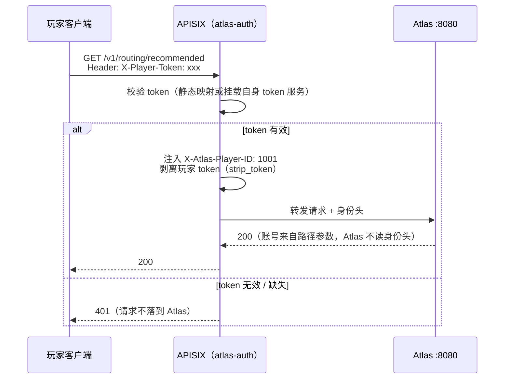

# APISIX 接入插件

**什么场景用**：Atlas 部署在 APISIX 网关后面（[部署拓扑](/topology)的公网形态），
玩家客户端统一走网关域名访问 :8080 的 Discovery / Directory / Routing。此时两件事在
网关做最省事、Atlas 与游戏服务器都不用改一行：

- **玩家鉴权**：客户端的 token 在网关校验，通过后才转发到 Atlas（可选同时剥离
  token 头、向下游注入身份头 `X-Atlas-Player-ID`）——token 怎么发、怎么验，
  Atlas 一概不感知；
- **差异化限流**：按端点组给配额（读多的 discovery 放宽、写多的 directory 收紧、
  registry 每分钟 50 次防刷），一条路由覆盖整个 `/v1` 面。



Atlas 官方提供两个 APISIX 网关插件（源码与单元测试在
[`plugins/apisix/`](https://github.com/cuihairu/atlas/tree/main/plugins/apisix)），
分别负责**玩家身份注入**与**端点组限流**：

| 插件 | 职责 |
| --- | --- |
| `atlas-auth.lua` | 校验玩家 token，把玩家身份注入 Atlas 请求头（`X-Atlas-Player-ID`），可选剥离玩家 token 后再转发 |
| `atlas-ratelimit.lua` | 按 Atlas 端点组（discovery / directory / routing / registry）差异化限流，单路由覆盖整个 `/v1` 面 |

插件与 Atlas 的边界与 [架构设计](/architecture) 一致：认证、限流属于通用网关能力，
由 APISIX 承担；Atlas 不重复校验 token，当前也不读取注入的身份头（见下方信任规则第 2 条）。

**身份头信任规则（安全基线）：**

1. **网关覆盖，不信任客户端透传。** 无论客户端是否自带 `X-Atlas-Player-ID` /
   `X-Player-Token`，网关必须先**剥离再注入**（`atlas-auth` 的实现即如此：
   token 校验通过后重写身份头，客户端携带的同名头永远被覆盖）。基于可信
   网关重新标记（stamp）而不是"如果为空才注入"——下游看到的身份头只出自网关。
2. **Atlas 当前不读取身份头。** `X-Atlas-Player-ID` 是网关注入给下游的预留元数据；
   Atlas 的账号维度一律来自请求显式参数（路径如 `/v1/directory/accounts/{id}/characters`、
   创建角色 body 的 `account_id`），身份头不构成 Atlas 的鉴权输入，伪造与否都不改变
   Atlas 行为——它的消费方是网关后面的其他上游服务（或 Atlas 未来版本）。管理面
   （:8082 API Key + RBAC）与注册面（:8081 Service Token，支持
   [mTLS](/security)）各自独立鉴权，与玩家身份头无关——即便网关被穿透，
   伪造的玩家身份头也碰不到内部端口。
3. **内部服务调用建议 mTLS / 签名身份**（registry 已支持 mTLS，见
   [安全模型](/security)），不依赖裸 Header 作为服务身份。

## 安装

1. 把两个 `.lua` 拷进 APISIX 插件搜索路径（默认 `apisix/plugins/`，或通过
   `APISIX_CUSTOM_PLUGINS` / `lua_module_hook` 指向自定义目录）：

   ```bash
   cp atlas-auth.lua atlas-ratelimit.lua /usr/local/apisix/apisix/plugins/
   ```

2. 在 APISIX `config.yaml` 中启用插件并声明限流共享字典：

   ```yaml
   plugins:
     - atlas-auth          # 加到现有插件列表
     - atlas-ratelimit

   nginx_config:
     http:
       shared_dicts:
         - atlas_ratelimit: 10m
   ```

3. 重载 APISIX：`apisix reload`。

## 路由配置

一条路由即可把整个 `/v1` 转给 Atlas 公网端口（:8080），两个插件分别处理
鉴权与限流。完整示例见
[`config-example.yaml`](https://github.com/cuihairu/atlas/blob/main/plugins/apisix/config-example.yaml)，
可经 Admin API 一键创建：

```bash
curl http://127.0.0.1:9180/apisix/admin/routes/atlas -X PUT \
  -H "X-API-KEY: $ADMIN_KEY" -d @config-example.yaml
```

等价的路由 JSON：

```yaml
uri: /v1/*
upstream:
  nodes: { "atlas:8080": 1 }
plugins:
  atlas-auth:
    token_header: X-Player-Token
    account_header: X-Atlas-Player-ID
    required: true
    strip_token: true
    accounts:
      demo-token-alice: 1001
  atlas-ratelimit:
    groups:
      - { prefix: /v1/routing,   rate: 1000, window: 60 }
      - { prefix: /v1/discovery, rate: 600,  window: 60 }
      - { prefix: /v1/directory, rate: 300,  window: 60 }
      - { prefix: /v1/registry,  rate: 50,   window: 60 }
    default_rate: 0
    rejected_code: 429
```

## 配置参考

### atlas-auth

| 键 | 默认 | 说明 |
| --- | --- | --- |
| `token_header` | `X-Player-Token` | 玩家 token 头；`Authorization: Bearer <token>` 同样接受 |
| `account_header` | `X-Atlas-Player-ID` | 注入 Atlas 的身份头——**注入前先剥离客户端携带的同名入站头**（覆盖而非透传，见上文信任规则） |
| `accounts` | — | token → account id 静态映射；生产环境应替换为自身 token 服务的校验（插件提供挂载点，业务无侵入） |
| `required` | `true` | 缺 token / 未知 token 返回 401；`false` 时匿名放行（Directory 浏览类接口） |
| `strip_token` | `false` | 转发前剥离玩家 token 头 |

### atlas-ratelimit

| 键 | 默认 | 说明 |
| --- | --- | --- |
| `groups` | `[]` | `{prefix, rate, window}` 数组；**最长前缀匹配**，固定窗口计数 |
| `default_rate` | `0` | 未匹配组的兜底配额（0 = 不限） |
| `rejected_code` | `429` | 超限状态码 |

计数键 = 组前缀 + 客户端 IP；共享字典缺失时**失败放行**（fail open）并记
ERROR 日志，限流故障不阻断网关。

## 验证

```bash
# 鉴权：无 token → 401；有效 token → 200
curl -i http://127.0.0.1:9080/v1/directory/accounts/1001/characters
curl -i -H "X-Player-Token: demo-token-alice" \
  http://127.0.0.1:9080/v1/directory/accounts/1001/characters

# 命中限流组：快速打满 discovery 配额，观察 429
for i in $(seq 1 700); do
  curl -s -o /dev/null -w "%{http_code} " -H "X-Player-Token: demo-token-alice" \
    http://127.0.0.1:9080/v1/discovery/servers
done
```

## 测试

插件逻辑不依赖 OpenResty 即可测试（mock `apisix.core` / `ngx`）：

```bash
cd plugins/apisix
lua test/run_tests.lua     # 13 例：注入/401/Bearer/剥离/限流组/最长前缀/失败放行
luac -p *.lua test/*.lua   # 语法检查
```

## 与三端口拓扑的关系

APISIX 作为公网入口反代 Atlas public 端口（:8080），见
[部署拓扑](/topology)。Registry（:8081）与 Admin（:8082）是服务内部端口，
不挂在公网路由上；Registry 的心跳扇入 LB 使用 HAProxy TCP 模式（
[`deploy/haproxy/haproxy.cfg`](https://github.com/cuihairu/atlas/blob/main/deploy/haproxy/haproxy.cfg)），
高可用形态见 [高可用](/ha)。
