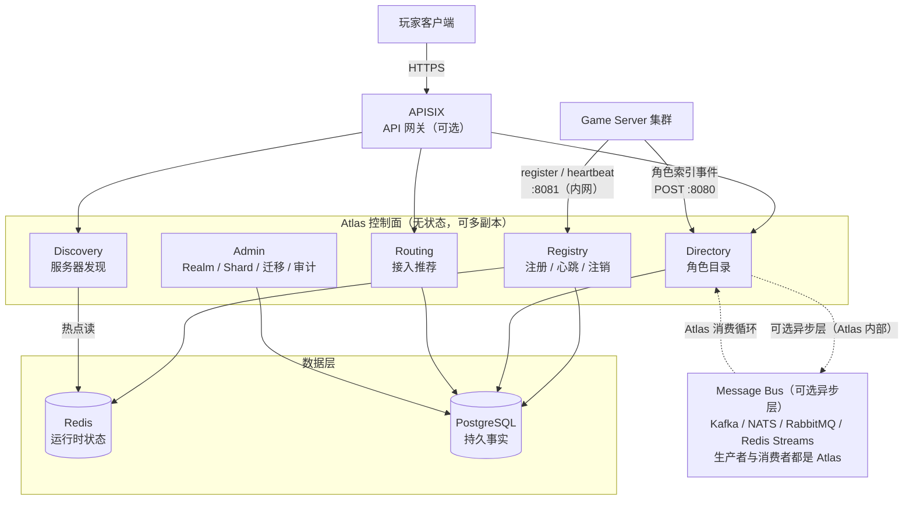
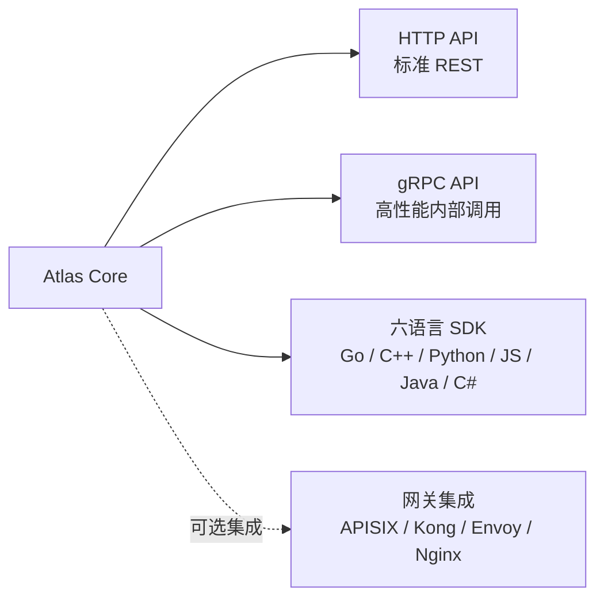
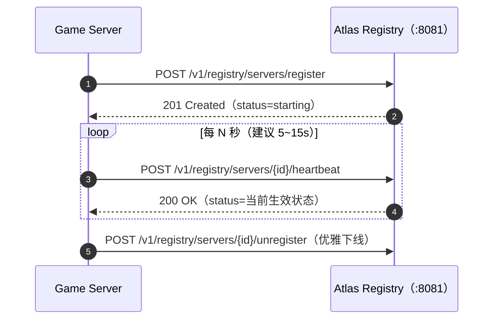
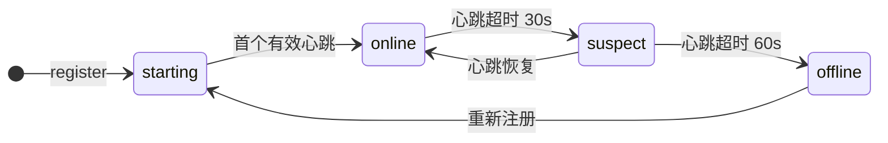
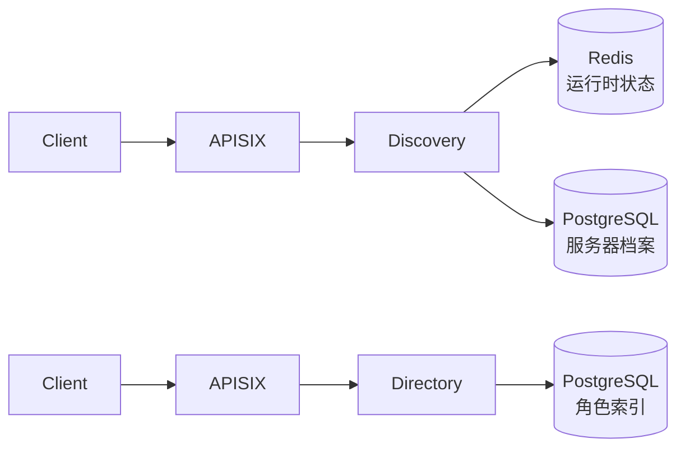
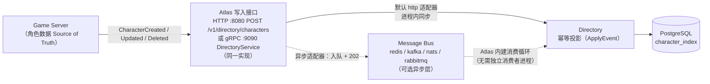
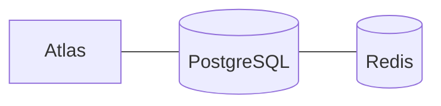
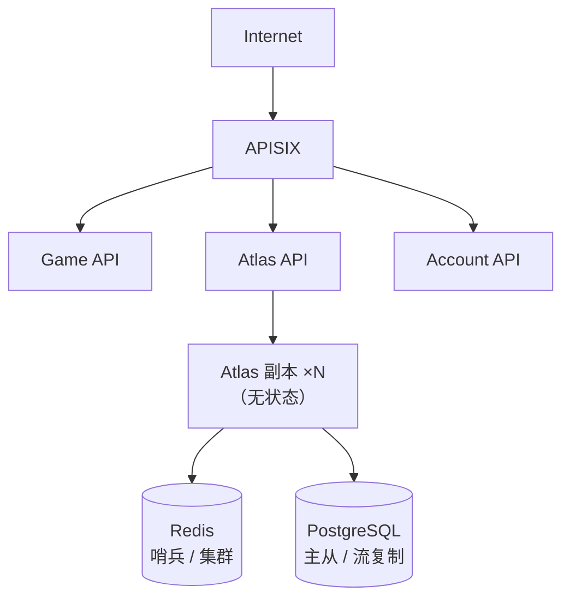

<p align="center">
  
</p>

# 架构设计

## 1. 总览

Atlas 是一个面向在线游戏的**控制面（Control Plane）**。它不处理游戏逻辑，不存储角色权威数据，只负责回答"服务器在哪、是否可用、玩家的角色在哪"这一类目录性问题。

> **定位声明（2026-10-04）：Atlas is a game infrastructure control plane, not a game backend.**
>
> Atlas 回答**目录性问题**："我是谁？""谁在线？""我的角色在哪？""应该推荐哪个服务器？"
> ——永远不回答**游戏运行时问题**："这个玩家现在能不能进？""这场对局怎么撮合？"
> "这个副本实例开在哪台机器？""角色的背包里有什么？"
>
> **Atlas NEVER owns：**
>
> ```text
> ❌ 角色权威数据           —— Directory 永远是 Projection（concepts.md §7）
> ❌ 对局 / 战斗状态        —— 匹配、排队、房间、实例分配是 Scheduler 的事
> ❌ 玩家 Session          —— 登录态、会话恢复归游戏侧管理服务，不进 Atlas
> ❌ 数值 / 经济 / 排行榜    —— 背包、道具、战力、榜单是游戏业务数据库的事
> ❌ 账号认证              —— 玩家身份由网关 / 账号系统校验，Atlas 只消费身份元数据
> ```
>
> 上述能力的**上游决策权不在 Atlas**：它们可以与 Atlas 集成（例如调度器
> 读 Discovery 的候选集），但**永远不内建**。任何新功能立项先回答：
> "这是目录性问题还是运行时问题？"——运行时问题一律不进来。



---

## 2. 分层职责

| 层 | 组件 | 职责 |
| --- | --- | --- |
| 接入层 | APISIX | TLS 终结、认证鉴权、限流、路由、负载均衡、WAF、可观测性 |
| 服务层 | Atlas Core | Registry / Discovery / Directory / Routing 四大模块。Routing 只做**推荐 / 定位元数据**，不做调度执行（边界声明见 §1） |
| 数据层 | Redis | Observed 运行时状态：心跳、负载、在线数（判活依据 `last_seen_at`） |
| 数据层 | PostgreSQL | 持久事实 + Effective 状态：服务器档案、拓扑、角色索引、迁移记录（`servers.status` 为合成结果，见 §4.4） |
| 来源层 | Game Server | 角色数据的 Source of Truth，经 Atlas 写入接口（HTTP `:8080` POST `/v1/directory/characters`，或 gRPC `:9090` `DirectoryService`，同一实现）投递索引事件；不直连消息队列 |

---

## 3. 与网关的边界

**核心原则：Atlas 是独立服务，网关是可选的接入层。**

### APISIX 负责

TLS 终结、认证鉴权、限流、路由、负载均衡、可观测性、WAF。

这些是**通用网关能力**，与游戏业务语义无关，任何后端服务都需要，不应由 Atlas 重复实现。APISIX、Kong、Envoy、Nginx 都能提供这些能力。

### Atlas 负责

服务器注册与发现、角色目录、健康监控与生命周期、Realm / Shard、合服迁移、接入推荐元数据。

这些是**游戏领域语义**，只有 Atlas 理解"什么是 Realm""什么是合服"。

### 为什么不做网关插件

把 Atlas 做成 APISIX / Kong / Envoy 的插件会带来三个问题：

1. **生命周期耦合** — 插件运行在网关 worker 内，无法独立扩缩容、独立灰度、独立回滚。
2. **能力受限** — 插件难以持有长连接、后台定时任务（如健康扫描）、独立存储连接池。
3. **可移植性丧失** — 换成 Nginx / Envoy / Traefik / 直连，Atlas 就不可用了。

正确的形态是：



这样 Atlas 可以脱离任何网关独立存在，网关只是众多部署形态中的一种。

---

## 4. 数据流

### 4.1 服务器注册与心跳



Atlas 依据心跳时间戳自动推进健康状态：



详见 [lifecycle.md](lifecycle.md)。

### 4.2 客户端查询



Discovery 是高频读路径，Redis 承载热点；Directory 是按 `account_id` 的点查，PostgreSQL 索引足以支撑。

### 4.3 角色索引同步

**写入接口是唯一入口，消息队列段发生在 Atlas 内部**——游戏服务器只调 Atlas
的写入接口：HTTP `:8080` 的 `POST /v1/directory/characters`（REST SDK 同款）或
gRPC `:9090` 的 `DirectoryService`（Go SDK 可选传输），二者同一实现；写入处理器
校验后交给 EventAdapter：默认 `http` 适配器进程内同步落地；切换为
`redis / kafka / nats / rabbitmq` 后同一接口改为入队并返回 `202`，由 Atlas
**内建的消费循环**（`main.go` 里的 `Subscribe`）取回事件调用 `ApplyEvent`
落地。生产者与消费者都是 Atlas，**游戏服务器不直连 broker**：



Atlas 只保存投影，不保存权威数据。详见 [sync.md](sync.md)。

> `character.login` / `character.moved` 两类事件已定义并可被消费，但当前版本
> **没有内建触发源**（写端点只产生 created / updated / deleted），见
> [sync.md](sync.md) 事件表注。

### 4.4 状态语义：Desired / Observed / Effective

作为控制面，Atlas 对每台服务器区分三类状态，**语义分层、互不打架**：

| 态 | 定义 | 落点 |
| --- | --- | --- |
| **Desired（期望态）** | 运维声明：`maintenance` / `drain` / `disable` / `enable`；计划维护窗口到点自动写入 | 管理操作 → PG `servers.status` |
| **Observed（观测态）** | 心跳观测：`starting` / `online` / `suspect` / `offline` 由 `last_seen_at` 年龄推进 | Redis runtime HASH；健康监控巡检后回写 PG |
| **Effective（生效态）** | 对外广告的合成结果，所有对外视图（发现 / 推荐 / 统计）只暴露它 | PG `servers.status` |

合成规则：**Desired 优先于 Observed、永不互斥**——`disabled` 永不被自动状态机覆盖，
`maintenance` / `draining` 期间心跳不把状态拉回 `online`。完整定义见
[lifecycle.md §0](lifecycle.md#_0-状态三态-desired-observed-effective)，存储批注见
[data-model.md](data-model.md)。

---

## 5. 存储分层

采用 **PostgreSQL + Redis** 双存储，按访问模式分工而非按数据类型分工：

| 存储 | 承载内容 | 访问模式 |
| --- | --- | --- |
| **Redis** | 心跳时间戳、`status`、`load`、`players` | 高频写（每服务器每 N 秒一次）、高频读（列表页） |
| **PostgreSQL** | `servers`、`realms`、`shards`、`character_index`、`migrations` | 低频写、事务性、需要持久与关联查询 |

### 为什么这样分

- **心跳是易失数据。** 服务器掉线后，最后一次心跳的精确数值没有历史价值，放 Redis 用 TTL 自动过期，天然契合语义。
- **服务器档案是事实。** 名称、区域、版本、拓扑归属需要持久化与审计，放 PostgreSQL。
- **角色索引需要事务与外键。** 合服/转服会产生跨行变更，PostgreSQL 的事务能力是刚需。
- **列表页是热点。** 客户端拉服务器列表是最高频的读，这份流量走 Redis，不进 PG。

### 双写一致性

v0.1 采用 **PostgreSQL 为准、Redis 为缓存** 的策略：

- 写路径先落 PG，再更新 Redis。
- Redis 中的运行时字段（`load` / `players` / `status`）允许短暂不一致，因为它们本身就是近似值。
- 心跳超时由健康监控巡检（默认每 10s）计算 `last_seen_at` 年龄并回写 PG 的 `status`；Redis 键上的 TTL（120s）只为键自清理，不参与判活。

详细表结构与键设计见 [data-model.md](data-model.md)。

---

## 6. 部署形态

### 最小部署



3 个容器，docker-compose 一键拉起。

### 生产部署



Atlas Core 无状态，可水平扩展；所有状态都在 Redis 与 PostgreSQL 中。

---

## 7. 可观测性

Atlas 对外暴露的运维指标建议覆盖：

| 指标 | 含义 |
| --- | --- |
| `atlas_registry_servers_total{status}` | 当前各状态服务器数 |
| `atlas_registry_heartbeat_lag_seconds` | 心跳年龄分布 |
| `atlas_directory_characters_total` | 角色索引总量 |
| `atlas_discovery_requests_total{filter}` | 发现查询量与筛选维度 |
| `atlas_admin_requests_total{endpoint,status}` | Admin 请求量与响应码（REST 路由模式 + gRPC Admin 全方法名，状态码同词表） |
| `atlas_health_transitions_total{from,to}` | 生命周期状态迁移量 |
| `atlas_directory_write_duration_seconds{op}` | 角色目录写路径延迟（REST 写 + 事件投影） |
| `atlas_registry_write_duration_seconds{op}` | 注册/心跳/注销写路径延迟（最热写路径，写劣化先于此显形） |

三个 HTTP 监听口与 gRPC 口另有请求级追踪：`X-Request-ID`（gRPC 为 `x-request-id` metadata）沿用/生成并回显，请求完成时记录含 request_id 的访问日志（`/healthz`、`/readyz`、`/metrics` 除外），被限流/鉴权拒绝的请求同样有 id，详见 docs/api.md「请求追踪」。配置 `ATLAS_OTLP_ENDPOINT` 后，同一请求还会开启 OpenTelemetry server span 导出到任意 OTLP 接收端（Jaeger / Tempo / collector），span 属性携带同一 request id，见 api.md「分布式追踪」。

这些指标同时服务于容量规划与告警（例如 `suspect` 状态服务器数突增）。

---

## 8. 架构选型理由

### 8.1 网关选型：APISIX 是推荐，不是绑定

Atlas 是标准 HTTP REST 服务，**任何能做反向代理的网关都可以放在前面**：

| 网关 | 限流 | 动态路由 | 可观测性 | 备注 |
| --- | --- | --- | --- | --- |
| **APISIX** | 插件内置，毫秒级热更新 | etcd watch，原生动态 | Prometheus/SkyWalking | 推荐，理由见下 |
| **Kong** | 插件内置 | 依赖 DB 或声明式 | 插件支持 | 成熟，但中文社区弱 |
| **Envoy** | 本地限流或外部限流服务 | xDS 协议 | 原生支持 | 需要控制面，运维重 |
| **Nginx** | `limit_req` 模块 | reload 或 OpenResty | 需额外配置 | 最轻量，但动态能力弱 |
| **Caddy** | 插件 | 自动 HTTPS | 基础 | 适合小规模 |
| **无网关** | Atlas 自身中间件 | — | — | 开发/测试，不推荐生产 |

**Atlas 自身也可以做基础限流**——在 `internal/httpapi` 加一个令牌桶中间件就够了。但生产环境建议把限流放在网关层，原因是：
- 网关限流在 Atlas 进程之外，Atlas 过载时网关还能挡
- 网关可以对不同路由设不同限流策略（注册接口严格，查询接口宽松）
- 网关限流不需要改 Atlas 代码

**选 APISIX 的具体理由：**

1. **动态路由是刚需。** 游戏服务器频繁上下线，网关必须能毫秒级更新路由表，不需要 reload。APISIX 的 etcd watch 机制天然契合。
2. **限流插件开箱即用。** `limit-count`、`limit-req`、`limit-conn` 三个插件覆盖了游戏场景的所有限流需求，不需要自己写。
3. **国内社区活跃。** 中文文档完善，遇到问题能找到人。Kong 和 Envoy 在国内的社区弱一些。
4. **插件可以前置通用逻辑。** 认证、WAF、日志在网关层做，Atlas 就不需要重复实现。

**但如果你已经有 Kong / Envoy / Nginx 的运维经验，直接用就好。** Atlas 不关心前面是什么网关，它只暴露标准的 REST 端点。

### 8.2 为什么 Atlas 是独立服务而不是网关插件

这个决定经过反复权衡。插件模式看起来更简单，但在游戏场景下有三个致命问题：

**1. 生命周期耦合**

| 形态 | 网关进程 crash 时 | 后果 |
| --- | --- | --- |
| 插件模式 | Atlas 一起挂 | 所有游戏服务器注册状态丢失 |
| 独立服务 | Atlas 不受影响 | 心跳继续，网关恢复后自动回连 |

游戏服务器的注册和心跳不应该因为网关重启而中断。

**2. 后台任务受限**

Atlas 需要运行后台任务：
- 心跳超时扫描（每 10 秒）
- 合服迁移编排（可能持续数分钟）
- 健康状态机推进

插件运行在请求-响应模型中，没有原生的后台任务能力。要实现就得 hack，不优雅也不可靠。

**3. 独立扩缩容**

| 形态 | 扩缩行为 | 结果 |
| --- | --- | --- |
| 插件模式 | 网关扩 10 副本 → Atlas 逻辑跟着扩 10 份 | 资源浪费 |
| 独立服务 | 网关扩 10 副本（流量），Atlas 扩 2 副本（注册与查询） | 各自按需扩缩 |

网关的流量峰值和 Atlas 的计算负载是不同的曲线，绑定在一起无法独立优化。

### 8.3 为什么 PostgreSQL + Redis 而不是单一数据库

| 数据特征 | 放在哪 | 理由 |
| --- | --- | --- |
| 心跳、负载、在线数 | Redis | 高频写（每服务器每 10 秒），TTL 自动过期，丢失可恢复 |
| 服务器档案 | PostgreSQL | 低频写，需要持久化和审计 |
| 角色索引 | PostgreSQL | 合服需要跨行事务，Redis 事务能力不够 |
| 运行时合并读 | Redis | 列表/详情读路径把 PG 档案与 Redis 运行时（`players` / `load` / `last_seen_at`）合并返回 |

**为什么不用 PostgreSQL 单独完成？**

技术上可以——心跳也写 PG，用定时任务扫描 `last_seen_at` 字段（Atlas 的巡检本来就要回写 PG 状态，这个方案是自洽的）。但：
- 1000 台服务器 × 0.1 QPS = 100 QPS 的心跳写入，PG 能扛但不优雅
- 运行时数值（`players` / `load`）每次心跳都变，放 PG 意味着最高频的写落在最贵的一层
- Redis 键 TTL 过期是原生的自清理语义，PG 需要额外的清理任务

**为什么不用 Redis 单独完成？**

Redis 不适合：
- 事务性写入（合服时角色索引跨行变更）
- 持久化审计（服务器历史、迁移记录）
- 复杂查询（按名称搜索角色）

双存储的代价是运维复杂度多一个组件，但对于游戏基础设施这个量级，这是值得的。

### 8.4 为什么用 Go 而不是 C++ / Rust

| 维度 | Go | C++ | Rust |
| --- | --- | --- | --- |
| **开发效率** | 高，标准库完善 | 低，构建和依赖管理复杂 | 中，学习曲线陡 |
| **并发模型** | goroutine，天然适合心跳/扫描 | 需手动管理线程 | async/await，但心智负担重 |
| **部署** | 单二进制，无依赖 | 需要运行时库 | 单二进制，无依赖 |
| **生态** | pgx、go-redis、net/http 都是高质量 | 需要选型，版本碎片化 | 生态好但游戏领域库少 |
| **团队匹配** | Go 是游戏后端主流语言 | 游戏服务器主语言，但基础设施不一定用 | 非主流 |

Atlas 是控制面，不是数据面。控制面优先考虑开发效率和运维简单性，Go 的单二进制 + goroutine 模型是最合适的选择。

游戏服务器本身用 C++ 是合理的（性能敏感），但 Atlas 不在热路径上——它不处理游戏帧，不转发战斗包，只回答"服务器在哪、角色在哪"。这类控制面用 Go 完全够用。
