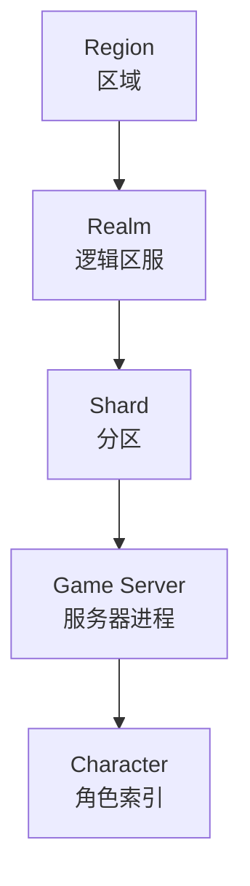
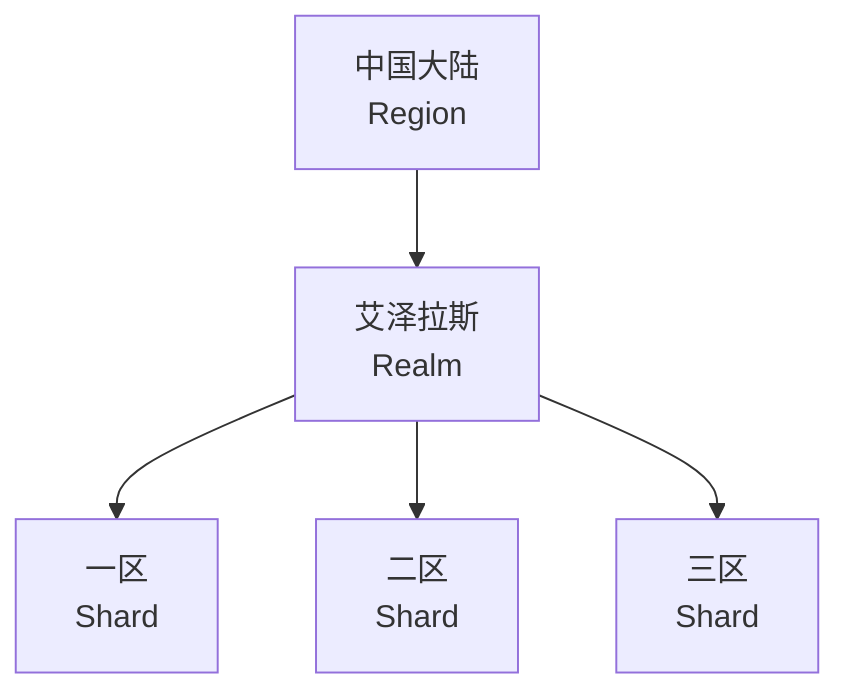
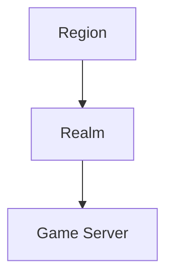
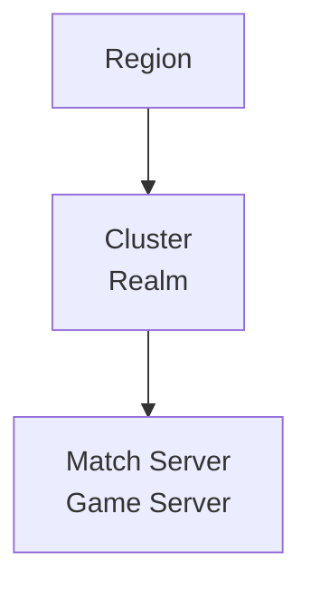
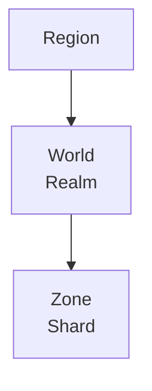
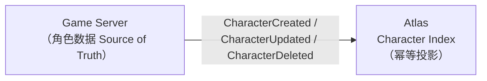

# 概念模型

本文定义 Atlas 中的核心概念，以及它们之间的关系。

---

## 1. 层级总览



**关键原则：除 `Region` 与 `Server` 外，`Realm` 与 `Shard` 都是可选的 metadata。**

Atlas 不强制任何游戏采用某一种固定层级。

---

## 2. 为什么要让层级可选

不同品类的游戏，拓扑概念差异极大。

### MMORPG



或者：



### MOBA



### SLG



如果 Atlas 把 `Realm → Shard → Server` 做成硬编码层级，那么 MOBA 与 SLG 就无法使用。

正确做法是把 `Realm`、`Shard` 定义为**可选的分组 metadata**，游戏按自己的语义填充：

| 游戏类型 | Region | Realm | Shard | Server |
| --- | --- | --- | --- | --- |
| MMORPG | 中国大陆 | 艾泽拉斯 | 一区 | game-1001 |
| MOBA | cn-east | cluster-01 | — | match-2001 |
| SLG | cn-north | world-07 | zone-03 | zone-3003 |

空的层级直接省略，不占用概念空间。

---

## 3. Region

区域，通常是机房地域或合规边界（`cn-east`、`cn-north`、`us-west`）。

- Atlas 中**必填**
- 影响客户端延迟与合规，是 Routing 的第一优先级筛选条件
- **不是独立实体**：Region 没有独立的 CRUD，它以字段形式挂在 Server 与 Realm 上（`region`）

---

## 4. Realm

| 字段 | 类型 | 说明 |
| --- | --- | --- |
| `id` | string | 唯一标识 |
| `name` | string | 展示名 |
| `region` | string | 所属区域 |
| `status` | string | 状态（如 `active`） |
| `created_at` | time | 创建时间 |

逻辑区服。MMORPG 中的"艾泽拉斯"、SLG 中的"世界"。

- **可选**
- 多个 Server 可归属同一 Realm，合服时 Realm 是重要的聚合维度
- 玩家跨 Realm 交互的规则由游戏本身决定，Atlas 只记录归属

---

## 5. Shard

| 字段 | 类型 | 说明 |
| --- | --- | --- |
| `id` | string | 唯一标识 |
| `realm_id` | string | 所属 Realm，可为空（直接挂在 Region 下） |
| `name` | string | 展示名 |
| `status` | string | 状态（如 `active`） |
| `created_at` | time | 创建时间 |

Realm 内的分区。MMORPG 中的"一区""二区"。

- **可选**
- `realm_id` 可为空，允许 Shard 直接挂在 Region 下
- 合服/转服的主要操作单元

---

## 6. Server

物理或逻辑上的游戏服务器进程，是 Atlas 的**核心注册单元**。

| 字段 | 说明 |
| --- | --- |
| `id` | 全局唯一标识，如 `game-1001` |
| `name` | 展示名，如 `一区·青龙` |
| `type` | `game` / `match` / `zone` / `login` 等，游戏自定义 |
| `region` | 所属区域，必填 |
| `realm_id` | 所属 Realm，可空 |
| `shard_id` | 所属 Shard，可空 |
| `version` | 游戏版本，用于灰度与版本匹配 |
| `platform` | 平台约束，如 `android` / `ios` / `pc` |
| `endpoint` | 客户端接入地址 `{host, port}` |
| `status` | 生命周期状态，见 [lifecycle.md](lifecycle.md) |
| `players` | 当前在线人数 |
| `capacity` | 最大容量 |
| `load` | 负载系数，0.0 ~ 1.0 |
| `tags` | 运营标记列表，见[下文 §服务器标记](#服务器标记) |
| `created_at` / `updated_at` | 创建 / 最近更新时间 |

### 服务器标记 {#服务器标记}

一台服务器可挂**多个运营标记**，每个标记四个字段：

| 字段 | 说明 |
| --- | --- |
| `code` | 标记代码，`[a-z0-9][a-z0-9_-]{0,31}`，同服务器内唯一 |
| `label` | 展示文案（角标上显示的字，如「火热」） |
| `tier` | 样式档位：`hot` 火爆红 / `new` 新服绿 / `warning` 警示黄 / `info` 信息蓝 / `neutral` 中性 |
| `public` | 是否对外：`true` 才会出现在玩家可见的发现/推荐响应里 |

**预设标记**（自带文案与档位，`public` 默认 true）：`hot` 火热、`full` 爆满、`no_register` 禁止注册、`maintenance` 维护中、`new` 新服、`recommended` 推荐。自定义标记默认 `public=false`（内部标记，不出前端）。

三条硬规则：

1. **管理台独占维护**：`GET/POST /v1/admin/servers/{id}/tags`、`DELETE …/tags/{code}`。游戏服的注册 upsert 在 SQL 里**省略 tags 列**，重新注册/心跳永远不覆盖、不清空标记——它们是运营资产，不是游戏服的自我描述。
2. **对外面只出 public 标记**：发现列表/详情与推荐接口统一过滤（仅视图层），内部标记（如运营备注）只存在于管理台。
3. **`no_register` 是行为不只是显示**：注册管控判定 `registry.CheckRegistration` 同时管 REST（`POST /v1/directory/characters` → 403 `REGISTRATION_FORBIDDEN`）与 gRPC（PermissionDenied）。`maintenance` 标记与维护状态同权：`ATLAS_MAINTENANCE_ENFORCE=block`（默认）拒绝并返回 `SERVER_IN_MAINTENANCE`，`=warn` 放行但附 `Warning: 299` 告警头。

真实走查（打「火热+禁止注册」→ 玩家侧角标 → 创角 403 → 摘除恢复 201）见[场景导览 §2](/scenarios#scenario-tags)。

---

## 7. Character

| 字段 | 说明 |
| --- | --- |
| `account_id` | 所属账号（**不透明引用**，见下方边界声明） |
| `server_id` | 所在服务器 |
| `character_id` | 角色唯一标识 |
| `name` | 角色名 |
| `level` | 等级（列表展示用，允许秒级滞后） |
| `class_id` | **已弃用**（仅存量兼容，见下方边界声明）——职业等业务概念走 `metadata`（如 `class=warrior`） |
| `avatar` | 头像（可选） |
| `metadata` | 游戏自定义键值（可选；平台唯一内建的业务语义过滤通道） |
| `last_login_at` | 最近登录时间 |
| `created_at` / `updated_at` | 索引创建 / 更新时间 |

### 平台边界声明（去业务硬编码裁决，2026-10-04）

**职业是游戏业务概念，平台不内建。** Atlas 不理解「职业/门派/种族」
这类游戏侧分类——`class_id` 字段与列仅作存量数据兼容保留（DB 列保留、
搜索参数已移除），新接入一律用 `metadata` 表达（`class=warrior`、
`faction=horde`、`vip_level=6`…），筛选走元数据键值过滤。

**账号口径：只持不透明引用。** `account_id` 是一个 int64 引用，Atlas
不识别手机号/邮箱/openid/unionid，不做账号认证，不联动任何账号系统。
账号的形态标注（测试号/内部号/渠道号）同样走 `metadata`
（如 `account_type=test`）。

**Control Plane 边界（2026-10-04 定位裁决）：** Atlas 回答目录性问题，
不回答游戏运行时问题——定位声明与 NEVER-owns 清单见
[architecture.md](architecture.md#_1-总览)，状态三态模型见
[lifecycle.md](lifecycle.md#_0-状态三态-desired-observed-effective)。

### metadata 的边界：opaque 元数据，不是业务数据库

`metadata` 是 Atlas 唯一内建的业务语义过滤通道，但它的定位是
**不透明键值（opaque metadata）**：

| 允许 | 不允许 |
| --- | --- |
| 平台可理解的分类键：`class` / `faction` / `channel` / `account_type`（静态、低基数、用于列出/过滤） | 平台据此做业务决策的字段：`combat_power` / `guild_rank` / `arena_rating` / `dungeon_progress`… |
| 展示与回显（管理台列表、详情、搜索） | 数值型业务属性的持续跟踪（Atlas 不理解，也不该假装理解） |
| 简单键值过滤（`metadata_key=class&metadata_value=warrior`） | 任何依赖"值的大小/排序/区间"的查询——那是游戏数据库的事 |

判据：**如果某个键的值会随玩家/对局动态变化、且游戏逻辑依赖其语义，
它就不属于 metadata**——那是游戏业务数据库的列。metadata 只容纳
"分类标签"级别的静态口径。既不无限增长业务字段，也不把 Atlas 变成
metadata 数据库。

### 角色归属与位置的边界（Character vs Locator，概念预留）

`character.server_id` 回答的是**归属**："这个角色属于哪个服务器"。
它**不是** "角色此时此刻在哪"——两者在未来会分叉成两个概念：

```text
Locator（位置，未来可能，当前不实现）
  ├── home_server     归属服务器（= 现在的 server_id）
  ├── current_server  当前所在服（跨服活动时的临时所在）
  ├── current_instance 当前实例 / 副本 / Zone
  └── session         当前会话
```

当前版本**只实现归属层**：`server_id` = 角色家服；跨服活动期间"角色
此刻在哪"由游戏侧对局/匹配服务自持（见 config-center.md §2.1 运行时
ID 边界），Atlas 不追踪。`character.login` / `character.moved` 事件在
事件协议里已定义（sync.md 事件表），未来若需要"位置层"，在事件协议
支持下扩展投影即达，**不改变现在的概念模型**——但"归属"与"位置"
两个词从今天起就是两个概念，不再混用。

### 最重要的设计原则

> **Atlas 中的角色信息是 Projection / Index，不是 Source of Truth。**



| 归属 | 数据 |
| --- | --- |
| **Atlas 保存** | `account_id`（不透明引用）、`server_id`、`character_id`、`name`、`level`、`last_login_at`（`class_id` 仅存量兼容） |
| **游戏服务器保存** | 装备、背包、任务、技能、好友、邮件……一切权威角色数据 |

### 为什么必须是 Projection

1. **职责边界** — Atlas 是控制面，不是数据面。让控制面持有权威数据会让它成为瓶颈与单点。
2. **一致性责任** — 角色数据的一致性由游戏服务器自己保证，Atlas 不介入。
3. **性能** — 索引只需要少量冗余字段，可以冗余存储、可以异步更新，不必强一致。
4. **故障隔离** — Atlas 不可用时，游戏服务器照常运行，只是角色列表展示暂时失效。

### 索引的完整性

Atlas 需要保证的是**索引的完整性**，即"账号下所有角色都能被找到"，而不是"字段值是最新的"。`level`、`name` 等字段允许滞后（秒级到分钟级），因为它们只用于列表展示。

---

## 8. Server Migration

| 字段 | 说明 |
| --- | --- |
| `id` | 迁移唯一标识 |
| `source_servers` | 源服务器列表（合服可多源） |
| `target_server` | 目标服务器 |
| `status` | `pending` / `migrating` / `verifying` / `completed` / `failed` / `rolled_back` |
| `started_at` | 开始时间 |
| `completed_at` | 完成时间（未完成为空） |

记录服务器之间的迁移过程，承载**合服 / 转服 / 迁服 / 跨区**等场景。详见 [migration.md](migration.md)。

---

## 9. Announcement 与 MaintenanceWindow

这两个概念是**时间区间型运维对象**——它们都有生效区间，到点自动出现 / 自动切换，过期自动失效：

| 概念 | 面向 | 作用 | 关键字段 |
| --- | --- | --- | --- |
| **Announcement**（公告） | 玩家客户端 | 信息通道：紧急故障、维护预告、活动排期 | `level`（info / warning / critical）、全局或服务器级、`starts_at` / `ends_at` |
| **MaintenanceWindow**（维护窗口） | 服务器状态 | 声明式维护：`start_at` 自动进入 `maintenance`，`end_at` 自动恢复 | `previous_status`（恢复目标）、`announcement_id`（联动公告） |

二者可以独立使用，也可以联动：创建窗口时（`announce` 缺省 true）自动生成一条覆盖同时段的 warning 公告并通过 `announcement_id` 关联。自动状态机永不覆盖运维决策——窗口只移动它自己放入的服务器。

场景与演练（curl 全流程、定时进入机制、边界规则）见 [operations.md](operations.md)，端点定义见 [api.md](api.md)。

---

## 10. 概念与 API 的对应

| 概念 | API 分组 | 说明 |
| --- | --- | --- |
| Server 注册 / 心跳 | `/v1/registry/*` | 游戏服务器调用 |
| Server 查询 / 公告拉取 | `/v1/discovery/*` | 客户端与工具调用 |
| Character 索引 | `/v1/directory/*` | 客户端查询，游戏服务器写入 |
| 推荐接入 | `/v1/routing/*` | 客户端调用 |
| 生命周期 / 公告 / 维护窗口管理 | `/v1/admin/*` | 运维工具调用 |

完整定义见 [api.md](api.md)。
