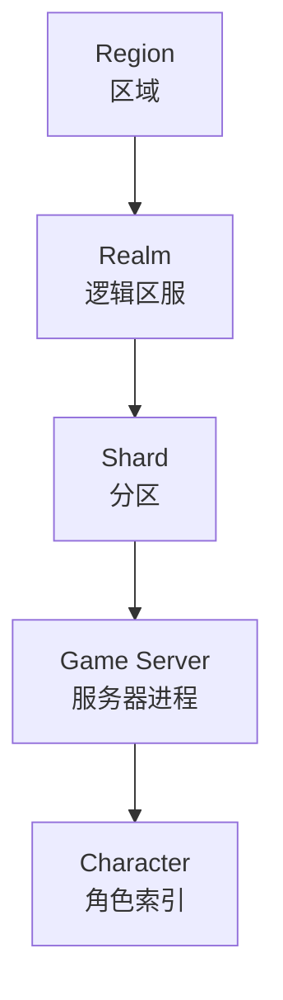
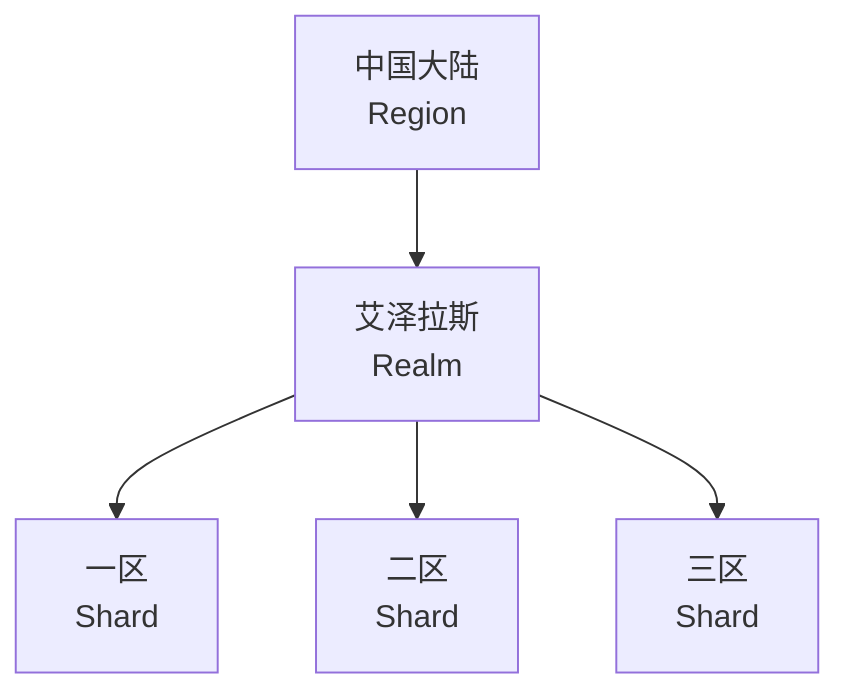
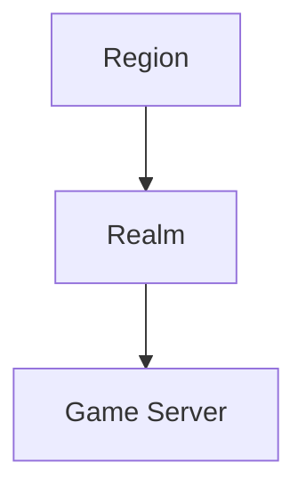
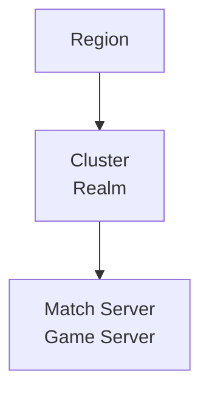
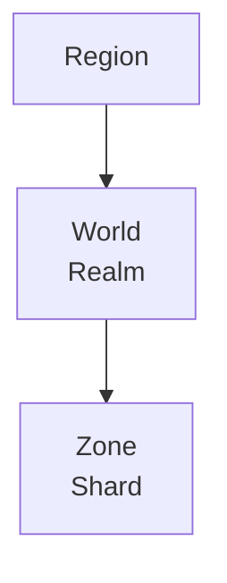
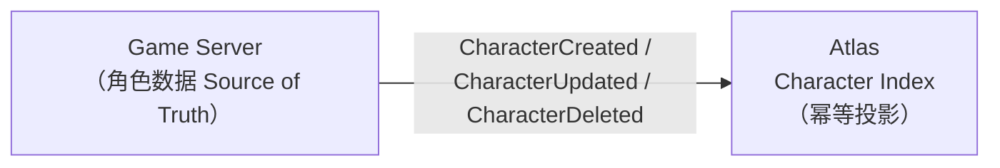

# 概念模型

本文定义 Atlas 中的核心概念，以及它们之间的关系。

---

## 1. 层级总览

**关键原则：除 `Region` 与 `Server` 外，`Realm` 与 `Shard` 都是可选的 metadata。**

Atlas 不强制任何游戏采用某一种固定层级。

---

## 2. 为什么要让层级可选

不同品类的游戏，拓扑概念差异极大。

### MMORPG

或者：

### MOBA

### SLG

如果 Atlas 把 `Realm → Shard → Server` 做成硬编码层级，那么 MOBA 与 SLG 就无法使用。

正确做法是把 `Realm`、`Shard` 定义为**可选的分组 metadata**，游戏按自己的语义填充：

| 游戏类型 | Region | Realm | Shard | Server |
| --- | --- | --- | --- | --- |
| MMORPG | 中国大陆 | 艾泽拉斯 | 一区 | game-1001 |
| MOBA | cn-east | cluster-01 | — | match-2001 |
| SLG | cn-north | world-07 | zone-03 | zone-3003 |

空的层级直接省略，不占用概念空间。

---

## 3. Region

区域，通常是机房地域或合规边界（`cn-east`、`cn-north`、`us-west`）。

- Atlas 中**必填**
- 影响客户端延迟与合规，是 Routing 的第一优先级筛选条件
- **不是独立实体**：Region 没有独立的 CRUD，它以字段形式挂在 Server 与 Realm 上（`region`）

---

## 4. Realm

| 字段 | 类型 | 说明 |
| --- | --- | --- |
| `id` | string | 唯一标识 |
| `name` | string | 展示名 |
| `region` | string | 所属区域 |
| `status` | string | 状态（如 `active`） |
| `created_at` | time | 创建时间 |

逻辑区服。MMORPG 中的"艾泽拉斯"、SLG 中的"世界"。

- **可选**
- 多个 Server 可归属同一 Realm，合服时 Realm 是重要的聚合维度
- 玩家跨 Realm 交互的规则由游戏本身决定，Atlas 只记录归属

---

## 5. Shard

| 字段 | 类型 | 说明 |
| --- | --- | --- |
| `id` | string | 唯一标识 |
| `realm_id` | string | 所属 Realm，可为空（直接挂在 Region 下） |
| `name` | string | 展示名 |
| `status` | string | 状态（如 `active`） |
| `created_at` | time | 创建时间 |

Realm 内的分区。MMORPG 中的"一区""二区"。

- **可选**
- `realm_id` 可为空，允许 Shard 直接挂在 Region 下
- 合服/转服的主要操作单元

---

## 6. Server

物理或逻辑上的游戏服务器进程，是 Atlas 的**核心注册单元**。

| 字段 | 说明 |
| --- | --- |
| `id` | 全局唯一标识，如 `game-1001` |
| `name` | 展示名，如 `一区·青龙` |
| `type` | `game` / `match` / `zone` / `login` 等，游戏自定义 |
| `region` | 所属区域，必填 |
| `realm_id` | 所属 Realm，可空 |
| `shard_id` | 所属 Shard，可空 |
| `version` | 游戏版本，用于灰度与版本匹配 |
| `platform` | 平台约束，如 `android` / `ios` / `pc` |
| `endpoint` | 客户端接入地址 `{host, port}` |
| `status` | 生命周期状态，见 [lifecycle.md](lifecycle.md) |
| `players` | 当前在线人数 |
| `capacity` | 最大容量 |
| `load` | 负载系数，0.0 ~ 1.0 |
| `created_at` / `updated_at` | 创建 / 最近更新时间 |

---

## 7. Character

| 字段 | 说明 |
| --- | --- |
| `account_id` | 所属账号 |
| `server_id` | 所在服务器 |
| `character_id` | 角色唯一标识 |
| `name` | 角色名 |
| `level` | 等级（列表展示用，允许秒级滞后） |
| `class_id` | 职业 |
| `avatar` | 头像（可选） |
| `metadata` | 游戏自定义键值（可选） |
| `last_login_at` | 最近登录时间 |
| `created_at` / `updated_at` | 索引创建 / 更新时间 |

### 最重要的设计原则

> **Atlas 中的角色信息是 Projection / Index，不是 Source of Truth。**

| 归属 | 数据 |
| --- | --- |
| **Atlas 保存** | `account_id`、`server_id`、`character_id`、`name`、`level`、`class_id`、`last_login_at` |
| **游戏服务器保存** | 装备、背包、任务、技能、好友、邮件……一切权威角色数据 |

### 为什么必须是 Projection

1. **职责边界** — Atlas 是控制面，不是数据面。让控制面持有权威数据会让它成为瓶颈与单点。
2. **一致性责任** — 角色数据的一致性由游戏服务器自己保证，Atlas 不介入。
3. **性能** — 索引只需要少量冗余字段，可以冗余存储、可以异步更新，不必强一致。
4. **故障隔离** — Atlas 不可用时，游戏服务器照常运行，只是角色列表展示暂时失效。

### 索引的完整性

Atlas 需要保证的是**索引的完整性**，即"账号下所有角色都能被找到"，而不是"字段值是最新的"。`level`、`name` 等字段允许滞后（秒级到分钟级），因为它们只用于列表展示。

---

## 8. Server Migration

| 字段 | 说明 |
| --- | --- |
| `id` | 迁移唯一标识 |
| `source_servers` | 源服务器列表（合服可多源） |
| `target_server` | 目标服务器 |
| `status` | `pending` / `migrating` / `verifying` / `completed` / `failed` / `rolled_back` |
| `started_at` | 开始时间 |
| `completed_at` | 完成时间（未完成为空） |

记录服务器之间的迁移过程，承载**合服 / 转服 / 迁服 / 跨区**等场景。详见 [migration.md](migration.md)。

---

## 9. Announcement 与 MaintenanceWindow

这两个概念是**时间区间型运维对象**——它们都有生效区间，到点自动出现 / 自动切换，过期自动失效：

| 概念 | 面向 | 作用 | 关键字段 |
| --- | --- | --- | --- |
| **Announcement**（公告） | 玩家客户端 | 信息通道：紧急故障、维护预告、活动排期 | `level`（info / warning / critical）、全局或服务器级、`starts_at` / `ends_at` |
| **MaintenanceWindow**（维护窗口） | 服务器状态 | 声明式维护：`start_at` 自动进入 `maintenance`，`end_at` 自动恢复 | `previous_status`（恢复目标）、`announcement_id`（联动公告） |

二者可以独立使用，也可以联动：创建窗口时（`announce` 缺省 true）自动生成一条覆盖同时段的 warning 公告并通过 `announcement_id` 关联。自动状态机永不覆盖运维决策——窗口只移动它自己放入的服务器。

场景与演练（curl 全流程、定时进入机制、边界规则）见 [operations.md](operations.md)，端点定义见 [api.md](api.md)。

---

## 10. 概念与 API 的对应

| 概念 | API 分组 | 说明 |
| --- | --- | --- |
| Server 注册 / 心跳 | `/v1/registry/*` | 游戏服务器调用 |
| Server 查询 / 公告拉取 | `/v1/discovery/*` | 客户端与工具调用 |
| Character 索引 | `/v1/directory/*` | 客户端查询，游戏服务器写入 |
| 推荐接入 | `/v1/routing/*` | 客户端调用 |
| 生命周期 / 公告 / 维护窗口管理 | `/v1/admin/*` | 运维工具调用 |

完整定义见 [api.md](api.md)。
