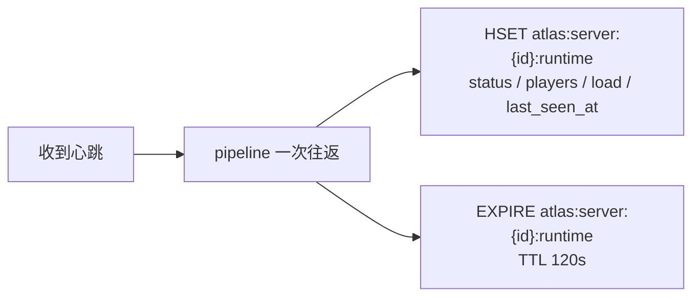
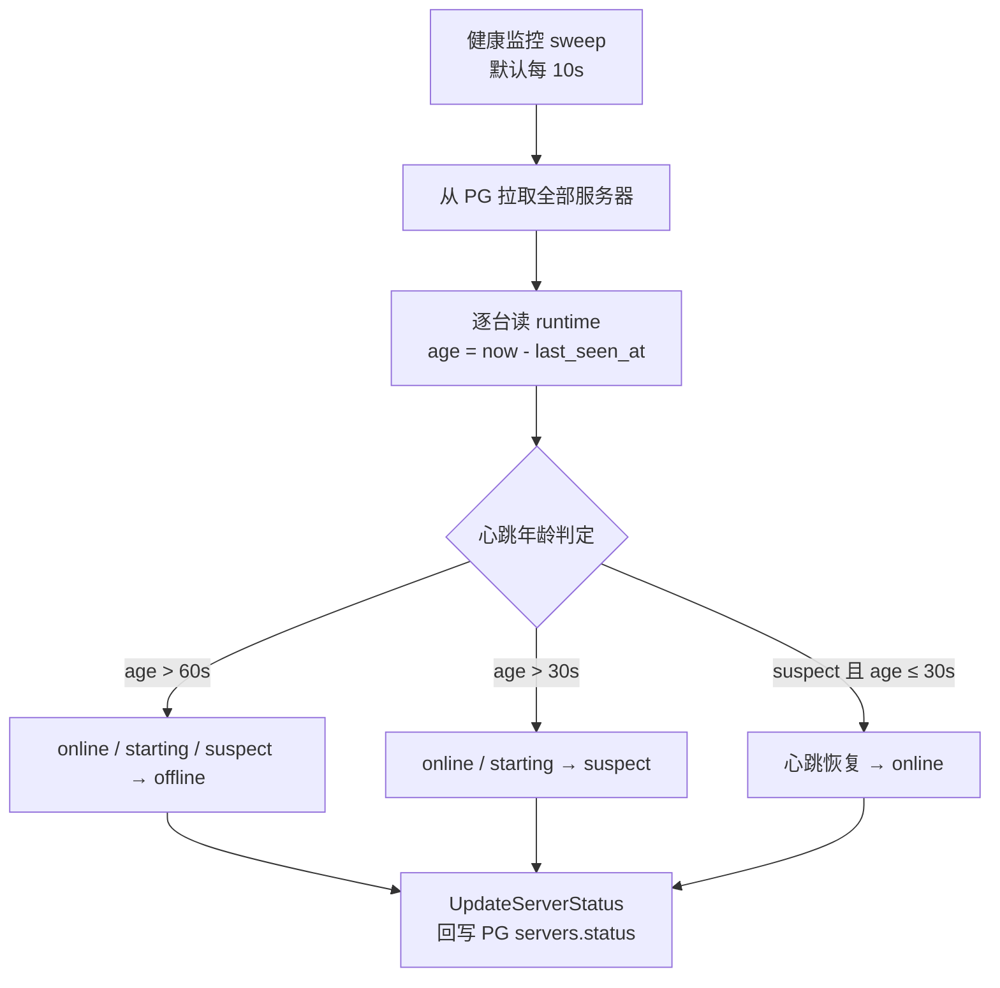
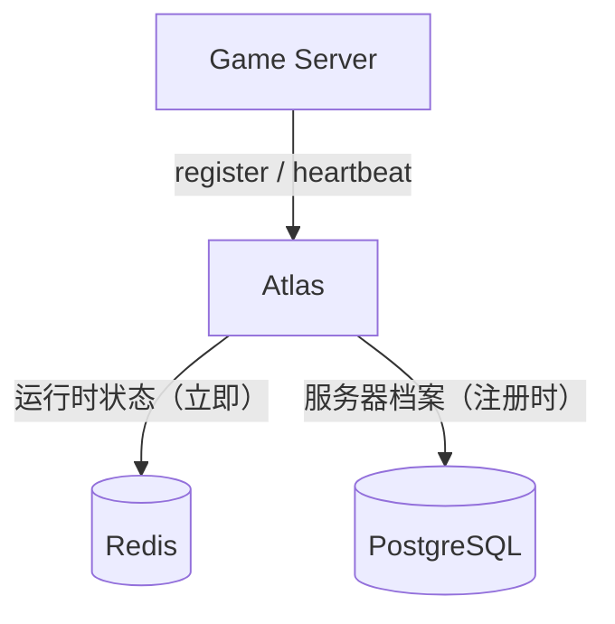
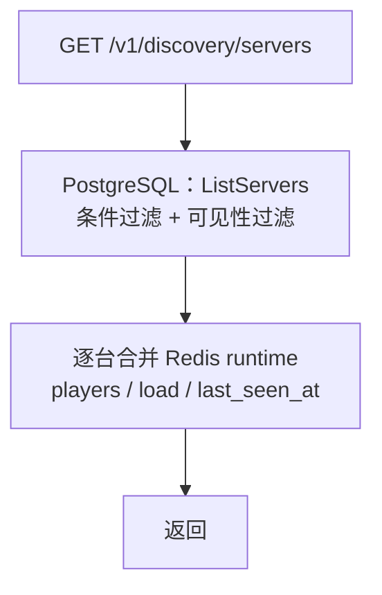
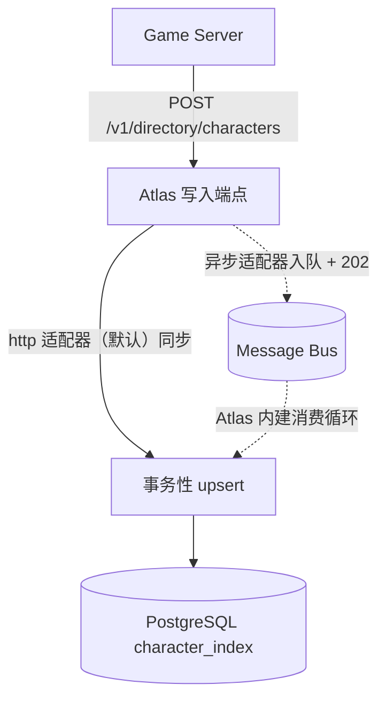
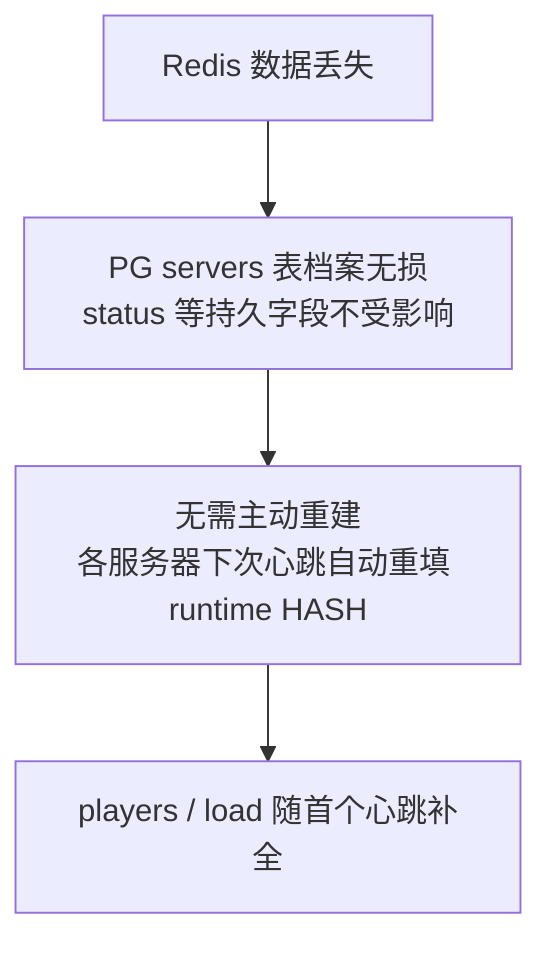

# 数据模型

Atlas 的存储按**访问模式**分两层：注册表 / 角色目录等持久态由可插拔存储承载（`ATLAS_STORE`：`memory` 默认、零依赖开箱即用；`postgres` 面向生产；`mysql` 实现已备、主程序装配未接），**运行时状态**（心跳、玩家数、负载，TTL ≤ 120s）固定走 Redis。本章以生产形态（PostgreSQL + Redis）给表结构：

| 存储 | 承载内容 | 访问模式 |
| --- | --- | --- |
| **Redis** | 心跳时间戳、`status`、`load`、`players` | 高频写、高频读、可丢失 |
| **PostgreSQL** | `servers`、`realms`、`shards`、`character_index`、`migrations` | 低频写、事务性、需持久 |

---

## 1. 为什么这样分

- **心跳是易失数据。** 服务器掉线后，最后一次心跳的精确数值没有历史价值。Redis TTL 天然契合这个语义。
- **服务器档案是事实。** 名称、区域、版本、拓扑归属需要持久化与审计。
- **角色索引需要事务与外键。** 合服/转服产生跨行变更，事务能力是刚需。
- **列表页是热点。** 拉服务器列表是最高频的读，这份流量走 Redis，不进 PG。

### 一致性策略

**PostgreSQL 为准，Redis 为缓存。**

- 写路径先落 PG，再更新 Redis。
- Redis 中的运行时字段（`load` / `players` / `status`）允许短暂不一致，它们本身就是近似值。
- 心跳超时由健康监控巡检计算 `last_seen_at` 年龄（默认每 10s），回写 PG 的 `status`；Redis 键 TTL（120s）仅做自清理。
- Redis 全量丢失时，可从 PG 重建运行时状态（服务器档案都在，只是心跳数据丢失）。

---

## 2. PostgreSQL 表结构

### servers

```sql
CREATE TABLE servers (
    id          TEXT PRIMARY KEY,
    name        TEXT        NOT NULL,
    type        TEXT        NOT NULL DEFAULT 'game',
    region      TEXT        NOT NULL,
    realm_id    TEXT        REFERENCES realms(id) ON DELETE SET NULL,
    shard_id    TEXT        REFERENCES shards(id) ON DELETE SET NULL,
    version     TEXT        NOT NULL,
    platform    TEXT        NOT NULL DEFAULT '',
    endpoint_host TEXT      NOT NULL,
    endpoint_port INTEGER   NOT NULL,
    capacity    INTEGER     NOT NULL DEFAULT 0,
    metadata    JSONB       NOT NULL DEFAULT '{}',
    source      TEXT        NOT NULL DEFAULT '',
    status      TEXT        NOT NULL DEFAULT 'starting',
    started_at  TIMESTAMPTZ,
    created_at  TIMESTAMPTZ NOT NULL DEFAULT now(),
    updated_at  TIMESTAMPTZ NOT NULL DEFAULT now()
);

CREATE INDEX idx_servers_region_status ON servers (region, status);
CREATE INDEX idx_servers_realm        ON servers (realm_id);
CREATE INDEX idx_servers_shard        ON servers (shard_id);
```

`source` 标记档案归属（migrations/0004）：`''` = API 注册（默认），`config` = 配置文件声明（`ATLAS_SERVERS_CONFIG`）——config 归属的记录注册 API 拒改其档案字段（`409 SERVER_MANAGED_BY_CONFIG`），心跳与生命周期操作照常。

`status` 的取值域见 [lifecycle.md](lifecycle.md)：

| 状态 | 语义 |
| --- | --- |
| `starting` | 进程启动中，尚未就绪 |
| `online` | 正常服务 |
| `draining` | 排水中（优雅下线） |
| `maintenance` | 维护中 |
| `suspect` | 疑似失联 |
| `offline` | 已下线 |
| `disabled` | 运维禁用 |

> **语义批注（三态模型，见 [lifecycle.md §0](lifecycle.md#_0-状态三态-desired-observed-effective)）**：
> 本表 `servers.status` 落库的是 **Effective（生效态）**——合成结果，所有对外视图
> （发现 / 推荐 / 统计）读它的就是这个值，不存在与别处 `status` 打架的语义。

`players`、`load`、`last_seen_at` **不在此表**，它们在 Redis 中。

---

### realms

```sql
CREATE TABLE realms (
    id        TEXT PRIMARY KEY,
    name      TEXT        NOT NULL,
    region    TEXT        NOT NULL,
    status    TEXT        NOT NULL DEFAULT 'active',
    created_at TIMESTAMPTZ NOT NULL DEFAULT now()
);
```

---

### shards

```sql
CREATE TABLE shards (
    id        TEXT PRIMARY KEY,
    realm_id  TEXT        REFERENCES realms(id) ON DELETE SET NULL,
    name      TEXT        NOT NULL,
    status    TEXT        NOT NULL DEFAULT 'active',
    created_at TIMESTAMPTZ NOT NULL DEFAULT now()
);

CREATE INDEX idx_shards_realm ON shards (realm_id);
```

`realm_id` 可为 `NULL`，允许 Shard 直接挂在 Region 下。这与 [concepts.md](concepts.md) 中"层级可选"的原则一致。

---

### character_index

```sql
CREATE TABLE character_index (
    account_id    BIGINT      NOT NULL,
    server_id     TEXT        NOT NULL,
    character_id  BIGINT      NOT NULL,
    name          TEXT        NOT NULL,
    level         INTEGER     NOT NULL DEFAULT 1,
    class_id      INTEGER     NOT NULL DEFAULT 0,
    avatar        TEXT        NOT NULL DEFAULT '',
    metadata      JSONB       NOT NULL DEFAULT '{}',
    last_login_at TIMESTAMPTZ,
    created_at    TIMESTAMPTZ NOT NULL DEFAULT now(),
    updated_at    TIMESTAMPTZ NOT NULL DEFAULT now(),

    PRIMARY KEY (account_id, server_id, character_id)
);

CREATE INDEX idx_char_by_account ON character_index (account_id);
CREATE INDEX idx_char_by_char_id ON character_index (character_id);
CREATE INDEX idx_char_by_server  ON character_index (server_id);
```

**这是投影表，不是权威数据表。** 完整角色数据在游戏服务器的角色数据库中。见 [concepts.md §7](concepts.md#7-character)。

主键选 `(account_id, server_id, character_id)` 三元组，因为：
- 同一账号可在多个服务器有角色
- `character_id` 全局唯一性由游戏服务器保证，但 Atlas 不依赖它作为主键，以容忍不同服务器 ID 空间冲突

`idx_char_by_char_id` 用于 `GET /v1/directory/characters/{id}` 反查。

---

### server_migrations

```sql
CREATE TABLE server_migrations (
    id             TEXT PRIMARY KEY,
    source_servers JSONB       NOT NULL DEFAULT '[]',
    target_server  TEXT        NOT NULL,
    status         TEXT        NOT NULL DEFAULT 'pending',
    started_at     TIMESTAMPTZ NOT NULL DEFAULT now(),
    completed_at   TIMESTAMPTZ
);

CREATE INDEX idx_migration_status ON server_migrations (status);
```

详见 [migration.md](migration.md)。

---

## 3. Redis 键设计

### 服务器运行时状态

| 键 | 类型 | 说明 | TTL |
| --- | --- | --- | --- |
| `atlas:server:{server_id}:runtime` | HASH | 服务器运行时快照，字段见下表 | 120 秒，每次心跳刷新 |

**`atlas:server:{id}:runtime`** 字段：

| 字段 | 示例 | 说明 |
| --- | --- | --- |
| `status` | `online` | 心跳上报的**观测态**（Observed 侧，见 [lifecycle.md §0](lifecycle.md#_0-状态三态-desired-observed-effective)），判活依据是 `last_seen_at` 而非本字段 |
| `players` | `843` | 当前在线玩家数（整数字符串） |
| `load` | `0.42` | 负载比，`[0, 1]` 浮点字符串 |
| `last_seen_at` | `2026-01-01T12:00:00Z` | 最近一次心跳的写入时间（RFC3339），判活依据 |

TTL 为 120 秒（`redisstore.runtimeTTL`），刻意大于判活阈值（suspect 30s / offline 60s）：键过期只负责运行时数据的自清理，判活由监控按 `last_seen_at` 计算心跳年龄完成。

档案字段（`capacity`、`region`、`realm`、`shard`、`version`、`endpoint`）**不进 Redis**，始终以 PG 为准。

### 列表与推荐的读路径

当前实现没有 ZSET 索引：Discovery 与 Routing 都以 PG 为候选源，Redis 只负责补充运行时字段。

| 读路径 | 实现 |
| --- | --- |
| Discovery 列表 | PG `ListServers`（条件过滤 + 可见性过滤）→ 逐台合并 Redis `runtime` 的 `players / load / last_seen_at` |
| Routing 推荐 | PG 候选集 → 合并运行时 → 打分排序：已有角色 > 最低负载 > 剩余容量最大 > 稳定 ID 兜底 |

### 心跳写路径



单次心跳涉及 2 个 Redis 命令（`HSET` + `EXPIRE`），pipeline 一次往返完成。

### 掉线检测



---

## 4. 数据流

### 写路径



### 读路径



### 角色索引路径



角色索引不进 Redis，因为它是按 `account_id` 的点查，PG 索引足以支撑，且需要事务保证合服时的跨行一致性。

---

## 5. 数据量估算

以中等规模 MMORPG 为例：

| 数据 | 规模 | 存储 |
| --- | --- | --- |
| 服务器 | 1,000 台 | PG + Redis，可忽略 |
| 心跳写入 | 1,000 × 0.1 QPS = 100 QPS | Redis |
| 列表读取 | 5,000 QPS | PG 候选集 + Redis 运行时合并 |
| 角色索引 | 5,000 万行 | PG |
| 角色点查 | 2,000 QPS | PG（走 `idx_char_by_account`） |

角色索引是唯一有规模压力的表。分片基础设施（v0.1.16）已就位：

- **策略接口** `store.CharacterShardStrategy` + 默认实现 `HashShardStrategy`（`account_id` 的 FNV-1a hash 对分片数取模，纯函数、跨进程稳定）；
- **分片组合** `store/sharded` 实现 `CharacterStore`：按 `account_id` 路由的读写一跳到达；无法路由的查询（全局 `character_id` 点查、按服列表、Admin 搜索）扇出全部分片后按游标序归并；
- **迁移工具** `cmd/atlas-reshard`（或 `sharded.Reshard`）：游标分页读源、幂等 upsert 写目标，支持单库 → N 库、N 分片 → M 分片重切；
- **启用方式** `ATLAS_CHAR_SHARDS`（默认 1）：单物理库时逻辑分片（验证路由路径），多库部署时按库拆分物理存储。

物理拆分（每分片独立 PG 实例）属于部署运维决策，接口与迁移工具已按 v2.0 目标预留，见 [roadmap.md](roadmap.md)。

---

## 6. 迁移与备份

- **PG**：常规逻辑备份 + WAL 归档。`character_index` 可从游戏服务器的角色数据库**全量重建**，这是它作为投影表的最大运维优势。
- **Redis**：不需要备份。全量丢失时从 PG 的 `servers` 表重建运行时状态，代价是所有服务器需重新上报一次心跳（通常 15 秒内恢复）。




## 7. 维护窗口与公告（v0.1.20）

两张补充表（`migrations/0003_maintenance_announcements.sql`），都偏运维侧、数据量小：

```sql
-- 计划维护窗口（瞬态：监控应用完毕即删除，不存历史）
CREATE TABLE maintenance_windows (
    id              TEXT PRIMARY KEY,
    server_id       TEXT NOT NULL,
    start_at        TIMESTAMPTZ NOT NULL,
    end_at          TIMESTAMPTZ NOT NULL,
    previous_status TEXT NOT NULL DEFAULT '',   -- 应用后记录恢复目标；'' = 无需恢复
    announcement_id TEXT,                       -- 关联的自动公告
    created_at      TIMESTAMPTZ NOT NULL DEFAULT now()
);

-- 客户端公告（server_id NULL = 全局）
CREATE TABLE announcements (
    id         TEXT PRIMARY KEY,
    server_id  TEXT,
    title      TEXT NOT NULL,
    body       TEXT NOT NULL DEFAULT '',
    level      TEXT NOT NULL DEFAULT 'info',    -- info | warning | critical
    starts_at  TIMESTAMPTZ NOT NULL,
    ends_at    TIMESTAMPTZ NOT NULL,
    created_at TIMESTAMPTZ NOT NULL DEFAULT now()
);
```

要点：

- **窗口是瞬态的**：健康监控在窗口结束后恢复状态并 `DELETE`，表里只会出现「尚未开始 / 进行中」的窗口；公告则是持久记录。
- **`servers.started_at`**（0003 新增列）：注册时上报的进程启动时间，重注册刷新；Discovery 响应携带，用于展示 uptime。
- 公告的时间区间是**半开区间** `[starts_at, ends_at)`，与维护窗口的判定一致。
