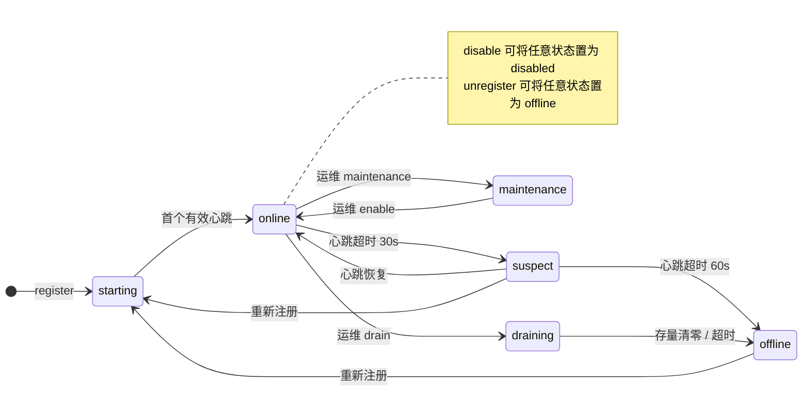
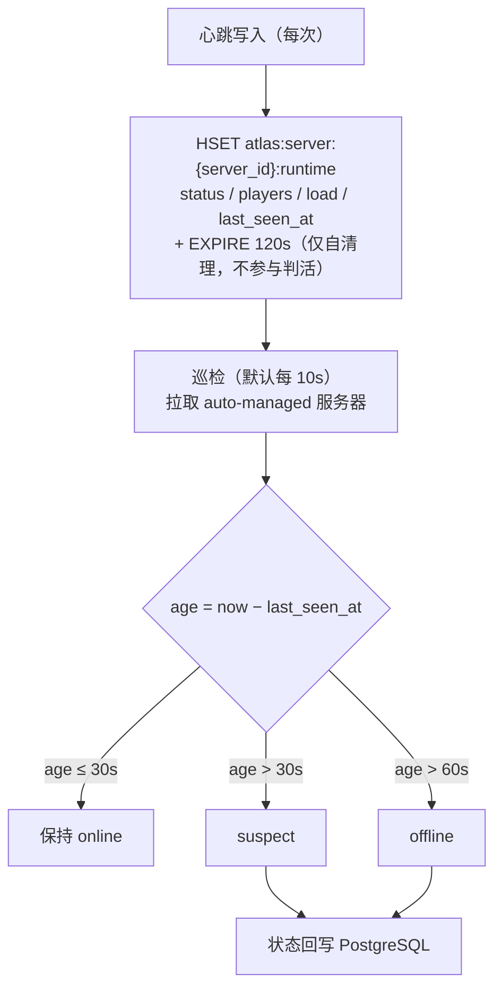

# 服务器生命周期

服务器不是简单的 `online / offline`，而应有完整生命周期。这对大型游戏尤为重要。

---

## 1. 状态机



完整状态集：

| 状态 | 含义 | 客户端可见 | 可接受新连接 | 存量玩家 |
| --- | --- | --- | --- | --- |
| `starting` | 进程启动中，尚未就绪 | 否 | 否 | — |
| `online` | 正常服务 | 是 | 是 | 正常 |
| `draining` | 排水中 | 否 | 否 | 正常 |
| `maintenance` | 维护中 | 是（标记维护） | 否 | 正常 |
| `suspect` | 疑似失联 | 是（标记异常） | 是 | 正常 |
| `offline` | 已下线 | 否 | 否 | — |
| `disabled` | 运维禁用 | 否 | 否 | 强制断开 |

---

## 2. 状态详解

### STARTING

服务器进程已启动，正在加载资源、连接依赖、预热缓存。

- 由 `register` 触发进入
- 就绪后由游戏服务器显式上报 `status: online`，或 Atlas 依据首次有效心跳自动提升
- **不对外可见**，避免客户端连上一个还没准备好的服务器

### ONLINE

正常服务状态。唯一同时满足"客户端可见 + 接受新连接"的状态。

### DRAINING

排水状态，用于**优雅下线**：`ONLINE → DRAINING → OFFLINE`。

- 停止接受新连接
- **存量玩家不受影响**，继续游戏直到自己退出
- 等待玩家自然离开或到达超时阈值后转 `OFFLINE`
- 通常用于版本更新前的缩容、实例替换

### MAINTENANCE

维护状态：`ONLINE → MAINTENANCE`。

**与 DRAINING 的关键区别**：`MAINTENANCE` 时**老玩家可以继续游戏**，只是新玩家不能进入。

- 客户端选服界面会展示"维护中"标记，而不是隐藏该服务器
- 适用于：临时故障排查、数据库变更、热修复
- 维护完成后转回 `ONLINE`

### SUSPECT

疑似失联：`online → (心跳超时) → suspect → (超时未恢复) → offline`。

- 心跳超时但尚未确认死亡
- **仍然对外可见**，因为可能是网络抖动而非服务器崩溃
- 客户端会看到"连接不稳定"之类的提示
- 超过第二段阈值后转 `OFFLINE`

两段式设计的意义：避免因一次网络抖动就把服务器从列表中摘掉，导致客户端频繁刷新列表。

### OFFLINE

已下线。不可见、不接受连接。

### DISABLED

运维禁用。与 `OFFLINE` 的区别是这是**显式人工操作**，需要 `enable` 才能恢复，不会被自动状态机覆盖。

---

## 3. 状态转移触发

| 转移 | 触发方 | 说明 |
| --- | --- | --- |
| — → `starting` | 游戏服务器 | `register` |
| `starting` → `online` | 游戏服务器 / Atlas | 首次有效心跳 |
| `online` → `draining` | 运维 | `POST /admin/servers/{id}/drain` |
| `online` → `maintenance` | 运维 | `POST /admin/servers/{id}/maintenance` |
| `online` → `suspect` | Atlas | 心跳超时阈值 1 |
| `suspect` → `online` | Atlas | 收到心跳（恢复） |
| `suspect` → `offline` | Atlas | 心跳超时阈值 2 |
| `suspect` / `offline` → `starting` | 游戏服务器 | 重新 `register`（幂等；仅 `suspect` / `offline` 会被重置，`online` 与运维设置的状态不受重复注册影响） |
| `draining` → `offline` | Atlas / 游戏服务器 | 存量清零或超时 |
| `maintenance` → `online` | 运维 | `POST /admin/servers/{id}/enable` |
| 任意 → `disabled` | 运维 | `POST /admin/servers/{id}/disable` |
| 任意 → `offline` | 游戏服务器 | `unregister` |

---

## 4. 自动掉线判定

每次心跳把运行时快照（`status` / `players` / `load` / `last_seen_at`）写入 Redis 的 runtime HASH，健康监控的巡检循环（默认每 10s，与维护窗口应用同一个循环）拉取所有 auto-managed 服务器，计算**心跳年龄**并推进状态：



> TTL（120s）比判活阈值大，刻意如此：Redis 键过期只负责"彻底失联的服务器的运行时数据自动消失"，生死判定一律以 `last_seen_at` 年龄为准，避免两层语义打架。

阈值建议：

| 参数 | 默认值 | 说明 |
| --- | --- | --- |
| 心跳间隔 | 10s | 游戏服务器上报频率 |
| runtime HASH TTL | 120s | 固定值，仅键自清理；每次心跳刷新 |
| suspect 阈值 | 30s | 3× 心跳间隔（见 §4.2） |
| offline 阈值 | 60s | 6× 心跳间隔 |

阈值应可配置，不同部署环境（同机房 vs 跨地域）差异较大。从未上报过心跳的服务器（无 runtime 数据）以注册时刻起算年龄。

### 4.1 健康警报（v0.1.15 交付）

**什么场景用**：舰队几十上百台服务器时，靠人盯 `GET /v1/admin/stats` 发现不了"半夜有一批服悄悄掉线"。健康警报让 Atlas 巡检时顺手做全舰队的**占比巡检**：失联（suspect）或死亡（offline）的服务器占比越阈值就发告警——推送一条 JSON 到你的 webhook（值班机器人 / 电话网关），同时记一条 Warn 日志供日志告警系统抓取。

**怎么配**——三个环境变量，进程启动时生效：

| 环境变量 | 默认值 | 说明 |
| --- | --- | --- |
| `ATLAS_ALERT_SUSPECT_RATIO` | `0.3` | suspect 占比 ≥ 该值触发告警；`0` 关闭 |
| `ATLAS_ALERT_OFFLINE_RATIO` | `0.2` | offline 占比 ≥ 该值触发告警；`0` 关闭 |
| `ATLAS_ALERT_WEBHOOK_URL` | （空） | 告警触发 / 恢复时 POST 一条 JSON 通知 |

**跑起来什么样**——一个 75 秒的最小演练：两台服务器在线，`game-1002` 停止心跳模拟宕机（`game-1001` 持续保活），阈值都设 `0.5`：

```bash
ATLAS_ALERT_SUSPECT_RATIO=0.5 ATLAS_ALERT_OFFLINE_RATIO=0.5 \
ATLAS_ALERT_WEBHOOK_URL=http://127.0.0.1:9999/hook ./atlas
# 注册 game-1001 / game-1002 并心跳上线（见快速上手 §1），随后停止 game-1002 的心跳
```

约 30 秒后 `game-1002` 因心跳超龄进入 suspect，占比 1/2 达到阈值，webhook 收到第一条：

```json
{"alert":"suspect_ratio","state":"firing","count":1,"auto_managed_total":2,"ratio":0.5,"threshold":0.5,"fired_at":"2026-10-02T03:27:30Z"}
```

约 60 秒后它超龄转 offline：suspect 回落到 0（发 `suspect_ratio` 的 `recovered`），offline 占比越限（发 `offline_ratio` 的 `firing`）。同一时段 Atlas 日志里是三条对应的 Warn：

```text
level=WARN msg="health alert" alert=suspect_ratio state=firing    count=1 auto_managed_total=2 ratio=0.500 threshold=0.500
level=WARN msg="health alert" alert=suspect_ratio state=recovered count=0 auto_managed_total=2 ratio=0.000 threshold=0.500
level=WARN msg="health alert" alert=offline_ratio state=firing    count=1 auto_managed_total=2 ratio=0.500 threshold=0.500
```

**语义要点**：

- 告警对象是「监控接管」的服务器集合（starting / online / suspect / offline）；维护、禁用由运维设置，不参与分母。
- **锁存语义**：占比越限时发一条 `firing`，之后持续越限**不重复发送**；回落到阈值以下才发一条 `recovered`。不会刷屏。
- webhook 载荷字段：`alert`（`suspect_ratio` / `offline_ratio`）、`state`（`firing` / `recovered`）、`count` / `auto_managed_total`（不健康数 / 分母）、`ratio` / `threshold`、`fired_at`（RFC3339 UTC）。
- webhook 投递失败只记错误日志，不影响巡检循环。

webhook 载荷示例：

```json
{
  "alert": "offline_ratio",
  "state": "firing",
  "count": 5,
  "auto_managed_total": 20,
  "ratio": 0.25,
  "threshold": 0.2,
  "fired_at": "2026-10-01T12:00:00Z"
}
```

webhook 投递失败只记错误日志，不影响巡检循环。

### 4.2 心跳节奏指引（3:1 法则，v0.1.20）

阈值设定遵循 **3:1:6 节奏**——心跳间隔 : suspect 阈值 : offline 阈值 = 1 : 3 : 6（默认 10s / 30s / 60s）：

- **3×** 心跳间隔进入 suspect：容忍连续丢两个心跳再标记，避免单次网络抖动造成客户端列表闪烁；
- **6×** 进入 offline：给监控方一整个 suspect 窗口去确认，而不是直接判死；
- 心跳间隔改变时按比例缩放阈值（如 5s 心跳 → 15s suspect / 30s offline），保持容错语义不变。

心跳间隔越大，故障转移（如 [ha.md](ha.md) 中 Atlas 副本宕机）后客户端感知越慢；不建议超过 offline 阈值的三分之一。

### 4.3 注册元数据（v0.1.20）

注册请求新增两个可选字段：

| 字段 | 说明 |
| --- | --- |
| `players` | 注册时的初始在线人数，直接写入运行时数据；Atlas 重启后游戏服务器重注册不会上报 0 |
| `started_at` | 游戏服务器进程启动时间；缺省取注册时刻。重注册（进程重启）会刷新，Discovery 侧可据此展示 uptime |

---

## 5. 计划维护窗口（v0.1.20）

运维可以预先安排维护时段，健康监控在窗口开启时自动把服务器置入 `maintenance`，结束后恢复原状态：

```http
POST /v1/admin/servers/{id}/maintenance-window
{ "start_at": "...", "end_at": "...", "announce": true }
```

应用规则：

| 时机 | 行为 |
| --- | --- |
| `start_at` 到达 | auto-managed 状态（starting / online / suspect）→ `maintenance`，并把原状态记入窗口的 `previous_status` |
| `end_at` 到达 | 若服务器仍在 `maintenance`（窗口放进去的）→ 恢复 `previous_status`，随后删除窗口记录 |
| 服务器处于 operator 状态（draining / disabled）或 offline | 不动它，窗口标记为已应用（无恢复目标） |
| 窗口期间运维手动转移 | 以运维操作为准，窗口结束不回滚 |

窗口默认（`announce` 缺省为 `true`）自动创建一条覆盖同时段、server 范围、warning 级别的公告并与窗口关联（见 §6 与 api.md）。窗口取消（DELETE）不会撤回已创建的公告，也不会把已在维护中的服务器拉出来。

---

## 6. 与 API 的对应

| 状态操作 | API |
| --- | --- |
| 注册 | `POST /v1/registry/servers/register` |
| 心跳 | `POST /v1/registry/servers/{id}/heartbeat` |
| 主动下线 | `POST /v1/registry/servers/{id}/unregister` |
| 进入维护 | `POST /v1/admin/servers/{id}/maintenance` |
| 排水 | `POST /v1/admin/servers/{id}/drain` |
| 启用 | `POST /v1/admin/servers/{id}/enable` |
| 禁用 | `POST /v1/admin/servers/{id}/disable` |
| 计划维护窗口 | `POST /v1/admin/servers/{id}/maintenance-window` |
| 维护窗口列表 | `GET /v1/admin/maintenance-windows` |
| 取消维护窗口 | `DELETE /v1/admin/maintenance-windows/{id}` |

完整定义见 [api.md](api.md)。

---

## 7. 客户端可见性规则

Discovery 接口的默认行为：

| 状态 | 默认返回 | 理由 |
| --- | --- | --- |
| `online` | ✅ | 正常 |
| `maintenance` | ✅（带标记） | 玩家需要知道服务器在维护，而不是"消失" |
| `suspect` | ✅（带标记） | 可能是网络抖动，不应摘除 |
| `starting` | ❌ | 未就绪 |
| `draining` | ❌ | 正在下线，不应再进入 |
| `offline` | ❌ | 已死 |
| `disabled` | ❌ | 运维禁用 |

**核心原则：客户端不应看到已经死掉的服务器，但也不应看到"突然消失"的服务器。** `maintenance` 与 `suspect` 保持可见并打标记，是避免客户端列表抖动的关键。
