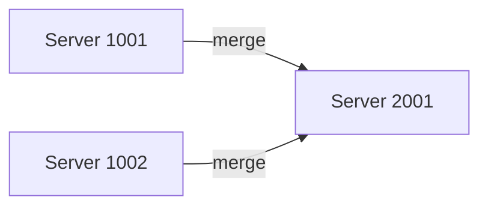
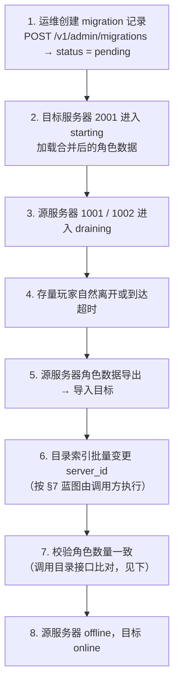
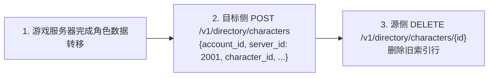
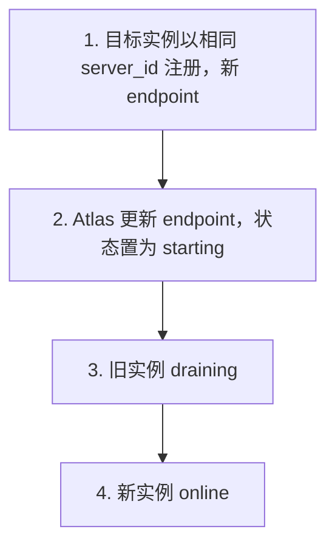
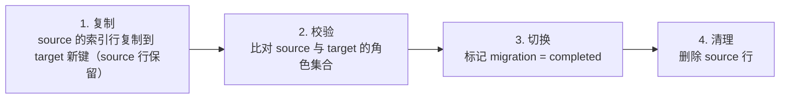
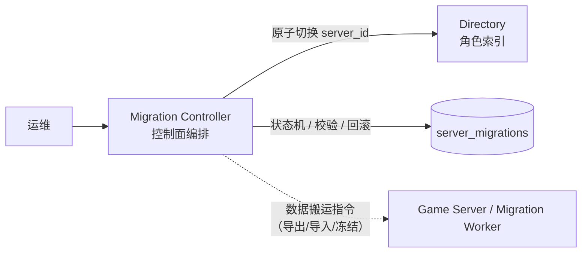

# 合服 / 转服 / 迁服

Atlas 的角色目录设计让它天然适合承载服务器之间的角色迁移。这是 Atlas 相对普通 Service Discovery 的第二大差异点。

---

## 1. 场景

| 场景 | 含义 |
| --- | --- |
| 合服 | 多个服务器合并为一个 |
| 转服 | 玩家把角色从一个服务器移到另一个 |
| 迁服 | 服务器整体搬迁（换机房 / 换集群） |
| 跨区 | 跨 Region 迁移 |

四者在 Atlas 中抽象为同一件事：**角色索引的 `server_id` 从源迁移到目标**。

---

## 2. 合服



### 角色目录的变化

| 字段 | 值 |
| --- | --- |
| `character_id` | 123 |
| `old_server` | 1001 |
| `new_server` | 2001 |

### 过程



> **v0.1 现状**：步骤 1 是 Atlas API（只创建记录，`status = pending`）；步骤 2-5、8
> 是运维与游戏服务器的动作，Atlas 不参与编排，也**不自动推进迁移状态**——
> `migrating` / `verifying` / `completed` 目前没有 API 可达路径（记录会停在
> `pending`，可用的唯一状态推进是 `rollback`）。步骤 6 的索引变更当前没有原子
> 端点（见 §3 现状）；步骤 7 的校验由你调用目录接口完成比对。自动编排是 §7 的
> 设计蓝图，尚未实现。

### 校验

合服最容易出问题的是**角色丢失**。Atlas 在第 7 步提供校验能力：

`GET /v1/directory/servers/{server_id}/characters`（分别拉取源与目标的角色列表）

比对迁移前后的角色数与 `character_id` 集合，确保：

| # | 校验条件 |
| --- | --- |
| 1 | source 角色数 == target 中来自 source 的角色数 |
| 2 | 无 `character_id` 遗漏 |
| 3 | 无 `character_id` 重复 |

---

## 3. 转服

玩家主动转移单个角色。

| 字段 | 值 |
| --- | --- |
| `character_id` | 123 |
| `source_servers` | `["1001"]` |
| `target_server` | 2001 |

> 说明：API 请求体使用 `source_servers` 数组（`CreateMigrationRequest.SourceServers []string`），合服/转服/迁服共用同一端点。转服时数组仅含单个源服务器。

与合服的区别：转服是**单角色粒度**，合服是**服务器粒度**。但对 Atlas 而言都是 `character_index` 中 `server_id` 字段的变更。

> **v0.1 现状**：目录 API 暂无原子变更 `server_id` 的端点——`PATCH
> /v1/directory/characters/{id}` 只接受 `name` / `level` / `class_id` / `avatar`
> （`server_id` 是行定位符，不是可改字段）。当前的落地路径是**建新删旧**两步：



两步**不是事务**：目标建行受注册门禁约束（目标处于维护中/禁止注册会被拒），建删之间同一 `character_id` 可能短暂在两侧并存。原子切换端点是规划项；数据转移本身始终由游戏服务器负责，Atlas 保证的是目录与运行时状态的一致视图。

---

## 4. 迁服

服务器整体搬迁，`server_id` 不变，`endpoint` 变化。

| 服务器 | 阶段 | endpoint |
| --- | --- | --- |
| `game-1001` | before | `10.0.1.21:30001` |
| `game-1001` | after | `10.0.5.88:30001` |

对 Atlas 只是 `servers.endpoint` 的更新，角色索引无需变更。



---

## 5. 数据模型

### server_migrations

```sql
CREATE TABLE server_migrations (
    id             TEXT PRIMARY KEY,
    source_servers JSONB       NOT NULL DEFAULT '[]',
    target_server  TEXT        NOT NULL,
    status         TEXT        NOT NULL DEFAULT 'pending',
    started_at     TIMESTAMPTZ NOT NULL DEFAULT now(),
    completed_at   TIMESTAMPTZ
);
```

`status` 取值：

| status | 含义 |
| --- | --- |
| `pending` | 已创建，未开始 |
| `migrating` | 进行中 |
| `verifying` | 校验中 |
| `completed` | 已完成 |
| `failed` | 失败，需要人工介入 |
| `rolled_back` | 已回滚 |

### character_index 的变更

合服不产生新行，只更新 `server_id`：

```sql
-- 合服：1001 与 1002 并入 2001
UPDATE character_index
   SET server_id = '2001', updated_at = now()
 WHERE server_id IN ('1001', '1002');
```

因为主键是 `(account_id, server_id, character_id)`，`server_id` 变更会改变主键，所以需要：

1. 插入新键行
2. 删除旧键行
3. **在同一个事务中完成**

```sql
BEGIN;

INSERT INTO character_index (account_id, server_id, character_id, name, level, class_id, last_login_at)
SELECT account_id, '2001', character_id, name, level, class_id, last_login_at
  FROM character_index
 WHERE server_id = '1001';

DELETE FROM character_index WHERE server_id = '1001';

INSERT INTO server_migrations (id, source_servers, target_server, status, completed_at)
VALUES ('mig-2026-001', '["1001"]', '2001', 'completed', now());

COMMIT;
```

**这正是角色索引必须放在 PostgreSQL 而不是 Redis 的原因**：跨行事务是刚需。

---

## 6. 迁移 API

### POST /v1/admin/migrations

```json
{
  "source_servers": ["game-1001", "game-1002"],
  "target_server": "game-2001"
}
```

> 请求体只有 `source_servers` 与 `target_server` 两个字段（`CreateMigrationRequest`）。合服 / 转服 / 迁服共用同一个端点，语义由源与目标的数量与关系决定，不需要 `type` 字段。

### GET /v1/admin/migrations/{id}

```json
{
  "id": "mig-2026-001",
  "source_servers": ["game-1001", "game-1002"],
  "target_server": "game-2001",
  "status": "pending",
  "started_at": "2026-10-01T02:00:00Z",
  "completed_at": null
}
```

> 迁移记录不携带 `progress`（角色计数）字段；过程中的校验用第 4 节的目录查询自行比对。

### POST /v1/admin/migrations/{id}/rollback

失败时回滚。前提是迁移过程中的每一步都可逆，因此**迁移必须是幂等且可重放的**。

---

## 7. 幂等与重放

迁移过程中途失败是常态（网络抖动、目标服务器崩溃、磁盘满）。Atlas 对迁移能力的设计要求与 v0.1 现状：

| 要求 | 设计 | v0.1 现状 |
| --- | --- | --- |
| **幂等** | 以 `character_id` 为粒度，重复迁移同一角色不产生副作用 | 目录写端点幂等 upsert：重复创建同一 `(account_id, server_id, character_id)` 视为更新 |
| **可重放** | 记录迁移进度游标，失败后从中断点继续 | 未实现——migration 记录无 `progress` 字段 |
| **可回滚** | 保留源服务器的角色索引直到校验通过 | `POST /v1/admin/migrations/{id}/rollback` 仅把记录标记为 `rolled_back`（唯一可达的状态推进），不执行数据动作 |
| **可校验** | 提供迁移前后角色集合比对接口 | 用目录接口自行比对（§2 第 7 步） |

核心设计：**先复制，后切换，再清理**，而不是原地移动。



这是**设计蓝图**：v0.1 的 Atlas 只提供迁移记录（创建 / 查询 / 回滚）与目录写端点，
编排不会自动发生——每一步都需要调用方（运维脚本或游戏服务器）显式执行。
「任何一步失败，源数据都还在，可以重来」正是把编排交给手动控头的理由。

---

## 8. 为什么归 Atlas 管

一个自然的问题是：**合服不就是游戏服务器自己的事吗？**

不是。原因有三：

1. **跨服务器** — 合服涉及两个以上服务器，任何单个服务器都无法拥有全局视图。
2. **角色索引是 Atlas 的数据** — `character_index` 的归属在 Atlas，`server_id` 的变更只能由 Atlas 原子完成。
3. **可观测性** — 迁移进度、失败原因、回滚记录需要统一的地方呈现给运维。

但要注意边界：

| 归 Atlas | 归游戏服务器 |
| --- | --- |
| 角色索引的 `server_id` 变更 | 角色权威数据的搬移 |
| 迁移记录与状态机 | 迁移过程中玩家的在线体验 |
| 校验索引完整性 | 校验角色数据完整性 |
| 迁移编排 | 具体的数据导入导出 |

Atlas 是**编排者与索引持有者**，不是数据搬运工。

---

## 9. 概念边界：Migration Controller 与 Directory 分离

迁移是控制面能力，不是目录的附属品。两者在**概念与代码模块**上始终分开：

| | Directory | Migration Controller |
| --- | --- | --- |
| 职责 | 角色索引的查询与写入投影 | 迁移的编排状态机（plan / status / cutover / rollback / 校验） |
| 数据 | `character_index` 行 | `server_migrations` 行 |
| 变更对象 | 单个角色的 `server_id`（只归 Directory 改） | 迁移记录本身；需要动索引时**调用** Directory 的原子操作 |
| 对外形态 | `GET/POST/PATCH/DELETE /v1/directory/*` | `POST /v1/admin/migrations*`（独立资源、独立状态机） |



**分工的铁律**：

- Atlas（Migration Controller）管**谁迁到哪里、当前迁移状态、cutover、
  rollback、索引校验**——这是控制面职责，定位声明见
  [architecture.md](architecture.md#_1-总览)。
- 角色数据复制、角色冻结、数据库导出 / 导入、游戏服侧状态迁移
  **归 Game Server / Migration Worker**——数据搬运不是 Atlas 的活。

当前版本两者共存在 Atlas 进程内（API 层已是独立资源），未来若要拆成
独立模块 / 服务，边界从今天就以此为准——至少不得在代码层把
"迁移编排"与"角色索引投影"揉成一个包。v0.1 系列的
`internal/admin`（迁移服务）与 `internal/directory`（索引投影）天然分流，
拆分的唯一动因是独立扩缩容，而不是清理职能。
