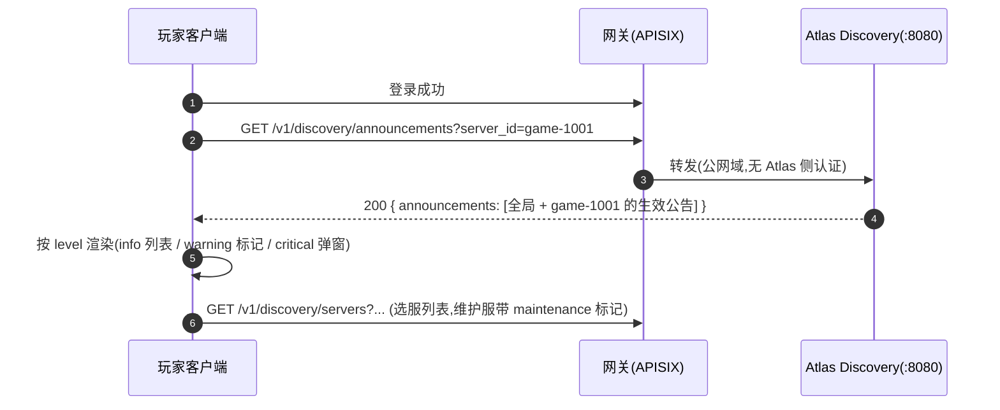
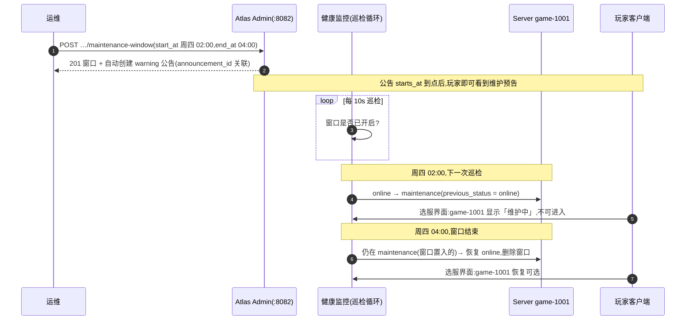

# 公告与计划维护

公告(Announcement)与计划维护窗口(Maintenance Window)是 Atlas 管理面(:8082)面向**运维日常**的两个能力:一个把消息送达玩家客户端,一个把服务器状态按时间表自动切换。两者可以独立使用,也可以联动——创建维护窗口时自动生成一条覆盖同时段的维护公告。

---

## 1. 为什么需要

| 场景 | 没有 Atlas 时 | 有 Atlas 时 |
| --- | --- | --- |
| **紧急故障** | 公告靠客户端热更,发版要等玩家更新;没有统一通道,玩家继续往故障服挤 | Admin 一条 API 发布 `critical` 公告,`starts_at` 设为当前时刻立即生效;客户端下次登录拉 `/v1/discovery/announcements` 即见 |
| **计划停机维护** | 运维定闹钟手动把服务器置维护、手动发公告、维护完再手动恢复,漏一步就是事故 | 提前创建维护窗口:`start_at` 到点自动进入 `maintenance`、`end_at` 到点自动恢复,同时段自动挂 `warning` 公告 |
| **活动预告** | 运营排期表和游戏内公告两套系统,时间对不齐 | `info` 级公告 + 生效区间,提前创建、到点自动出现、过期自动消失 |
| **客户端发版窗口** | 旧版本客户端连新服务器,兼容问题爆发 | 维护窗口 + 公告提示"请更新客户端",窗口结束自动恢复服务 |

核心设计:**声明式,而非操作式**。运维只声明"什么时候、发生什么",到点的状态切换由 Atlas 健康监控的巡检循环自动执行。

---

## 2. 公告系统

### 2.1 概念

公告是一条**带生效区间、面向客户端**的通知。它不修改任何服务器状态,纯粹是信息通道。

```text
Admin 发布 ──▶ Announcement(全局 或 服务器级)──▶ 玩家客户端经 Discovery 拉取
                     │
                     └─ starts_at ≤ now < ends_at 时才出现在 Discovery 响应里
```

字段(完整定义见 [api.md](api.md#post-v1-admin-announcements)):

| 字段 | 必填 | 说明 |
| --- | --- | --- |
| `server_id` | 否 | 缺省(不传)即**全局公告**;传了则只在该服务器的查询中返回 |
| `title` | ✅ | 标题 |
| `body` | 否 | 正文 |
| `level` | 否 | `info` / `warning` / `critical`,缺省 `info` |
| `starts_at` | ✅ | 生效起点(RFC3339) |
| `ends_at` | ✅ | 生效终点,必须晚于 `starts_at` |

服务端生成 `id`(`ann-<纳秒时间戳>`)与 `created_at`。

### 2.2 三级严重度

| 级别 | 语义 | 典型用途 | 客户端建议呈现 |
| --- | --- | --- | --- |
| `info` | 一般信息 | 活动预告、版本更新内容、双倍掉落 | 列表项、跑马灯 |
| `warning` | 需要注意 | 计划维护预告、网络波动、延迟升高 | 选服界面黄色标记、登录弹窗 |
| `critical` | 紧急 | 紧急停机、回档公告、安全事件 | 强弹窗、阻止进入相关服务器 |

### 2.3 生效与可见性

- **时间区间语义**:`starts_at ≤ 当前时间 < ends_at` 才算生效。提前创建、到点自动出现、过期自动消失,无需删除。
- **作用域**:Discovery 端点返回**全局公告 + 所查服务器自己的公告**;查询 A 服务器看不到 B 服务器的公告。
- Admin 侧 `GET /v1/admin/announcements?active=true` 可只看当前生效的,`?server_id=` 过滤(注意:Admin 列表与 Discovery 语义一致,返回全局 + 指定服务器)。

### 2.4 场景演练:紧急故障公告

凌晨 2 点,`game-1001` 出现回档风险,需要立刻通知玩家并阻止进入:

```bash
# 1. 发布 critical 公告,starts_at 设为现在,立即生效
curl -X POST http://localhost:8082/v1/admin/announcements \
  -H 'Content-Type: application/json' \
  -H 'Authorization: Bearer <ADMIN_API_KEY>' \
  -d '{
    "server_id": "game-1001",
    "title": "紧急维护:检测到数据异常",
    "body": "game-1001 暂时停止进入,正在排查数据异常,恢复后另行公告。",
    "level": "critical",
    "starts_at": "2026-10-02T02:00:00Z",
    "ends_at": "2026-10-02T06:00:00Z"
  }'

# 2. 同步把服务器手动置入维护,新玩家不再进入
curl -X POST http://localhost:8082/v1/admin/servers/game-1001/maintenance \
  -H 'Authorization: Bearer <ADMIN_API_KEY>'

# 3. 玩家侧验证:Discovery 只返回生效中的公告
curl 'http://localhost:8080/v1/discovery/announcements?server_id=game-1001'
```

恢复后:运维 `enable` 服务器、`DELETE /v1/admin/announcements/{announcement_id}` 撤下公告(或等它自然过期)。

### 2.5 场景演练:活动预告

提前三天排期,到点自动出现、结束自动消失:

```bash
curl -X POST http://localhost:8082/v1/admin/announcements \
  -H 'Content-Type: application/json' \
  -H 'Authorization: Bearer <ADMIN_API_KEY>' \
  -d '{
    "title": "双倍掉落周末",
    "body": "10 月 5 日 00:00 至 10 月 7 日 24:00,全服双倍掉落。",
    "level": "info",
    "starts_at": "2026-10-04T16:00:00Z",
    "ends_at": "2026-10-07T16:00:00Z"
  }'
```

注意这里**不带 `server_id`**——全局公告,所有服务器的玩家都能看到。

### 2.6 玩家侧如何消费



拉取时机建议:**登录后一次 + 选服界面刷新时一次**。公告是低频写、极高频读的数据,客户端无需轮询;运维发公告的时效预期是"玩家下次进选服界面时看到",而不是推送秒达。

---

## 3. 计划维护窗口

### 3.1 概念:声明式维护

维护窗口是一份**提前声明的时间表**:到 `start_at` 时,健康监控把服务器自动置入 `maintenance`;到 `end_at` 时自动恢复原状态。运维不需要定闹钟。

创建接口:

```bash
curl -X POST http://localhost:8082/v1/admin/servers/game-1001/maintenance-window \
  -H 'Content-Type: application/json' \
  -H 'Authorization: Bearer <ADMIN_API_KEY>' \
  -d '{
    "start_at": "2026-10-08T18:00:00Z",
    "end_at": "2026-10-08T20:00:00Z",
    "announce": true
  }'
```

响应 `201 Created`(完整窗口对象):

```json
{
  "id": "mwin-1759376400000000000",
  "server_id": "game-1001",
  "start_at": "2026-10-08T18:00:00Z",
  "end_at": "2026-10-08T20:00:00Z",
  "previous_status": "",
  "announcement_id": "ann-1759376400000000001",
  "created_at": "2026-10-05T09:30:00Z"
}
```

| 字段 | 说明 |
| --- | --- |
| `previous_status` | 窗口应用前服务器的状态;窗口开启前为空。应用后为空表示没有恢复目标(见 §3.4 边界规则) |
| `announcement_id` | `announce: true`(缺省)时自动创建的维护公告 ID,两边已关联 |
| `start_at` | 可省略——省略即"现在开始",对应"今晚维护到搞定为止"的常见流 |

### 3.2 场景演练:每周四凌晨例行维护

1. **周三**,运维为舰队里每台需要维护的服务器批量创建窗口(`start_at` 周四 02:00、`end_at` 04:00,`announce` 缺省):
   每台服务器同时多出一条 warning 级公告「Maintenance scheduled: game-1001」,生效区间与窗口完全一致,周四 02:00 前玩家就能在选服界面看到预告。
2. **周四 02:00**,健康监控的下一次巡检(默认每 10 秒)发现窗口到期,把 `online` 的服务器自动置入 `maintenance`,`previous_status` 记为 `online`。
3. **窗口期间**:选服列表里该服务器带 `maintenance` 标记(可见但不可进入);游戏服务器自己的心跳照常上报,不受影响。
4. **周四 04:00**,巡检发现窗口结束:服务器仍处于窗口置入的 `maintenance` → 自动恢复为 `online`,窗口记录删除。公告也已过 `ends_at`,自动从 Discovery 消失。



### 3.3 定时进入维护的机制

健康监控的巡检循环(与心跳判活同一个循环,见 [lifecycle.md §5](lifecycle.md#_5-计划维护窗口-v0-1-20))在心跳检查**之前**处理窗口:

| 时机 | 行为 |
| --- | --- |
| `start_at` 到达 | 服务器处于 auto-managed 状态(starting / online / suspect)→ 置入 `maintenance`,`previous_status` 记原状态 |
| `end_at` 到达 | 服务器仍处于**该窗口置入的** `maintenance` → 恢复 `previous_status`,删除窗口记录 |
| 服务器已是 `maintenance` / `offline` / `draining` / `disabled` | 不动它;窗口标记为已应用(`previous_status` 留空),结束时不恢复任何东西 |

与直接调 `POST /v1/admin/servers/{id}/maintenance` 的区别:**手动维护是"立即+人工恢复"**,窗口是"定时+自动恢复"。窗口只负责它自己放入的服务器。

### 3.4 公告联动(announce)

`announce` 缺省为 `true`,创建窗口时会**同时**创建一条公告:

| 属性 | 值 |
| --- | --- |
| 作用域 | 该服务器(server_id 同窗口) |
| 级别 | `warning` |
| 标题 | `Maintenance scheduled: <server_id>` |
| 正文 | `Server <server_id> will be under maintenance from <start> to <end>.`(RFC3339) |
| 生效区间 | 与窗口 `start_at` / `end_at` 完全一致 |

两个方向各自独立:

- `announce: false` → 只建窗口,不发公告(比如内部压测,不想惊动玩家)。
- 想要自定义文案?`announce: false` 建窗口,再自己 `POST /v1/admin/announcements` 发一条中文公告,区间对齐即可。自动公告的文案是英文模板,正式运营建议自管公告。

**取消窗口(DELETE)不会撤回已创建的公告**——公告有独立的生效区间,到点自动过期;需要立刻消失就单独 DELETE 公告。

### 3.5 边界规则(运维优先)

自动状态机永不覆盖运维决策:

- 窗口开启时服务器处于 `draining` / `disabled`(运维显式设置)或已 `offline` → **不动它**。
- 窗口期间运维手动转移(比如 `drain`)→ 以运维操作为准,窗口结束**不会**把服务器拉回来。
- 取消一个进行中的窗口 → 服务器保持当前状态;要把它从维护里拉出来,走正常的 `POST /v1/admin/servers/{id}/enable`。

---

## 4. 端点速查

| 方法 | 路径 | 说明 |
| --- | --- | --- |
| `POST` | `/v1/admin/announcements` | 发布公告(缺省全局;level 缺省 info) |
| `GET` | `/v1/admin/announcements` | 列出公告,`?server_id=` / `?active=true` / `?limit=` |
| `DELETE` | `/v1/admin/announcements/{announcement_id}` | 删除公告(204) |
| `GET` | `/v1/discovery/announcements` | 客户端拉取生效公告(全局 + `?server_id=`) |
| `POST` | `/v1/admin/servers/{id}/maintenance-window` | 创建计划维护窗口(announce 缺省 true) |
| `GET` | `/v1/admin/maintenance-windows` | 窗口列表(新→旧),`?server_id=` / `?limit=` |
| `DELETE` | `/v1/admin/maintenance-windows/{window_id}` | 取消窗口(不撤公告、不动已维护中的服务器) |

Admin 端点需 `Authorization: Bearer <ADMIN_API_KEY>`(`ATLAS_ADMIN_API_KEYS`,开发模式不配置则开放);Discovery 端点为公网只读。错误码与字段约束的完整定义见 [api.md](api.md#admin)。

---

## 5. 相关文档

- [API 参考](api.md) — 端点的请求/响应与错误码完整定义
- [服务器生命周期](lifecycle.md) — `maintenance` 状态在状态机中的位置、心跳判活与窗口巡检机制
- [数据模型](data-model.md) — `maintenance_windows` / `announcements` 表结构
- [安全](security.md) — Admin 域的 API Key、RBAC 与审计
