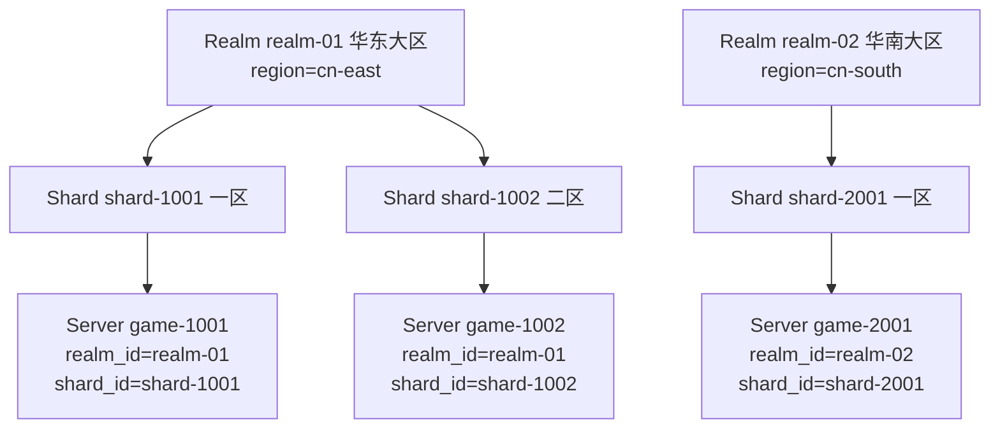

# Realm 与 Shard

**什么场景用**：游戏开到多个大区（华东 / 华南 / 海外）、一个大区里又分多组服（一区 / 二区 /
体验服）时，需要一层运营档案来回答"这台服属于哪个大区、哪组分服"，并让玩家端按大区或
分服拉服务器列表。Realm（大区）→ Shard（分服）→ Server（实例）就是这三层。

不需要多区分服运营的游戏**可以完全不用它们**——不写 `realm_id` / `shard_id`，一切照常
（层级是可选的，见[概念模型](/concepts)§2）。

## 一屏看懂



- **Realm** 归 `region`（地理/接入维度），**Shard** 归 Realm，**Server** 用
  `realm_id` / `shard_id` 两个弱引用字段挂进去。
- **弱引用**：注册服务器时可以先写 `realm_id` / `shard_id` 再补建档案（Atlas 不做外键
  校验）；档案服务于**检索筛选与运营视图**，删除或缺失不影响注册与心跳。

## 跑起来什么样

三步：建大区 → 建分服 → 服务器挂进去，然后玩家端按维度拉列表。

```bash
# 1. 建大区（管理端 :8082）
curl -X POST http://localhost:8082/v1/admin/realms \
  -H 'Content-Type: application/json' \
  -d '{"id":"realm-01","name":"华东大区","region":"cn-east"}'
# {"id":"realm-01","name":"华东大区","region":"cn-east","status":"active","created_at":"…"}

# 2. 大区下建分服
curl -X POST http://localhost:8082/v1/admin/shards \
  -H 'Content-Type: application/json' \
  -d '{"id":"shard-1001","name":"一区","realm_id":"realm-01"}'
# {"id":"shard-1001","realm_id":"realm-01","name":"一区","status":"active","created_at":"…"}

# 3a. 服务器注册时挂进去（:8081）
curl -X POST http://localhost:8081/v1/registry/servers/register \
  -H 'Content-Type: application/json' \
  -d '{"server_id":"game-1001","region":"cn-east","realm_id":"realm-01","shard_id":"shard-1001",
       "endpoint":{"host":"10.0.1.21","port":30001},"capacity":2000}'

# 3b. 已注册的服务器换分服？重注册即更新（幂等，字段覆盖）
```

玩家端按维度筛选（:8080）：

```bash
curl 'http://localhost:8080/v1/discovery/servers?realm=realm-01'
# 华东大区全部在线服务器

curl 'http://localhost:8080/v1/discovery/servers?shard=shard-1001&status=online'
# 指定分服的在线服务器
```

运营侧查档案（:8082）：

```bash
curl 'http://localhost:8082/v1/admin/realms?limit=50'      # 全部大区（新→旧）
curl 'http://localhost:8082/v1/admin/shards?realm_id=realm-01'  # 大区下的分服
```

## 典型场景

### 新大区开服

1. `POST /v1/admin/realms` 建大区档案；
2. `POST /v1/admin/shards` 建首组分服；
3. 新服务器配置里写上 `realm_id` / `shard_id`（[配置化声明](/server-config)或注册 API 均可）；
4. 客户端按 `?realm=` 拉列表，自然只看到新区。

### 分服合并（合服）

Shard 层面的合并由[合服迁移](/migration)完成：`POST /v1/admin/migrations` 把源服务器角色
索引原子迁到目标，之后源服务器下线、客户端按同一 `shard` 维度筛选即可无感。

### 玩家跨服查询带大区语境

`GET /v1/directory/accounts/{id}/characters` 返回的角色自带 `server_id`，配合发现列表的
`realm_id` / `shard_id` 即可在客户端把"角色 → 所在大区/分服"一次渲染出来。

## API 速查（:8082）

| Method | Path | 说明 |
| --- | --- | --- |
| `POST` | `/v1/admin/realms` | 建大区；`{id, name, region, status?}`，`status` 缺省 `active`；重 ID → `409 REALM_EXISTS` |
| `GET` | `/v1/admin/realms?limit=` | 大区列表（`created_at` 倒序，默认 50） |
| `POST` | `/v1/admin/shards` | 建分服；`{id, name, realm_id, status?}`；大区不存在 → `404 REALM_NOT_FOUND`，重 ID → `409 SHARD_EXISTS` |
| `GET` | `/v1/admin/shards?realm_id=&limit=` | 分服列表，可按大区过滤 |

服务器侧只有两个弱引用字段：注册体里的 `realm_id` / `shard_id`（可后补），与发现筛选的
`?realm=` / `?shard=`。
