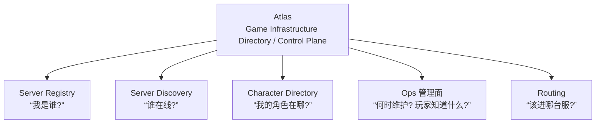

# 路线图

## 最终定位

> **Atlas is a game infrastructure control plane for online games — Server Registry / Server Discovery / Player Character Directory / Routing & Placement Metadata / Server Lifecycle / Operational Coordination. Not a game backend, not a server list service.**



定位声明与 NEVER-owns 边界（角色权威数据 / 对局状态 / 玩家 Session / 数值经济 / 账号认证）见
[architecture.md](architecture.md#_1-总览) 首屏；这个定位比单纯的 Game Server Discovery 更完整，
而且与游戏服务器框架、账号系统天然互补。

---

## 当前状态:v0.1 系列全量交付

**v0.1 系列（内部里程碑 v0.1.0 ~ v0.1.20）已经全部交付完毕**，对外发布四个 release：

| Release | 内容 |
| --- | --- |
| [v0.1.0](https://github.com/cuihairu/atlas/releases/tag/v0.1.0) | MVP：核心模型跑通（Registry / Discovery / Directory / 健康监控 / REST API） |
| [v0.1.1](https://github.com/cuihairu/atlas/releases/tag/v0.1.1) | v0.1 系列收官：MVP 之上补齐全部工程化能力（69 个提交） |
| [v0.1.2](https://github.com/cuihairu/atlas/releases/tag/v0.1.2) | 跨服配置中心 + 服务器标记体系 + 声明式服务器配置 + 管理台扩展 + Docker/部署腿（50 个提交） |
| [v0.1.3](https://github.com/cuihairu/atlas/releases/tag/v0.1.3) | v0.2 前奏：OTel 链路追踪 + 六 SDK 巩固 + memory 倒排索引/写队列 + dash 存储队列可观测 |

> 早期路线图曾把事件驱动、SDK、gRPC、高可用分别规划在 v0.2 ~ v1.0。实际开发中它们以 v0.1.x 内部里程碑的形式全部完成于 0.1 系列内——**原 v0.2 ~ v1.0 的每一项都已交付**，见下表。

### 已交付能力总览

| 能力 | 交付内容 | 里程碑 |
| --- | --- | --- |
| ✅ Server Registry | register / heartbeat / unregister，幂等注册，重注册恢复 | v0.1.0（恢复语义 v0.1.x 巡检修复） |
| ✅ Server Discovery | 多维筛选 + 游标分页 + 服务器详情 | v0.1.0 |
| ✅ Character Directory | CRUD + 账号跨服索引，幂等投影 | v0.1.0 |
| ✅ 生命周期状态机 | starting / online / draining / maintenance / suspect / offline / disabled，两段式掉线判定 | v0.1.0 起，v0.1.x 补全 |
| ✅ Admin 生命周期操作 | maintenance / drain / enable / disable | v0.1.x |
| ✅ 事件同步 | EventAdapter 抽象 + HTTP / Redis Streams / Kafka / NATS(JetStream) / RabbitMQ | v0.1.2 / v0.1.12 |
| ✅ Prometheus 指标 | :8082 `/metrics`（Grafana 为外接指引，见 topology.md——仓库内无看板实体） | v0.1.3 |
| ✅ Routing 接入推荐 | `GET /v1/routing/recommended`，同账号角色粘滞 | v0.1.x |
| ✅ gRPC 双传输 | 5 服务 22 RPC，:9090（核心面与 REST 同源，管理面扩展端点为 REST-only） | v0.1.5 |
| ✅ 六语言 SDK | Go(双传输) / C++ / Python(同步异步) / JS/TS / Java / C#，自动心跳内置 | v0.1.6 ~ v0.1.11 |
| ✅ APISIX 插件 | atlas-auth 玩家 token 鉴权注入 + atlas-ratelimit 端点组限流 | v0.1.13 |
| ✅ Realm / Shard 管理 | Admin CRUD + 三存储实现 + 索引迁移 | v0.1.14 |
| ✅ 健康告警 | suspect / offline 占比阈值 + webhook 通知（锁存语义） | v0.1.15 |
| ✅ 角色索引分片 | account-hash 分片 + 跨分片查询 + 重切工具 | v0.1.16 |
| ✅ 安全加固 | Registry mTLS、Admin RBAC + 审计（证书指纹）、令牌桶限流、三端口安全域 | v0.1.17 |
| ✅ Dashboard 增强 | 实时服务器地图、玩家趋势、迁移进度、主题切换、中英 i18n | v0.1.18 |
| ✅ 高可用 | Redis 哨兵/集群、PG 连接池调优、HAProxy 心跳扇入、主从复制指南 | v0.1.19 |
| ✅ 管理面：维护窗口与公告 | 服务器元数据、计划维护窗口（定时自动进出）、公告系统（三级严重度） | v0.1.20 |
| ✅ 质量基建 | service/handler 覆盖率 >80% 目标（CI 报告 + Codecov 上报，未作失败门禁）、性能基准、Dependabot、周期安全审计 CI | v0.1.x |

能力怎么用、什么场景用，见 [README 使用场景](https://github.com/cuihairu/atlas#使用场景) 与 [公告与计划维护](operations.md)。

### 明确不做（范围纪律）

```text
❌ Kubernetes Operator      —— Atlas 是普通无状态服务，compose/k8s 自行编排即可
❌ Service Mesh 集成        —— 不绑定任何 mesh，保持标准 REST/gRPC
❌ 复杂调度算法             —— Routing 只做推荐/定位元数据，不做调度器
❌ 强绑定 APISIX            —— 网关永远是可选集成层
❌ 角色权威数据              —— Directory 永远是 Projection
❌ 匹配 / 排队 / 房间        —— 撮合决策是 Scheduler 的职责，Atlas 不进匹配池
❌ 实例 / Zone 分配          —— 实例创建与放置归实例管理器，Atlas 只发布候选集
❌ 玩家 Session / 登录态     —— 会话恢复归游戏侧管理服务
❌ 背包 / 经济 / 排行榜等业务表 —— 游戏业务数据库的事，Atlas 连列都不建
```

这些不是"还没做"，是**设计决定**：Atlas 是控制面目录服务，以上每一项都有更合适的归属。
它们可以与 Atlas 集成（调度器读 Discovery 候选集、玩家服务写 Directory 事件），
但**不内建**——判别式见 [architecture.md](architecture.md#_1-总览) 定位声明。

---

## v0.2+ 候选方向

以下是**候选清单，不是承诺**——按需求驱动排期，欢迎 issue 讨论：

| 方向 | 说明 | 前置条件 |
| --- | --- | --- |
| **API 稳定化与 v1.0** | 冻结 REST/gRPC 契约、承诺兼容性、正式 v1.0 release | API 面在生产环境验证充分 |
| ✅ **Discovery 读路径管线化**（P1，2026-10-04 交付） | `RuntimeStore.GetRuntimes` 批量读：Redis pipeline 一次 Exec（N 次 RTT → 1–2 次，Cluster 按 slot 分批）、memory 单锁读全；列表路径批量合并、单点详情不变；契约测试与降级语义钉住（commit 9f99745 / 8201f57）。决策面收尾（2026-10-05）：健康巡检 sweep 与 Routing 推荐/诊断合并同样批量，失败 fail closed 传播 | 已完成；基准与往返估算见 [性能设计](/performance) §2 / [基准页](/benchmarks) §3 |
| ✅ **故障模式回归套件**（P1，2026-10-04 交付） | 「正确性优先于 QPS」演练矩阵（[性能设计](/performance) §7）逐项自动化：分区巡检 / 重注册契约 / 幂等与 rollback / Redis FLUSHALL 数据丢失（miniredis 兜底，契约不再 skip）；仅 PG 连接池自愈与副本宕机保留为部署级演练（ha.md） | 已完成，验证位置见 §7 表格 |
| 🔒 **状态三态显式化（已定档）** | 概念定稿（lifecycle §0 / architecture §4.4 / data-model 存储批注）+ 代码批注落位（`ServerStatus` 类型与 `Server.Status` 字段已标注三态分层）；**字段 / 接口重命名未做**——只在 v1.0 API 冻结窗口执行，避免契约碎片化 | v1.0 API 冻结窗口（触发即执行） |
| 🔒 **Migration Controller 独立模块（已定档）** | 概念边界定稿（migration §9）且代码分流已在位（`internal/admin` 编排 / `internal/directory` 投影零交叉）；**代码拆分未做**——只在独立扩缩容有真实需求时执行 | 多舰队独立迁移集群 / 独立扩缩容（触发即执行） |
| ✅ **Routing 维护前引导**（P1，2026-10-04 交付） | 推荐感知维护窗口：活动窗口或 Lead 内（缺省 5m，`ATLAS_ROUTING_MAINTENANCE_LEAD` 可调）开始的服务器进入排除——strict/fallback 两阶段一致生效，全排除如实 404；diagnose 逐台摊开窗口判定（`maintenance_window` 字段 + `maintenance_window=active|upcoming` 原因），`eligible` 计入窗口 | 已完成，语义见 [API §Routing](/api#routing) 与 [生命周期 §5](/lifecycle#_5-计划维护窗口-v0-1-20) |
| **Routing 策略扩展（余项）** | 权重、灰度放量的白名单——仍只做推荐元数据，不越调度边界 | 有真实运营需求反馈 |
| **公告与窗口批量编排** | 舰队级窗口模板、批量创建、与迁移编排联动 | 多服务器运营场景验证 |
| ✅ **可观测性深化（首期 + 注册写路径 + Admin 计数 + span 树）** | 首期：请求级追踪 X-Request-ID 贯通三监听口 + 目录写路径延迟指标 `atlas_directory_write_duration_seconds`；二期（2026-10-04）：注册写路径指标 `atlas_registry_write_duration_seconds{op}`（`op` = register / heartbeat / unregister）——全舰队最热写路径，写劣化先于此显形；三期（2026-10-07）：`atlas_admin_requests_total` 接入 gRPC Admin RPC（endpoint=全方法名、status=映射 HTTP 码，链序与 REST 同为最外层、被拒调用同样计数）；四期（2026-10-07）：X-Request-ID 贯通 gRPC 口（`x-request-id` metadata 沿用/生成/回显 + `grpc request` 访问日志，追踪拦截器最外层，被拒 RPC 同样有 id）；五期（2026-10-08）：OpenTelemetry span 树拍板落地——官方 OTel Go SDK + OTLP/HTTP 导出（协议是承诺，后端不锁定，Jaeger / Tempo / 厂商 collector 皆可收），`ATLAS_OTLP_ENDPOINT` 未配置即全局 no-op 零开销（与 gRPC TLS 未配置即明文同一默认哲学），REST 按路由模式 / gRPC 按全方法名开 server root span，注册 / 发现 / 路由 / 目录四服务自动挂 `internal` 子 span 成树，`atlas.request_id` 与 X-Request-ID 同 id 日志链路互查，ParentBased 采样 `ATLAS_TRACING_SAMPLE_RATIO` | 已完成；指标仍走 Prometheus，不引入第二套 metrics 后端（0fe965d / f5359e2） |
| **Kubernetes 部署样例** | Helm chart / Operator 仍是"明确不做"，但部署样例可讨论 | 有部署需求提出 |

---

## 演进原则

### 1. 先跑通模型，再谈工程化

0.1 系列证明了这条顺序是对的：核心模型（注册、发现、投影）先稳定，事件总线、SDK、gRPC、高可用都是在这个底座上按里程碑叠加的。

### 2. Atlas Core 独立于任何网关

APISIX 从第一天起就是**可选集成层**，不是依赖。这个原则贯穿所有版本。

### 3. Character Directory 永远是 Projection

任何版本都不要让 Atlas 持有角色权威数据。这是职责边界，不是性能取舍。

### 4. 写入接口从第一天就幂等

无论是 HTTP 还是 Message Bus，重试都不应产生副作用。这个决定成本极低，但后悔成本极高。

### 5. 层级结构保持可选

Region / Realm / Shard 的可选性不会因为功能增加而收紧。MMORPG、MOBA、SLG 的拓扑差异是永久的。

### 6. 边界先定死，再扩功能（Control Plane 纪律）

任何新功能立项先回答"这是目录性问题还是运行时问题"：

- 目录性问题（谁在线 / 角色在哪 / 该进哪台服 / 何时维护）——候选，按需求排期；
- 运行时问题（能进不能进 / 怎么撮合 / 实例开哪 / 背包有什么）——**不内建**，给出与 Atlas 的集成点即可。

这条纪律是「明确不做」清单的活判据，防止 Atlas 膨胀成游戏平台后端。
定位声明见 [architecture.md](architecture.md#_1-总览)，模块边界见 [migration.md](migration.md) §9。

---

## 项目结构

```text
atlas/
├── cmd/                    服务入口与工具（atlas 主服务 / crossagent / demoagents / reshard）
├── internal/
│   ├── model/              领域模型（Server, Character, Realm, Shard…）
│   ├── store/              存储接口
│   │   ├── memory/         内存实现（测试 + 开发）
│   │   ├── postgres/       PostgreSQL 实现
│   │   ├── mysql/          MySQL 实现
│   │   ├── redisstore/     Redis 运行时状态
│   │   └── sharded/        一致性哈希分片包装
│   ├── registry/           注册 / 心跳 / 注销
│   ├── discovery/          服务器发现
│   ├── directory/          角色目录
│   ├── routing/            接入推荐
│   ├── admin/              Admin 服务（Realm/Shard/维护窗口/公告/迁移/审计）
│   ├── health/             健康监控（自动掉线 + 占比告警）
│   ├── event/              事件适配器（redis/kafka/nats/rabbitmq）
│   ├── httpapi/            REST API handlers
│   ├── grpc/               gRPC 服务
│   ├── metrics/            Prometheus 指标
│   ├── tlsutil/            mTLS 辅助
│   ├── tracing/            请求追踪（X-Request-ID 贯通三监听口）
│   ├── crossserver/        跨服配置中心（发布 / 订阅 / 回调 / 轮询）
│   ├── fleet/              舰队实时索引（load-series / 匹配判定）
│   ├── serversconfig/      服务器配置文件托管（config-owned 记录）
│   ├── telemetry/          负载与总线序列采样（load-series / bus-series）
│   ├── config/             环境变量配置
│   └── version/            版本信息
├── api/proto/              gRPC proto 定义
├── migrations/             SQL migration
├── sdk/                    六语言 SDK（go/cpp/python/js/java/csharp）
├── plugins/apisix/         APISIX 接入插件
├── dashboard/              内置管理台（前端源码与构建产物）
├── examples/               各语言可运行示例
├── deploy/                 haproxy / postgres / redis 部署配置
├── deployments/docker/     Dockerfile + docker-compose
├── docs/                   设计文档（VitePress 站点）
├── Makefile
├── .env.example
└── go.mod
```

**当前状态**：v0.1 系列交付完毕，对外发布四个 release（v0.1.0 ~ v0.1.3，v0.1.3 为最新）。后续方向见「v0.2+ 候选方向」。
