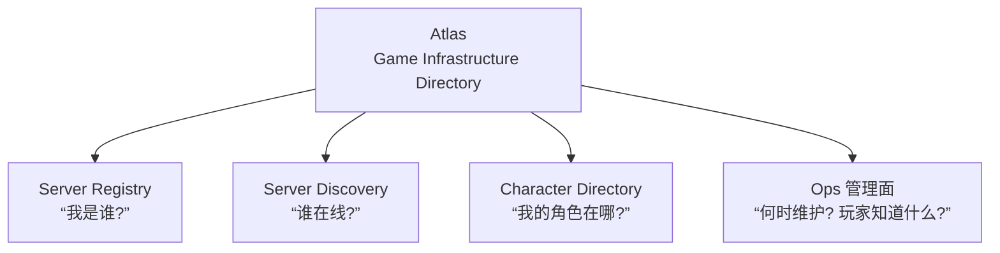

# 路线图

## 最终定位

> **Atlas is a lightweight control plane for online games, providing game server registration, discovery, health tracking, and account-to-character directory services.**



这个定位比单纯的 Game Server Discovery 更完整，而且以后做游戏服务器框架、账号系统时都能复用。

---

## 当前状态:v0.1 系列全量交付

**v0.1 系列（内部里程碑 v0.1.0 ~ v0.1.20）已经全部交付完毕**，对外发布两个 release：

| Release | 内容 |
| --- | --- |
| [v0.1.0](https://github.com/cuihairu/atlas/releases/tag/v0.1.0) | MVP：核心模型跑通（Registry / Discovery / Directory / 健康监控 / REST API） |
| [v0.1.1](https://github.com/cuihairu/atlas/releases/tag/v0.1.1) | v0.1 系列收官：MVP 之上补齐全部工程化能力（69 个提交） |

> 早期路线图曾把事件驱动、SDK、gRPC、高可用分别规划在 v0.2 ~ v1.0。实际开发中它们以 v0.1.x 内部里程碑的形式全部完成于 0.1 系列内——**原 v0.2 ~ v1.0 的每一项都已交付**，见下表。

### 已交付能力总览

| 能力 | 交付内容 | 里程碑 |
| --- | --- | --- |
| ✅ Server Registry | register / heartbeat / unregister，幂等注册，重注册恢复 | v0.1.0（恢复语义 v0.1.x 巡检修复） |
| ✅ Server Discovery | 多维筛选 + 游标分页 + 服务器详情 | v0.1.0 |
| ✅ Character Directory | CRUD + 账号跨服索引，幂等投影 | v0.1.0 |
| ✅ 生命周期状态机 | starting / online / draining / maintenance / suspect / offline / disabled，两段式掉线判定 | v0.1.0 起，v0.1.x 补全 |
| ✅ Admin 生命周期操作 | maintenance / drain / enable / disable | v0.1.x |
| ✅ 事件同步 | EventAdapter 抽象 + HTTP / Redis Streams / Kafka / NATS(JetStream) / RabbitMQ | v0.1.2 / v0.1.12 |
| ✅ Prometheus 指标 | :8082 `/metrics` + Grafana 概览看板 | v0.1.3 |
| ✅ Routing 接入推荐 | `GET /v1/routing/recommended`，同账号角色粘滞 | v0.1.x |
| ✅ gRPC 双传输 | 5 服务 22 RPC，:9090，与 REST 同一 API 面 | v0.1.5 |
| ✅ 六语言 SDK | Go(双传输) / C++ / Python(同步异步) / JS/TS / Java / C#，自动心跳内置 | v0.1.6 ~ v0.1.11 |
| ✅ APISIX 插件 | atlas-auth 玩家 token 鉴权注入 + atlas-ratelimit 端点组限流 | v0.1.13 |
| ✅ Realm / Shard 管理 | Admin CRUD + 三存储实现 + 索引迁移 | v0.1.14 |
| ✅ 健康告警 | suspect / offline 占比阈值 + webhook 通知（锁存语义） | v0.1.15 |
| ✅ 角色索引分片 | account-hash 分片 + 跨分片查询 + 重切工具 | v0.1.16 |
| ✅ 安全加固 | Registry mTLS、Admin RBAC + 审计（证书指纹）、令牌桶限流、三端口安全域 | v0.1.17 |
| ✅ Dashboard 增强 | 实时服务器地图、玩家趋势、迁移进度、主题切换、中英 i18n | v0.1.18 |
| ✅ 高可用 | Redis 哨兵/集群、PG 连接池调优、HAProxy 心跳扇入、主从复制指南 | v0.1.19 |
| ✅ 管理面：维护窗口与公告 | 服务器元数据、计划维护窗口（定时自动进出）、公告系统（三级严重度） | v0.1.20 |
| ✅ 质量基建 | service/handler 覆盖率 >80% 门禁、性能基准、Dependabot、周期安全审计 CI | v0.1.x |

能力怎么用、什么场景用，见 [README 使用场景](https://github.com/cuihairu/atlas#使用场景) 与 [公告与计划维护](operations.md)。

### 明确不做（范围纪律）

```text
❌ Kubernetes Operator      —— Atlas 是普通无状态服务，compose/k8s 自行编排即可
❌ Service Mesh 集成        —— 不绑定任何 mesh，保持标准 REST/gRPC
❌ 复杂调度算法             —— Routing 只做推荐元数据，不做调度器
❌ 强绑定 APISIX            —— 网关永远是可选集成层
❌ 角色权威数据              —— Directory 永远是 Projection
```

这些不是"还没做"，是**设计决定**：Atlas 是控制面目录服务，以上每一项都有更合适的归属。

---

## v0.2+ 候选方向

以下是**候选清单，不是承诺**——按需求驱动排期，欢迎 issue 讨论：

| 方向 | 说明 | 前置条件 |
| --- | --- | --- |
| **API 稳定化与 v1.0** | 冻结 REST/gRPC 契约、承诺兼容性、正式 v1.0 release | API 面在生产环境验证充分 |
| **Routing 策略扩展** | 权重、灰度放量的白名单、维护前引导(把玩家引向非维护服) | 有真实运营需求反馈 |
| **公告与窗口批量编排** | 舰队级窗口模板、批量创建、与迁移编排联动 | 多服务器运营场景验证 |
| **可观测性深化** | 请求级 tracing、目录写路径延迟指标 | 生产部署规模上来之后 |
| **Kubernetes 部署样例** | Helm chart / Operator 仍是"明确不做"，但部署样例可讨论 | 有部署需求提出 |

---

## 演进原则

### 1. 先跑通模型，再谈工程化

0.1 系列证明了这条顺序是对的：核心模型（注册、发现、投影）先稳定，事件总线、SDK、gRPC、高可用都是在这个底座上按里程碑叠加的。

### 2. Atlas Core 独立于任何网关

APISIX 从第一天起就是**可选集成层**，不是依赖。这个原则贯穿所有版本。

### 3. Character Directory 永远是 Projection

任何版本都不要让 Atlas 持有角色权威数据。这是职责边界，不是性能取舍。

### 4. 写入接口从第一天就幂等

无论是 HTTP 还是 Message Bus，重试都不应产生副作用。这个决定成本极低，但后悔成本极高。

### 5. 层级结构保持可选

Region / Realm / Shard 的可选性不会因为功能增加而收紧。MMORPG、MOBA、SLG 的拓扑差异是永久的。

---

## 项目结构

```text
atlas/
├── cmd/atlas/              主服务入口
├── internal/
│   ├── model/              领域模型（Server, Character, Realm, Shard…）
│   ├── store/              存储接口
│   │   ├── memory/         内存实现（测试 + 开发）
│   │   ├── postgres/       PostgreSQL 实现
│   │   ├── mysql/          MySQL 实现
│   │   ├── redisstore/     Redis 运行时状态
│   │   └── sharded/        一致性哈希分片包装
│   ├── registry/           注册 / 心跳 / 注销
│   ├── discovery/          服务器发现
│   ├── directory/          角色目录
│   ├── routing/            接入推荐
│   ├── admin/              Admin 服务（Realm/Shard/维护窗口/公告/迁移/审计）
│   ├── health/             健康监控（自动掉线 + 占比告警）
│   ├── event/              事件适配器（redis/kafka/nats/rabbitmq）
│   ├── httpapi/            REST API handlers
│   ├── grpc/               gRPC 服务
│   ├── metrics/            Prometheus 指标
│   ├── tlsutil/            mTLS 辅助
│   ├── config/             环境变量配置
│   └── version/            版本信息
├── api/proto/              gRPC proto 定义
├── migrations/             SQL migration
├── sdk/                    六语言 SDK（go/cpp/python/js/java/csharp）
├── plugins/apisix/         APISIX 接入插件
├── examples/               各语言可运行示例
├── deploy/                 haproxy / postgres / redis 部署配置
├── deployments/docker/     Dockerfile + docker-compose
├── docs/                   设计文档（VitePress 站点）
├── Makefile
├── .env.example
└── go.mod
```

**当前状态**：v0.1 系列交付完毕，release v0.1.1 为系列收官。后续方向见「v0.2+ 候选方向」。
