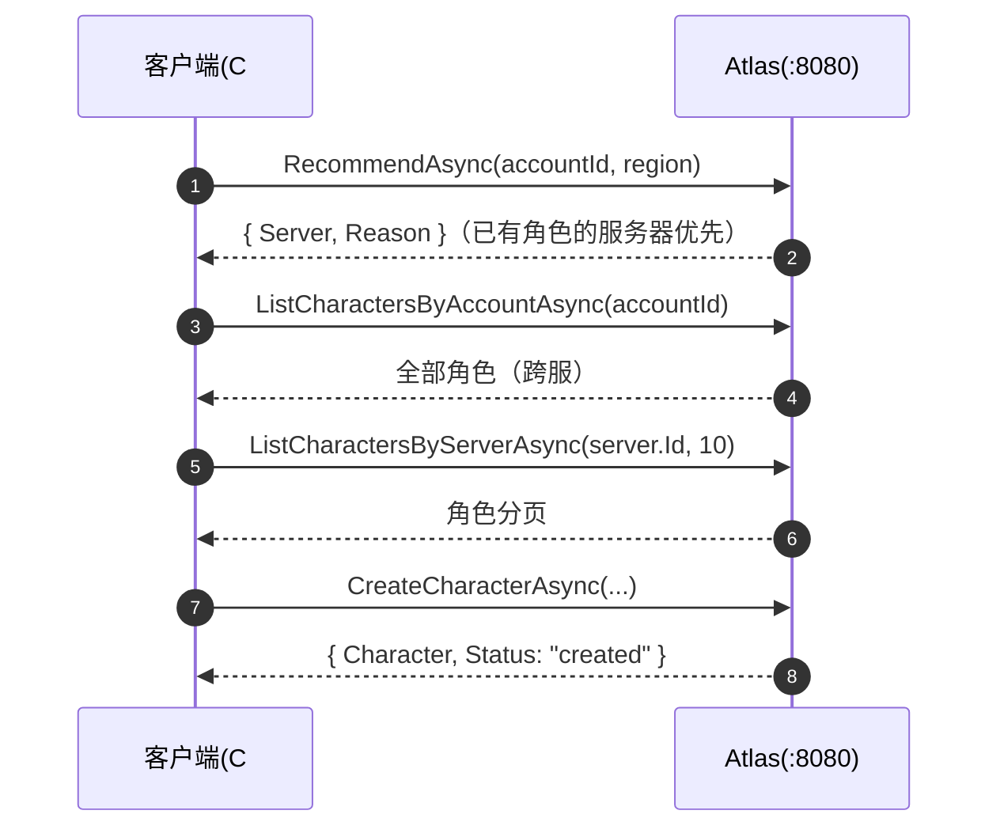

# C# SDK

`sdk/csharp/`（v0.1.11 交付）。HttpClient + System.Text.Json 的 REST
客户端，与 Go / C++ / Python / JS / Java SDK 同一 API 面。目标
net8.0 + net10.0，零第三方依赖，NuGet 包名 `Atlas.Client`。

## 安装

```bash
dotnet add package Atlas.Client
```

## 快速上手

```csharp
using Atlas;

var options = new AtlasClientOptions
{
    BaseUrl = "http://localhost:8080",
    RegistryBaseUrl = "http://localhost:8081", // Registry 独立端口（可选）
    RegistryToken = "...",                     // Registry 域 Bearer
    AdminApiKey = "...",                       // Admin 域 API Key
};
using var client = new AtlasClient(options);

var reg = await client.RegisterAsync(new RegisterRequest(   // 注册
    "game-1001", "Game 1001", "cn-east",
    new Endpoint { Host = "10.0.0.1", Port = 30001 }, 2000));

await client.HeartbeatAsync("game-1001", new HeartbeatRequest()); // 首跳同步：在线后才可被发现
var loop = client.StartHeartbeat("game-1001", TimeSpan.FromSeconds(10), // 自动心跳
    onError: e => Console.Error.WriteLine(e));
loop.Set(players: 120, load: 0.35);                         // 游戏线程更新负载

var rec = await client.RecommendAsync(42, "cn-east");       // 接入推荐
var page = await client.ListCharactersByServerAsync(rec.Server.Id, 10); // 角色目录
await client.CreateCharacterAsync(
    new CreateCharacterRequest(42, rec.Server.Id, 1001, "Hero"));

loop.Stop();                                                // 优雅下线
await client.UnregisterAsync("game-1001");
```

## 客户端选项

`AtlasClientOptions`（全部可选）：

| 选项 | 默认值 | 说明 |
| --- | --- | --- |
| `BaseUrl` | `http://localhost:8080` | 公网 + Admin 域基址 |
| `RegistryBaseUrl` | 同 `BaseUrl` | Registry 独立端口（`:8081`）覆盖；反代合并部署时不用设 |
| `RegistryToken` | 空 | Registry 域 Bearer（`ATLAS_REGISTRY_TOKENS` 之一） |
| `AdminApiKey` | 空 | Admin 域 API Key（`ATLAS_ADMIN_API_KEYS` 之一） |
| `TimeoutMs` | `10000` | `HttpClient.Timeout`；`0` 关闭；超时按网络错误参与重试 |
| `MaxRetries` | `3` | 瞬时失败（网络错误 / 5xx）重试次数；4xx 不重试 |
| `BaseBackoffMs` | `100` | 首次重试退避上限，逐次翻倍 + 全抖动，封顶 10s |
| `HttpInvoker` | 空 | 注入自管 `HttpMessageInvoker`（Polly / IHttpClientFactory 场景）；注入后 SDK 不负责其释放 |

## API 全览

所有方法均带 `CancellationToken ct = default` 尾参。

### Registry（Service Token，走 `RegistryBaseUrl`）

| 方法 | 返回 | 说明 |
| --- | --- | --- |
| `RegisterAsync(RegisterRequest)` | `Task<RegisterResult>` | 幂等注册 |
| `HeartbeatAsync(serverId, HeartbeatRequest)` | `Task<HeartbeatResult>` | `Status` 为服务端**当前生效状态**（suspect/offline 时如实返回，别只看 HTTP 200） |
| `UnregisterAsync(serverId)` | `Task<StatusResult>` | 主动下线 |

### Discovery（公网）

| 方法 | 返回 | 说明 |
| --- | --- | --- |
| `ListServersAsync(ServerFilter? filter = null)` | `Task<List<Server>>` | null = 全量 |
| `GetServerAsync(serverId)` | `Task<Server>` | 单台详情 |

### Directory（公网读，游戏服务器写）

| 方法 | 返回 | 说明 |
| --- | --- | --- |
| `CreateCharacterAsync(CreateCharacterRequest)` | `Task<CharacterWriteResult>` | |
| `GetCharacterAsync(long characterId)` | `Task<Character>` | |
| `ListCharactersByAccountAsync(long accountId)` | `Task<List<Character>>` | 账号跨服全部角色 |
| `ListCharactersByServerAsync(serverId, limit, cursor)` | `Task<CharacterPage>` | 翻页传上页 `NextCursor` |
| `UpdateCharacterAsync(characterId, UpdateCharacterRequest)` | `Task<CharacterWriteResult>` | 未设字段保持不变（PATCH） |
| `DeleteCharacterAsync(characterId)` | `Task<CharacterWriteResult>` | |

### Routing（公网）

| 方法 | 返回 | 说明 |
| --- | --- | --- |
| `RecommendAsync(accountId, region?, version?, platform?)` | `Task<Recommendation>` | `{Server, Reason}`；`Reason` ∈ `lowest_load` / `highest_capacity` / `has_character` / `fallback`；`accountId > 0` 才触发角色粘滞 |

### Admin（API Key，走 `BaseUrl`）

| 方法 | 返回 | 说明 |
| --- | --- | --- |
| `SetMaintenanceAsync` / `SetDrainAsync` / `EnableAsync` / `DisableAsync(serverId)` | `Task<StatusResult>` | 生命周期操作 |
| `StatsAsync()` | `Task<Stats>` | 舰队统计 |
| `SearchCharactersAsync(CharacterFilter)` | `Task<CharacterPage>` | `Name / ServerId / ClassId / MinLevel / MaxLevel / Limit / Cursor` |
| `CreateMigrationAsync(CreateMigrationRequest)` | `Task<Migration>` | `SourceServers` 数组 + `TargetServer`，合服可多源 |
| `GetMigrationAsync(id)` / `ListMigrationsAsync(limit = 0)` | `Task<Migration>` / `Task<List<Migration>>` | |
| `RollbackMigrationAsync(id)` | `Task<Migration>` | 一键回退 |

### 自动心跳

| 成员 | 说明 |
| --- | --- |
| `StartHeartbeat(serverId, TimeSpan interval, HeartbeatRequest? req = null, Action<AtlasError>? onError = null)` | 立即首发一跳，之后每 `interval` 续报；需要立刻可被推荐时先同步调一次 `HeartbeatAsync` |
| `loop.Set(int players, double load)` | 线程安全更新下一跳载荷 |
| `loop.OnError(Action<AtlasError>)` | 每次失败回调；循环不停 |
| `loop.Stop()` | 幂等停止 |
| `loop.Dispose()` / `DisposeAsync()` | 等价于 `Stop()` |
| `client.Dispose()` / `DisposeAsync()` | 释放内部 `HttpClient`（自注入的 `HttpInvoker` 除外） |

## 场景：玩家登录选服



## 场景：游戏服务器优雅下线

```csharp
await client.SetDrainAsync("game-1001");   // 1. 停止接新玩家
// ... 等存量玩家离开 ...
loop.Stop();                               // 2. 停心跳
await client.UnregisterAsync("game-1001"); // 3. 注销
```

完整示例见 [`examples/csharp`](https://github.com/cuihairu/atlas/blob/main/examples/csharp/Program.cs)：

```bash
dotnet run --project examples/csharp
```

## 错误处理

所有方法失败抛 `AtlasError`：

| 字段 | 说明 |
| --- | --- |
| `Status` | HTTP 状态码；`0` = 网络错误（重试耗尽后抛出） |
| `Code` | 与 REST 错误码一致（`INVALID_ARGUMENT` / `SERVER_NOT_FOUND` / `RATE_LIMITED` / `STORAGE_UNAVAILABLE` / `NETWORK` …） |
| `Message` | 服务端错误消息或网络错误描述 |

自动心跳循环**不抛错**——失败进 `OnError` 回调，循环继续。

## 关键语义

| 主题 | 说明 |
| --- | --- |
| 重试 | 网络错误 + 5xx 自动全抖动指数退避（`MaxRetries` 默认 3，上限 10s）；4xx 不重试 |
| 心跳节奏 | 上报间隔 : 判死阈值 = 1:3（默认 10s / suspect 30s / offline 60s）；示例先同步首发再开循环，规避"注册未在线即推荐"竞态 |
| 目录写回复 | 同步 REST 返回扁平 Character 对象（SDK 按 JSON 形状解析并归一化为 `status="created"/"updated"`）；异步适配器返回 `{"status":"queued"}`（`Character` 为 null） |
| 三端口 | `BaseUrl` 覆盖公网/Admin；`RegistryBaseUrl` 覆盖 Registry 独立端口；反代合并部署时两者同值即可 |
| 空集合 | 服务端空列表可能序列化为 `null`，SDK 按 `[]` 处理（servers / characters / migrations 全部兜底） |
| 命名 | 传输层 snake_case，SDK 层 PascalCase（`JsonNamingPolicy.SnakeCaseLower` 双向映射），时间戳为 `DateTimeOffset` |
| 外部注入 | `HttpInvoker` 可传入自管 `HttpClient`（Polly/IHttpClientFactory 场景），此时 SDK 不负责其释放 |
