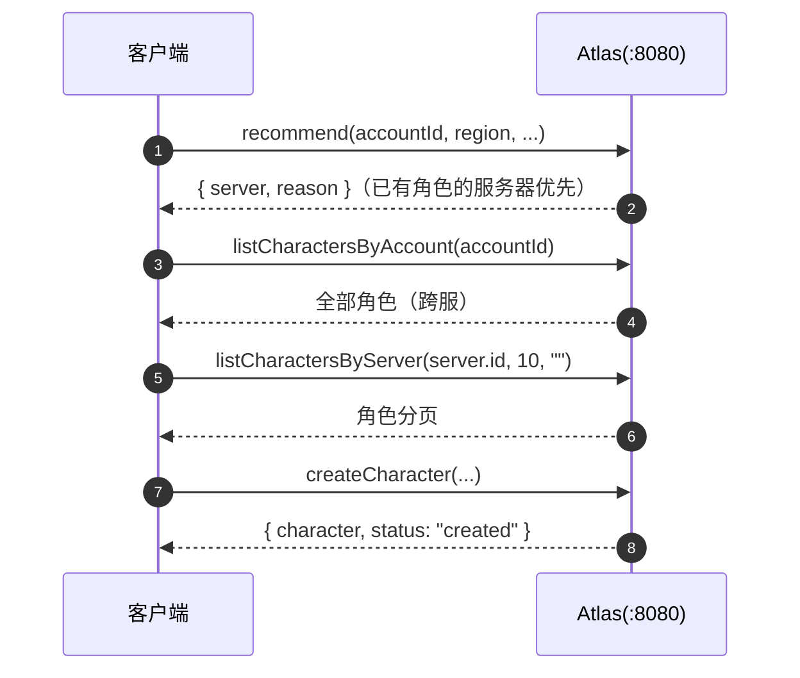

# Java SDK

`sdk/java/`（v0.1.10 交付）。OkHttp + Gson 的 REST 客户端，与 Go / C++ /
Python / JS SDK 同一 API 面。Java 17+，同步阻塞接口，发布坐标
`io.github.cuihairu:atlas-client`，Maven + Gradle 双构建配置。

## 安装

```xml
<dependency>
  <groupId>io.github.cuihairu</groupId>
  <artifactId>atlas-client</artifactId>
  <version>0.1.10</version>
</dependency>
```

```groovy
implementation 'io.github.cuihairu:atlas-client:0.1.10'
```

## 快速上手

```java
try (AtlasClient client = new AtlasClient(new AtlasClientOptions()
        .setBaseUrl("http://localhost:8080")
        .setRegistryBaseUrl("http://localhost:8081")  // Registry 独立端口（可选）
        .setRegistryToken("...")                      // Registry 域 Bearer
        .setAdminApiKey("...")                        // Admin 域 API Key
        .setDefaultHeaders(Map.of("X-Request-ID", "..."))) { // 每次调用都带的静态头（可选，关联 id 见 api.md「请求追踪」）

    var reg = client.register(new RegisterRequest(      // 注册
            "game-1001", "Game 1001", "cn-east",
            new Endpoint("10.0.0.1", 30001), 2000));

    client.heartbeat("game-1001", new HeartbeatRequest()); // 首跳同步：在线后才可被发现
    AutoHeartbeat loop = client.startHeartbeat("game-1001", 10_000, // 自动心跳
            new HeartbeatRequest(), err -> log.warning(err.getMessage()));
    loop.set(120, 0.35);                                // 游戏线程更新负载

    Recommendation rec = client.recommend(42, "cn-east", null, null);   // 接入推荐
    CharacterPage page = client.listCharactersByServer(rec.server.id, 10, ""); // 角色目录
    var wr = client.createCharacter(new CreateCharacterRequest(
            42, rec.server.id, 1001, "Hero"));

    loop.stop();                                        // 优雅下线
    client.unregister("game-1001");
}
```

## 客户端选项

`AtlasClientOptions`（链式 setter，全部可选）：

| 选项 | 默认值 | 说明 |
| --- | --- | --- |
| `setBaseUrl` | `http://localhost:8080` | 公网 + Admin 域基址 |
| `setRegistryBaseUrl` | 同 `baseUrl` | Registry 独立端口（`:8081`）覆盖；反代合并部署时不用设 |
| `setRegistryToken` | 空 | Registry 域 Bearer（`ATLAS_REGISTRY_TOKENS` 之一） |
| `setAdminApiKey` | 空 | Admin 域 API Key（`ATLAS_ADMIN_API_KEYS` 之一） |
| `setDefaultHeaders` | 空 | 每次调用都带的静态头（键原样覆盖；进程级 `X-Request-ID` 关联 id 走这里，见 api.md「请求追踪」） |
| `setTimeoutMs` | `10000` | OkHttp `callTimeout`；`0` 关闭超时 |
| `setMaxRetries` | `3` | 瞬时失败（网络错误 / 5xx）重试次数；4xx 不重试 |
| `setBaseBackoffMs` | `100` | 首次重试退避上限，逐次翻倍 + 全抖动，封顶 10s |

## API 全览

### Registry（Service Token，走 `registryBaseUrl`）

| 方法 | 返回 | 说明 |
| --- | --- | --- |
| `register(RegisterRequest)` | `RegisterResult` | 幂等注册 |
| `heartbeat(serverId, HeartbeatRequest)` | `HeartbeatResult` | `status` 为服务端**当前生效状态**（suspect/offline 时如实返回，别只看 HTTP 200） |
| `unregister(serverId)` | `StatusResult` | 主动下线 |

### Discovery（公网）

| 方法 | 返回 | 说明 |
| --- | --- | --- |
| `listServers()` / `listServers(ServerFilter)` | `List<Server>` | 无参 = 全量 |
| `getServer(serverId)` | `Server` | 单台详情 |

### Directory（公网读，游戏服务器写）

| 方法 | 返回 | 说明 |
| --- | --- | --- |
| `createCharacter(CreateCharacterRequest)` | `CharacterWriteResult` | |
| `getCharacter(long characterId)` | `Character` | |
| `listCharactersByAccount(long accountId)` | `List<Character>` | 账号跨服全部角色 |
| `listCharactersByServer(serverId)` / `(serverId, limit, cursor)` | `CharacterPage` | 翻页传上页 `nextCursor` |
| `updateCharacter(characterId, UpdateCharacterRequest)` | `CharacterWriteResult` | 未设字段保持不变（PATCH） |
| `deleteCharacter(characterId)` | `CharacterWriteResult` | |

### Routing（公网）

| 方法 | 返回 | 说明 |
| --- | --- | --- |
| `recommend()` / `recommend(accountId, region, version, platform)` | `Recommendation` | `{server, reason}`；`reason` ∈ `lowest_load` / `highest_capacity` / `has_character` / `fallback`；`accountId > 0` 才触发角色粘滞 |

### Admin（API Key，走 `baseUrl`）

| 方法 | 返回 | 说明 |
| --- | --- | --- |
| `setMaintenance` / `setDrain` / `enable` / `disable(serverId)` | `StatusResult` | 生命周期操作 |
| `getStats()` | `Stats` | 舰队统计 |
| `searchCharacters(CharacterFilter)` | `CharacterPage` | `name / serverId / classId / minLevel / maxLevel / limit / cursor` |
| `createMigration(CreateMigrationRequest)` | `Migration` | `source_servers` 数组 + `target_server`，合服可多源 |
| `getMigration(id)` / `listMigrations()` / `(limit)` | `Migration` / `List<Migration>` | |
| `rollbackMigration(id)` | `Migration` | 一键回退 |

### 自动心跳

| 成员 | 说明 |
| --- | --- |
| `startHeartbeat(serverId)` | 默认 10s 间隔 |
| `startHeartbeat(serverId, intervalMs, initial)` | 指定间隔与初始载荷 |
| `startHeartbeat(serverId, intervalMs, initial, onError)` | 失败回调，循环不停 |
| `loop.set(int players, double load)` | 原子更新下一跳载荷（`AtomicReference`），游戏线程随时可调 |
| `loop.stop()` | 幂等停止 |
| `client.close()` | 释放 OkHttp 连接池与 dispatcher（try-with-resources）；**不会**停心跳循环，先 `loop.stop()` |

心跳跑在**守护线程** `atlas-heartbeat-<serverId>`（`scheduleAtFixedRate`，立即首发）——不阻塞 JVM 退出，但也意味着主线程退出前记得 `stop()` + `unregister()`。

## 场景：玩家登录选服



## 场景：游戏服务器优雅下线

```java
client.setDrain("game-1001");   // 1. 停止接新玩家
// ... 等存量玩家离开 ...
loop.stop();                    // 2. 停心跳
client.unregister("game-1001"); // 3. 注销
```

完整示例见 [`examples/java`](https://github.com/cuihairu/atlas/blob/main/examples/java/src/main/java/io/github/cuihairu/example/AtlasExample.java)：

```bash
mvn install -f sdk/java/pom.xml          # SDK 进本地仓库
cd examples/java
ATLAS_ADDR=http://localhost:8080 ATLAS_REGISTRY_ADDR=http://localhost:8081 mvn exec:java
```

## 错误处理

所有方法失败抛 `AtlasError`（unchecked）：

| 字段 | 说明 |
| --- | --- |
| `getStatus()` | HTTP 状态码；`0` = 网络错误（重试耗尽后抛出） |
| `getCode()` | 与 REST 错误码一致（`INVALID_ARGUMENT` / `SERVER_NOT_FOUND` / `RATE_LIMITED` / `STORAGE_UNAVAILABLE` / `NETWORK` …） |
| `getMessage()` | 服务端错误消息或网络错误描述 |

自动心跳循环**不抛错**——失败进 `onError` 回调，循环继续。

## 关键语义

| 主题 | 说明 |
| --- | --- |
| 重试 | 网络错误 + 5xx 自动全抖动指数退避（`maxRetries` 默认 3）；4xx 不重试 |
| 心跳节奏 | 上报间隔 : 判死阈值 = 1:3（默认 10s / suspect 30s / offline 60s）；示例先同步首发再开循环，规避"注册未在线即推荐"竞态 |
| 目录写回复 | 同步 REST 返回扁平 Character 对象（SDK 归一化为 `status="created"/"updated"`）；异步适配器返回 `{"status":"queued"}`（`character` 为 null） |
| 三端口 | `baseUrl` 覆盖公网/Admin；`registryBaseUrl` 覆盖 Registry 独立端口；反代合并部署时两者同值即可 |
| 空集合 | 服务端空列表可能序列化为 `null`，SDK 按 `[]` 处理；显式 null 字段同样兜底 |
| 命名 | 传输层 snake_case，SDK 层 camelCase（Gson `@SerializedName` 双向映射），时间戳为 `java.time.Instant` |
