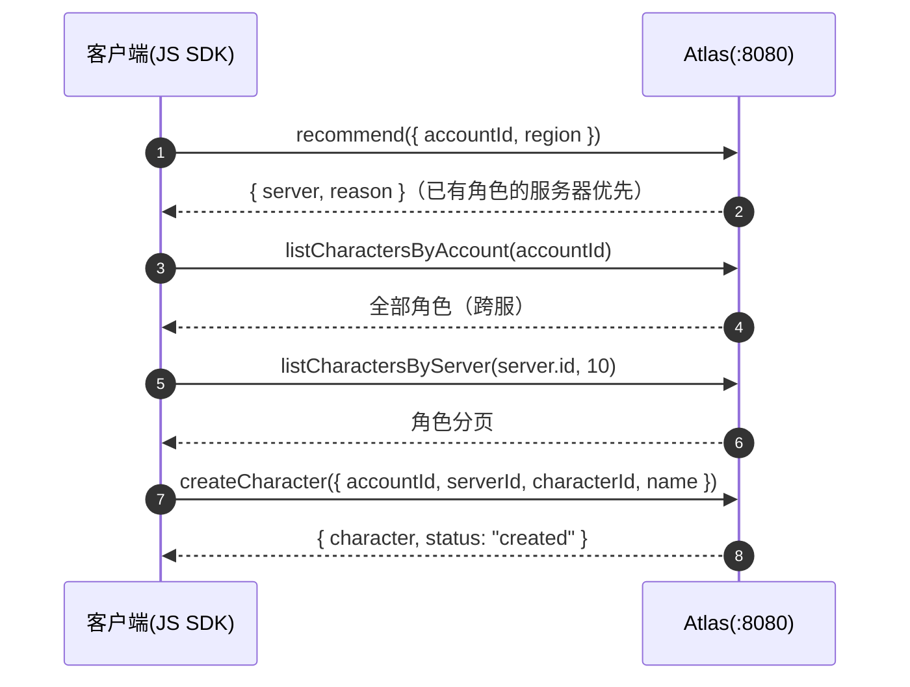

# JavaScript/TypeScript SDK

`sdk/js/`（v0.1.9 交付）。基于 `fetch` 的 REST 客户端，与 Go / C++ /
Python SDK 同一 API 面。零运行时依赖，Node.js 18+ 与现代浏览器通用；
npm 产物 ESM + CJS 双格式，含完整 TypeScript 类型。

## 安装

```bash
npm install @cuihairu/atlas-client
```

## 快速上手

```ts
import { AtlasClient } from "@cuihairu/atlas-client";

const client = new AtlasClient({
  baseUrl: "http://localhost:8080",
  registryBaseUrl: "http://localhost:8081", // Registry 独立端口（可选）
  registryToken: "...",                     // Registry 域 Bearer
  adminApiKey: "...",                       // Admin 域 API Key
  defaultHeaders: { "X-Request-ID": "..." }, // 每次调用都带的静态头（可选，关联 id 见 api.md「请求追踪」）
});

await client.register({                     // 注册
  serverId: "game-1001", name: "Game 1001",
  region: "cn-east", capacity: 2000,
  endpoint: { host: "10.0.0.1", port: 30001 },
});
await client.heartbeat("game-1001", {});    // 首跳同步：在线后才可被发现
const loop = client.startHeartbeat("game-1001", { intervalMs: 10_000 }); // 自动心跳
loop.set(120, 0.35);                        // 游戏线程更新负载

const rec = await client.recommend({ accountId: 42, region: "cn-east" }); // 接入推荐
const page = await client.listCharactersByServer(rec.server.id, 10);      // 角色目录
const wr = await client.createCharacter({
  accountId: 42, serverId: rec.server.id,
  characterId: 1001, name: "Hero", level: 1,
});

loop.stop();                                // 优雅下线
await client.unregister("game-1001");
client.close();
```

## 客户端选项

`AtlasClientOptions`（全部可选）：

| 选项 | 默认值 | 说明 |
| --- | --- | --- |
| `baseUrl` | `http://localhost:8080` | 公网 + Admin 域基址（尾部 `/` 自动去除） |
| `registryBaseUrl` | 同 `baseUrl` | Registry 独立端口（`:8081`）覆盖；反代合并部署时不用设 |
| `registryToken` | 空 | Registry 域 Bearer（`ATLAS_REGISTRY_TOKENS` 之一） |
| `adminApiKey` | 空 | Admin 域 API Key（`ATLAS_ADMIN_API_KEYS` 之一） |
| `defaultHeaders` | 空 | 每次调用都带的静态头（键原样覆盖；进程级 `X-Request-ID` 关联 id 走这里，见 api.md「请求追踪」） |
| `timeoutMs` | `10000` | 每次尝试的 `AbortSignal.timeout`；`0` 关闭超时 |
| `maxRetries` | `3` | 瞬时失败（网络错误 / 超时 / 5xx）重试次数；4xx 不重试 |
| `baseBackoffMs` | `100` | 首次重试退避上限，逐次翻倍 + 全抖动，封顶 10s |

## API 全览

### Registry（Service Token，走 `registryBaseUrl`）

| 方法 | 返回 | 说明 |
| --- | --- | --- |
| `register(req)` | `{ serverId, status }` | 幂等注册；`type` 缺省 `"game"`；`realmId` / `shardId` / `metadata` 可选 |
| `heartbeat(serverId, { players?, load? })` | `{ serverId, status, nextHeartbeatIn }` | `status` 为服务端**当前生效状态**（suspect/offline 时如实返回，别只看 HTTP 200） |
| `unregister(serverId)` | `{ serverId?, status }` | 主动下线 |

### Discovery（公网）

| 方法 | 返回 | 说明 |
| --- | --- | --- |
| `listServers(filter?)` | `Server[]` | filter：`{ region?, version?, platform?, status?, limit? }` |
| `getServer(serverId)` | `Server` | 单台详情 |

### Directory（公网读，游戏服务器写）

| 方法 | 返回 | 说明 |
| --- | --- | --- |
| `createCharacter(req)` | `CharacterWriteResult` | 必填 `accountId / serverId / characterId / name`；`level / classId / avatar` 可选 |
| `getCharacter(characterId)` | `Character` | |
| `listCharactersByAccount(accountId)` | `Character[]` | 账号跨服全部角色 |
| `listCharactersByServer(serverId, limit?, cursor?)` | `CharacterPage` | `limit > 0` 才生效；翻页传上页 `nextCursor` |
| `updateCharacter(characterId, req)` | `CharacterWriteResult` | 未设字段保持不变（PATCH） |
| `deleteCharacter(characterId)` | `CharacterWriteResult` | |

### Routing（公网）

| 方法 | 返回 | 说明 |
| --- | --- | --- |
| `recommend({ accountId?, region?, version?, platform? })` | `{ server, reason }` | `reason` ∈ `lowest_load` / `highest_capacity` / `has_character` / `fallback`；`accountId > 0` 才触发角色粘滞 |

### Admin（API Key，走 `baseUrl`）

| 方法 | 返回 | 说明 |
| --- | --- | --- |
| `setMaintenance(serverId)` / `setDrain` / `enable` / `disable` | `StatusResult` | 生命周期操作 |
| `getStats()` | `Stats` | 舰队统计（服务器数按状态/区域/版本分布、总在线、总容量、角色总数） |
| `searchCharacters(filter)` | `CharacterPage` | filter：`{ name?, serverId?, classId?, minLevel?, maxLevel?, limit?, cursor? }` |
| `createMigration({ sourceServers, targetServer })` | `Migration` | 合服可多源 |
| `getMigration(id)` / `listMigrations(limit?)` | `Migration` / `Migration[]` | |
| `rollbackMigration(id)` | `Migration` | 一键回退 |

### 自动心跳

| 成员 | 说明 |
| --- | --- |
| `startHeartbeat(serverId, opts?)` | 立即首发一跳，之后每 `intervalMs`（默认 10000）续报 |
| `loop.set(players, load)` | 游戏线程更新下一跳载荷（线程安全语义由 JS 单线程模型保证） |
| `loop.onError` | 每次失败回调 `AtlasError`；循环不停 |
| `loop.stop()` | 幂等停止 |
| `client.close()` | 空操作（fetch 自管连接池）；**不会**停心跳循环，先 `loop.stop()` |

## 场景：玩家登录选服



选服界面的筛选用 `listServers({ region, status: "online" })`；维护中的服务器带 `maintenance` 状态标记，建议照常展示"维护中"而不是隐藏。

## 场景：游戏服务器优雅下线

```ts
// 1. 停止接新玩家（SDK 侧通知 Atlas；服务器自己同时关入口）
await client.setDrain("game-1001");
// 2. 等存量玩家自然离开（或到达超时）
loop.stop();
// 3. 注销
await client.unregister("game-1001");
```

## 浏览器

`fetch` / `AbortSignal` / `URL` 全部为平台内置，打包器（Vite / webpack /
esbuild）直接可用；推荐接入、服务器发现、角色目录等公开端点天然适合
客户端调用，Registry / Admin 域请勿把令牌下发到浏览器。

完整示例见 [`examples/js`](https://github.com/cuihairu/atlas/blob/main/examples/js/main.ts)：

```bash
cd examples/js && npm install && npm start   # Node 22.18+ 直接运行 TS
ATLAS_ADDR=http://localhost:8080 ATLAS_REGISTRY_ADDR=http://localhost:8081 npm start
```

## 错误处理

所有方法失败抛 `AtlasError`：

| 字段 | 说明 |
| --- | --- |
| `status` | HTTP 状态码；`0` = 网络错误（重试耗尽后抛出） |
| `code` | 与 REST 错误码一致（`INVALID_ARGUMENT` / `SERVER_NOT_FOUND` / `RATE_LIMITED` / `STORAGE_UNAVAILABLE` / `NETWORK` …） |
| `message` | 服务端错误消息或网络错误描述 |

自动心跳循环**不抛错**——失败进 `onError`，循环继续，适合"Atlas 短暂不可达时游戏服务器照常跑"的语义。

## 关键语义

| 主题 | 说明 |
| --- | --- |
| 重试 | 网络错误 + 超时 + 5xx 自动全抖动指数退避（`maxRetries` 默认 3）；4xx 不重试 |
| 心跳节奏 | 上报间隔 : 判死阈值 = 1:3（默认 10s / suspect 30s / offline 60s）；示例先同步首发再开循环，规避"注册未在线即推荐"竞态 |
| 目录写回复 | 同步 REST 返回扁平 Character 对象（SDK 归一化为 `status="created"/"updated"`）；异步适配器返回 `{"status":"queued"}`（`character` 为 undefined） |
| 三端口 | `baseUrl` 覆盖公网/Admin；`registryBaseUrl` 覆盖 Registry 独立端口；反代合并部署时两者同值即可 |
| 空集合 | 服务端空列表可能序列化为 `null`，SDK 按 `[]` 处理 |
| 命名 | 传输层 snake_case，SDK 层 camelCase（`parseServer` 等转换函数亦可独立使用） |
| 时间字段 | `lastSeenAt` / `createdAt` / `updatedAt` / `lastLoginAt` 解析为 `Date`（缺失为 `undefined`） |
