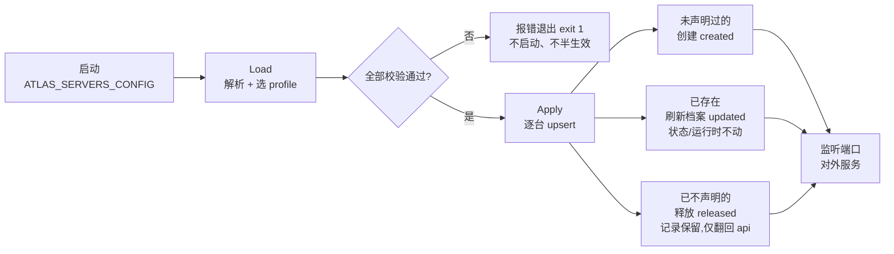

# 服务器信息配置化

服务器信息（realm / shard / 端点 / 容量）以往只有一条进来的路：游戏服务器调注册 API
`POST /v1/registry/servers/register`。配置化提供第二条路：**把服务器直接声明在配置文件里，
Atlas 起服务即生效**——不必先到管理台或 API 注册一遍，换环境、换服务器组 = 换配置。

| 场景 | 用哪条路 |
| --- | --- |
| 静态舰队、预开通的服务器组、环境迁移 | **配置声明**（本页） |
| 动态实例、频繁上下线的进程 | 注册 API + 心跳（[lifecycle.md](lifecycle.md)） |

两条路并存，字段一一对应，边界与冲突行为本页全部写明。

## 1. 最小示例：纯配置起一组服务器

`servers.json`（扁平结构，不分组）：

```json
{
  "servers": [
    {
      "server_id": "game-1001",
      "name": "Game 1001",
      "type": "game",
      "region": "cn-east",
      "realm_id": "realm-a",
      "shard_id": "shard-a1",
      "version": "1.0.0",
      "platform": "pc",
      "endpoint": { "host": "10.0.0.1", "port": 30001 },
      "capacity": 2000
    },
    {
      "server_id": "game-1002",
      "name": "Game 1002",
      "region": "cn-east",
      "endpoint": { "host": "10.0.0.2", "port": 30002 },
      "capacity": 2000
    }
  ]
}
```

启动时指向它：

```bash
ATLAS_SERVERS_CONFIG=./servers.json ./atlas
```

日志确认生效（创建 / 刷新 / 释放三类计数）：

```text
servers config applied file=./servers.json profile= declared=2 created=2 updated=0 released=0
```

声明的服务器立即存在于存储中。与注册 API 的语义一致：**首次心跳前对外不可见**（状态
`starting`，巡检 60s 无心跳会置 `offline`），实例起进程后照常发心跳即可上线、进入
推荐轮转：

```bash
curl -X POST localhost:8081/v1/registry/servers/game-1001/heartbeat \
  -H 'Content-Type: application/json' -d '{"players":42,"load":0.3}'
# {"server_id":"game-1001","status":"online"}
```

发现与推荐链路对配置声明的服务器完全无感——它们就是普通的在线服务器：

```bash
curl localhost:8080/v1/discovery/servers
# game-1001/1002 online source=config 10.0.0.1:30001 ...
curl "localhost:8080/v1/routing/recommended?account_id=42&region=cn-east"
# {"server": {...}, "reason": "lowest_load"}
```

## 2. 多环境 / 多服务器组：profile 切换

一个文件声明多组，一个环境变量切换——**换环境 = 换一个 profile 值**：

```json
{
  "profile": "dev",
  "profiles": {
    "dev":  { "servers": [ { "server_id": "game-dev-1",  "...": "..." } ] },
    "prod": { "servers": [ { "server_id": "game-prod-1", "...": "..." },
                           { "server_id": "game-prod-2", "...": "..." } ] }
  }
}
```

| 切换方式 | 命令 |
| --- | --- |
| 跑 dev 组（文件默认） | `ATLAS_SERVERS_CONFIG=./servers.json ./atlas` |
| 跑 prod 组（一条参数切换） | `ATLAS_SERVERS_PROFILE=prod ATLAS_SERVERS_CONFIG=./servers.json ./atlas` |

选择规则（高到低）：

1. `ATLAS_SERVERS_PROFILE` 环境变量 —— 最高优先级；
2. 文件自身的 `"profile"` 字段；
3. 名为 `"default"` 的 profile（存在时）；
4. 都没有 —— **启动报错**，列出全部可选 profile 名。

也支持每个环境一个文件（不写 `profiles`），用 `ATLAS_SERVERS_CONFIG` 指向哪个文件就是哪个
环境；此形态下设置 `ATLAS_SERVERS_PROFILE` 会直接报错（没有可选的东西，不静默忽略）。

## 3. 生效语义与优先级

启动时按「声明集合整体应用」，**配置优先**，落库前先走同一套校验：



- **配置优先于已注册档案**：同一 `server_id` 既存在过（API 注册过或上次声明过）又出现在
  配置里，配置中的字段（名称 / region / realm / shard / 端点 / 容量等）覆盖旧值。
- **状态与运行时数据永不被配置改动**：`status`、`players`、`load`、`last_seen_at`、进程
  启动时间不写——Atlas 重启、换 profile 都不会把在线服务器打回 `starting`。
- **声明集合是"配置托管"的唯一事实**：从配置中删掉一台服务器，下次启动该记录**释放**回
  API 托管（`source` 翻回、记录与状态原样保留），之后可以正常走注册 API。删除声明不删数据。

配置托管期间，各类操作的边界：

| 操作 | 行为 | 说明 |
| --- | --- | --- |
| 注册 API（同 ID） | ❌ **409** `SERVER_MANAGED_BY_CONFIG` | 档案归配置所有，API 改了下次启动也会被覆盖；错误信息指引改配置 |
| 心跳 | ✅ 正常 | 运行时数据归游戏服务器；`suspect`/`offline` 的声明服务器心跳即回轮转（配置托管无法重新注册，心跳就是唯一凭证） |
| 注销 | ✅ 正常 | 标记 `offline`、清运行时；记录保留，下次启动按配置刷新档案 |
| Admin 生命周期（维护 / 排空 / 禁用） | ✅ 正常 | 运维语义与托管方式无关 |
| 从配置移除后注册 API | ✅ 恢复 201 | 释放生效后重新成为普通 API 服务器 |

## 4. 校验：启动即报，绝不半生效

配置文件的任何问题都会在**监听端口之前**报错退出（`exit 1`，错误里带条目位置与原因），
不会跳过坏条目继续跑：

| 检查 | 错误示例 |
| --- | --- |
| 文件不存在 / JSON 语法错 | `read servers config: no such file` |
| **未知字段（拼写错）** | `json: unknown field "regoin"` |
| 同时写了 `profiles` 与 `servers` | `use either "profiles" or "servers", not both` |
| 重复 `server_id` | `server 1 (dup) duplicates server 0` |
| 缺 `region` | `server 0 (bad-1): invalid argument: region is required` |
| 端点缺 `host` / 端口越界 | `endpoint host is required` / `endpoint port must be within [1, 65535]` |
| `capacity` 为负 | `capacity must be >= 0` |
| 多 profile 未选择 | `profile not selected — set ATLAS_SERVERS_PROFILE to one of: dev, prod` |
| 选择的 profile 不存在 | `profile "staging" not found (available: dev, prod)` |
| 扁平文件却设置了 profile | `declares no profiles; ATLAS_SERVERS_PROFILE="dev" has nothing to select` |

校验规则与注册 API 完全一致（`model.Server.Validate`），配置里过不了的字段，API 里同样
过不了。

## 5. 配置项

| 环境变量 | 说明 | 默认 |
| --- | --- | --- |
| `ATLAS_SERVERS_CONFIG` | 服务器声明文件路径（JSON）。空 = 功能关闭，行为与未引入本特性完全一致 | `""` |
| `ATLAS_SERVERS_PROFILE` | 选择激活的 profile，覆盖文件自身 `"profile"` 字段 | `""` |

文件字段与注册 API 请求体一一对应：

| 字段 | 必填 | 说明 |
| --- | --- | --- |
| `server_id` | ✅ | 全局唯一，即注册 API 的 `server_id` |
| `region` | ✅ | 区域 |
| `endpoint.host` / `endpoint.port` | ✅ | 客户端接入地址（公网 / 网关后地址均可） |
| `name` / `type` / `version` / `platform` | — | 同注册 API |
| `realm_id` / `shard_id` | — | 隶属 Realm / Shard，须已通过 Admin API 创建 |
| `capacity` | — | 容量，`>= 0` |

状态（`starting`/`online`/`maintenance`/…）不可声明——需要预置维护 / 禁用等状态时，启动
后用 Admin 生命周期接口设置。
