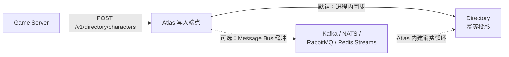
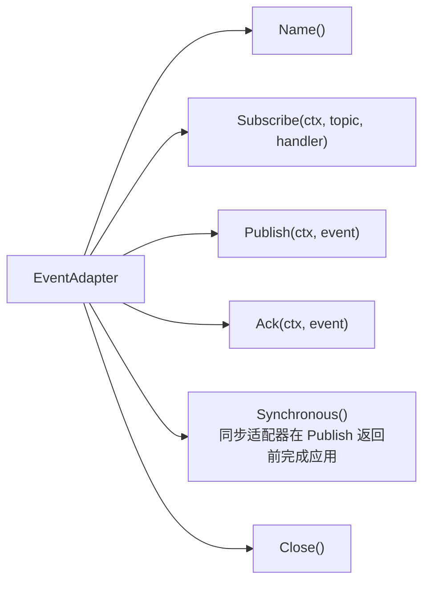
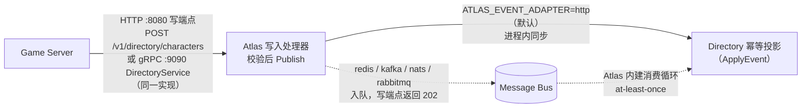
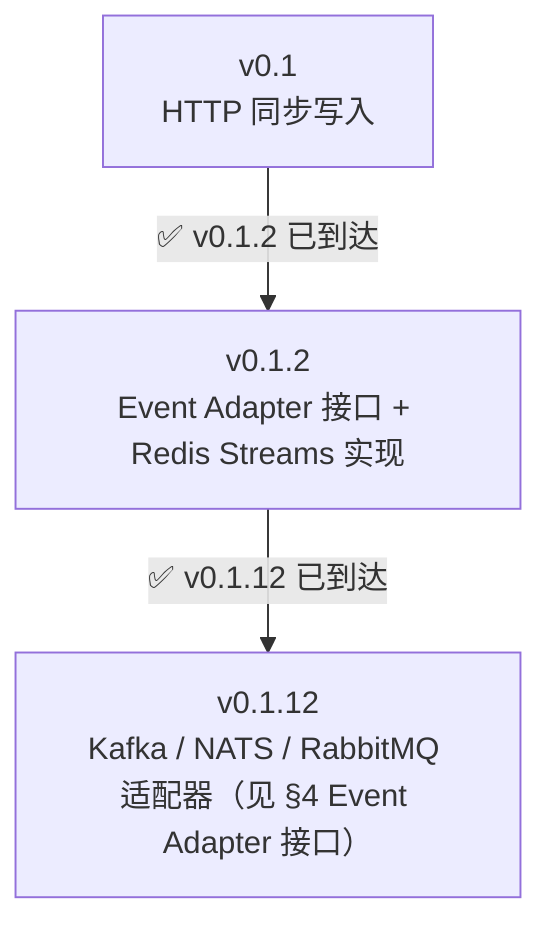
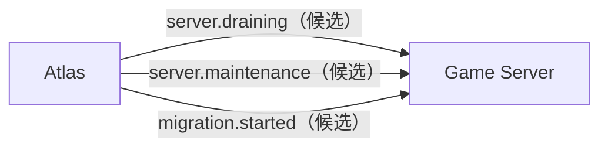

# 数据同步

游戏角色数据如何进入 Atlas 的角色索引。

## 0. 用法速览：怎么选、怎么配、怎么验证

**什么时候需要 Message Bus**（其余情况用默认 HTTP 同步就好，见[快速上手](/api-quickstart)§2）：

- 开服 / 合服时角色写入出现洪峰，需要**削峰缓冲**；
- 角色写入量大到逐条 REST 调用成为游戏服热路径上的负担，需要**异步化**；
- Atlas 滚动重启期间游戏服写入**不能失败**，需要故障隔离；
- 同一份角色事件还要喂给风控 / 数据分析等**其他订阅方**。

**怎么配**——不改代码，一个环境变量切换（连接细节见 §4 表格）：

```bash
ATLAS_EVENT_ADAPTER=redis  ./atlas                      # 复用已有 Redis，零新增组件
ATLAS_EVENT_ADAPTER=kafka  ATLAS_KAFKA_BROKERS=b1:9092,b2:9092 ./atlas
ATLAS_EVENT_ADAPTER=nats   ATLAS_NATS_URL=nats://nats:4222 ./atlas
ATLAS_EVENT_ADAPTER=rabbitmq ATLAS_RABBITMQ_URL=amqp://rabbit:5672/ ./atlas
```

**怎么验证在跑**——写入端点从"同步落地"变为"排队"即说明适配器已接管：

```bash
# 适配器为 http（默认）：201，响应里带投影结果
# 适配器为 redis/kafka/nats/rabbitmq：202 Accepted，{"status":"queued"}
curl -s -w '\n[%{http_code}]\n' -X POST http://localhost:8080/v1/directory/characters \
  -H 'Content-Type: application/json' \
  -d '{"account_id":10001,"server_id":"game-1001","character_id":9001,"name":"验证","level":1}'

# Redis 适配器：流里能看到事件、稍后角色可查即消费正常
redis-cli XLEN atlas.characters
curl http://localhost:8080/v1/directory/characters/9001
```

消费侧由 Atlas 内建消费循环承担（无需部署消费者进程）；投递是 at-least-once，
落地幂等（§6），失败重投语义见 §4 表格下方的适配器分述。

---

## 1. 核心原则

> **不要让 Game Server 每次修改角色都直接强耦合调用 Atlas API。**

落到实现上，"事件驱动"的是 **Atlas 写入接口内部**：游戏服务器仍然只调
`POST /v1/directory/characters`（HTTP 写端点；gRPC `:9090` 有同名镜像，同一
实现），事件化发生在 Atlas 写入处理器之后——默认同步落地，需要削峰/故障隔离时
一个环境变量切到 Message Bus 异步缓冲：



游戏服务器**不直连消息队列**；队列的生产者与消费者都是 Atlas（详见 §5 写入路径）。

---

## 2. 事件定义

```json
{
  "event": "character.created",
  "account_id": 10001,
  "server_id": 1001,
  "character_id": 823712,
  "name": "剑无尘",
  "level": 1
}
```

| 事件 | 触发时机 | 携带字段 | 当前触发源 |
| --- | --- | --- | --- |
| `character.created` | 创建角色 | 全量索引字段 | 写端点 `POST /v1/directory/characters` |
| `character.updated` | 升级 / 改名 / 转职 | 变更字段 | 写端点 `PATCH /v1/directory/characters/{id}` |
| `character.deleted` | 删除角色 | 主键三元组 | 写端点 `DELETE /v1/directory/characters/{id}` |
| `character.moved` | 转服 | 主键 + `target_server` | **暂无内建触发源**（定义与消费已就绪，待迁移联动/事件化反向通道） |
| `character.login` | 登录 | 主键，用于刷新 `last_login_at` | **暂无内建触发源**（同上） |

> 五类事件 `ApplyEvent` 都能消费；但触发源只有写端点三个（created / updated /
> deleted）。`moved` / `login` 目前**没有任何代码路径会产生它们**（预留的事件定义）：
> 转服的数据转移由游戏服务器完成后走写端点 `PATCH` 更新索引（产生 `updated`
> 事件），并不消费 `moved`——不要按事件表假设这两个事件会自动出现。

---

## 3. 为什么用事件而不是同步调用

| 维度 | 同步调用 | 事件驱动 |
| --- | --- | --- |
| **耦合** | 游戏服务器强依赖 Atlas 可用性 | Atlas 不可用时游戏照常运行 |
| **性能** | 角色创建路径增加一次网络往返 | 异步，不阻塞玩家操作 |
| **重试** | 每个游戏服务器自己实现 | 由 Message Bus 保证投递 |
| **扩展** | 加订阅者要改游戏服务器 | 加订阅者不改生产方 |
| **削峰** | 无 | 开服、合服时的写入洪峰被缓冲 |

最关键的是**故障隔离**：Atlas 是控制面，它的可用性不应影响游戏数据面。玩家创建角色时如果 Atlas 正在重启，不应该失败。

---

## 4. Message Bus 选型

第一版支持多种，通过 **Event Adapter** 抽象：

**Kafka / NATS / Redis Streams / RabbitMQ**

### 推荐

| 场景 | 选型 | 理由 |
| --- | --- | --- |
| 中小规模 | **Redis Streams** | 已有 Redis 依赖，零额外组件 |
| 大规模 | **Kafka** | 持久化、回放、多消费者组 |
| 低延迟 | **NATS** | 轻量，适合内网高频事件 |
| 传统架构 | **RabbitMQ** | 成熟的路由与确认机制 |

### Event Adapter 接口



Atlas Core 只依赖这个接口，不依赖具体实现。换 Message Bus 不改业务代码。
当前内置五种实现，通过 `ATLAS_EVENT_ADAPTER` 选择：

| 适配器 | 值 | 连接配置 | 语义 |
| --- | --- | --- | --- |
| 进程内同步 | `http`（默认） | — | 事件在请求内同步落地，保留 v0.1 行为，响应含投影结果 |
| Redis Streams | `redis` | `ATLAS_REDIS_URL` | `XADD` 入流，消费组 `atlas` 经 `XREADGROUP` 异步消费后 `XACK`；写端点返回 202 |
| Kafka | `kafka` | `ATLAS_KAFKA_BROKERS`（逗号分隔，默认 `localhost:9092`） | 写入 topic `atlas.characters`（segmentio/kafka-go，纯 Go）；消费组 `atlas` 手动提交 offset |
| NATS | `nats` | `ATLAS_NATS_URL`（默认 `nats://localhost:4222`） | JetStream 流 `ATLAS`（subject `atlas.characters`），durable pull consumer `atlas` 显式 Ack |
| RabbitMQ | `rabbitmq` | `ATLAS_RABBITMQ_URL`（默认 `amqp://localhost:5672/`） | durable topic exchange `atlas`，队列按 topic 命名；persistent 消息 + 手动 Ack |

除 `http` 外全部为 at-least-once 投递，处理失败的事件会重投：

- **redis**：失败事件留在 PEL，30 秒后被 `XAUTOCLAIM` 重投；超过 5 次投递
  记日志死信。
- **kafka**：失败事件的 offset 不提交，下一次 fetch/rebalance 重新投递。
- **nats**：失败消息不 Ack，超过 AckWait（默认 30s）由 durable consumer 重投。
- **rabbitmq**：失败消息 `Nack(requeue=true)` 立即回队。

因此消费端必须幂等——`Directory.ApplyEvent` 的 upsert 天然幂等（见 §6）。

接入只需改一个环境变量，例如：

```bash
ATLAS_EVENT_ADAPTER=kafka ATLAS_KAFKA_BROKERS=broker1:9092,broker2:9092 ./atlas
ATLAS_EVENT_ADAPTER=nats ATLAS_NATS_URL=nats://nats:4222 ./atlas
ATLAS_EVENT_ADAPTER=rabbitmq ATLAS_RABBITMQ_URL=amqp://rabbit:5672/ ./atlas
```

切换适配器不改写端点的 URL 与请求体（游戏服务器与 SDK 零改动），变的只是响应：
`http` 返回 `201` + 投影结果，其余四种返回 `202 Accepted`（`{"status":"queued"}`）；
消费侧由 Atlas 内建消费循环承担，无需额外部署消费者进程。

选型补充（§4 推荐表）之外的运维参照：已有 Redis 用 `redis`（零新增组件）；
日志/审计类大吞吐、需要回放与多消费组用 `kafka`；云原生内网低延迟、
多机广播用 `nats`；已有 AMQP 运维体系或需要复杂路由用 `rabbitmq`；
单机开发/小规模直连用 `http`（同步，行为最直观）。

---

## 5. 写入路径

**HTTP 同步写入保留为默认形态，Event Adapter 作为解耦入口并存。**

写接口是游戏服务器唯一接触的面（HTTP 写端点，gRPC 同名镜像）；队列段（如果启用）
完全在 Atlas 内部——写入处理器是生产者，Atlas 内建消费循环（`main.go` 里的
`Subscribe`）是消费者，**不需要也不建议部署独立的消费者进程**：



同步路径的响应与 v0.1 完全一致；Redis 路径下写端点返回 `202 Accepted`
（`{"status":"queued"}`），由消费组异步落地。

> broker 里的封包（如 Redis 的 `{type, data}` 流条目、Kafka 的 event JSON）
> 是 **Atlas 内部格式**，不作为对外契约：外部系统直接向 broker 投递机制上可行
> （消费循环会照常解析），但字段无版本承诺，升级可能不兼容——接入一律走
> Atlas 写入接口（HTTP 写端点或 gRPC）。

### 迁移路径



关键是**从第一天就把写入接口设计成幂等的**，这样无论底层是 HTTP 还是 MQ，重试都不会产生副作用。

---

## 6. 幂等性

事件可能重复投递（MQ 的 at-least-once 语义），Atlas 必须幂等。

**幂等键 = `(account_id, server_id, character_id)`**

```sql
INSERT INTO character_index (account_id, server_id, character_id, name, level, class_id)
VALUES (10001, 1001, 823712, '剑无尘', 1, 3)
ON CONFLICT (account_id, server_id, character_id)
DO UPDATE SET
    name      = EXCLUDED.name,
    level     = EXCLUDED.level,
    class_id  = EXCLUDED.class_id,
    updated_at = now();
```

`ON CONFLICT DO UPDATE` 让重复的 `character.created` 变成一次无害的 upsert。

### 乱序处理

事件可能乱序到达（`updated` 先于 `created`）。两种处理策略：

| 策略 | 做法 | 适用 |
| --- | --- | --- |
| **版本号** | 事件携带单调递增版本，低版本丢弃 | 强一致要求 |
| **最终一致** | 不处理乱序，靠下一次事件覆盖 | MVP 推荐 |

v0.1 采用**最终一致**，因为索引字段只用于列表展示，短暂的 `level` 滞后可以接受。

---

## 7. 一致性边界

Atlas 的角色索引保证的是：

| 保证 | 不保证 |
| --- | --- |
| 索引完整性（账号下角色都能查到） | 字段实时准确 |
| `character_id` 不丢失 | `level` / `name` 秒级一致 |
| 合服/转服的原子切换 | 角色数据本身的一致性 |

**索引的完整性 > 字段的实时性。** 这是投影表的设计取舍。

---

## 8. 反向同步（设计方向，未实现）

**当前版本 Atlas 不向游戏服务器推送事件。** 方向反过来时，游戏服务器这样感知 Atlas 侧的变化：

| 变化 | 现有感知通道 |
| --- | --- |
| 自己被判 `suspect` / `offline` | 心跳响应的 `status` 字段如实返回生效状态（v0.1.x 巡检修复），服务器可据此报警或重注册 |
| 维护中 / 公告 | 玩家客户端拉 `GET /v1/discovery/announcements`，服务器无需感知 |
| 迁移开始 | 运维通过迁移 API 通知相关服务器（`POST /v1/admin/migrations`），游戏服务器配合加锁 |

事件化的反向通道（`server.draining` / `server.maintenance` / `migration.started` 推送）是候选方向，未排期：



在它落地之前，**不要**假设 Atlas 会主动通知游戏服务器。

---

## 9. 监控

事件同步当前**没有专属指标**；重投递与死信（redis 的 PEL 超限、kafka 的 offset 不提交）见各适配器的结构化日志。服务整体健康用 `/metrics`（:8082）上的真实指标观测：

| 指标 | 含义 |
| --- | --- |
| `atlas_directory_characters_total` | 角色索引总量——持续不涨说明事件消费停了 |
| `atlas_health_transitions_total{from,to}` | 生命周期状态迁移量 |
| `atlas_registry_heartbeat_lag_seconds` | 心跳年龄分布 |
| `atlas_registry_servers_total{status}` | 各状态服务器数 |
| `atlas_registry_write_duration_seconds{op}` | 注册/心跳/注销写路径延迟——心跳写变慢先于此显形，随后才是假 suspect/offline |
| `atlas_discovery_requests_total{filter}` | 发现查询量 |
| `atlas_admin_requests_total{endpoint,status}` | Admin 请求量（REST 路由 + gRPC Admin 全方法名，状态码同词表） |

排查索引脱节：先看 `atlas_directory_characters_total` 是否停滞，再看适配器日志里的重投递/死信记录，最后确认总线（broker）本身可达。
