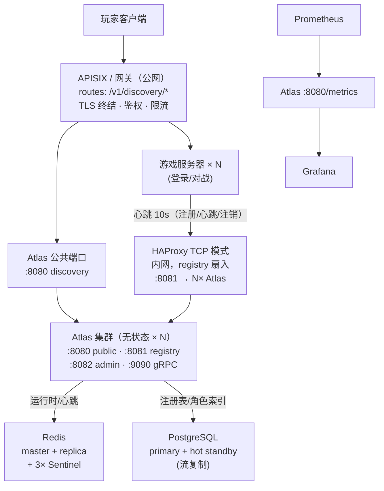

# 部署拓扑（v0.1.20）

从客户端到存储的完整部署视图。端口、职责与流量方向一一对应；高可用细节
（副本、哨兵、主从）见 [ha.md](ha.md)，状态机见 [lifecycle.md](lifecycle.md)。

## 1. 分层职责

| 层 | 组件 | 职责 | 说明 |
| --- | --- | --- | --- |
| 接入 | APISIX（或网关） | TLS 终结、玩家侧鉴权、限流、路由 `/v1/discovery/*` | 公网唯一入口；发现接口是只读的，可积极缓存 |
| 接入 | HAProxy TCP 模式 | 游戏服务器心跳扇入到 Atlas registry 端口 | 纯四层透传，registry 自带 token / mTLS（v0.1.17） |
| 服务 | Atlas public `:8080` | Discovery / Directory / Routing（只读） | 无状态，横向扩展 |
| 服务 | Atlas registry `:8081` | 注册 / 心跳 / 注销（写） | 心跳 3:1:6 节奏（lifecycle.md §4.2） |
| 服务 | Atlas admin `:8082` | 生命周期操作、统计、维护窗口、公告 | 内网/管理网；RBAC + 审计 + 限流 |
| 服务 | Atlas gRPC `:9090` | 同 HTTP 的内部高性能通道 | 游戏服务器可选直连 |
| 存储 | Redis | 运行时数据：心跳、玩家数、负载（TTL ≤ 120s） | 哨兵故障转移；Atlas 只做键值读写 |
| 存储 | PostgreSQL | 注册表、角色索引投影、迁移、realm/shard、维护窗口、公告 | 主从流复制；单写点 |
| 可观测 | Prometheus / Grafana | 指标抓取与健康面板 | `GET /metrics`；告警 webhook 见 lifecycle.md §4.1 |
| 管理 | Dashboard | 运维控制台（React） | 直连 admin 端口或经网关代理 |

## 2. 流量方向与端口矩阵

| 来源 → 目标 | 端口 | 协议 | 安全 |
| --- | --- | --- | --- |
| 玩家 → APISIX | 443 | HTTPS | 网关鉴权 + 限流 |
| APISIX → Atlas | 8080 | HTTP | 内网 / mTLS 可选 |
| 游戏服务器 → HAProxy → Atlas | 8081 | HTTP | `ATLAS_REGISTRY_TOKENS`，升级 mTLS 见 security.md |
| 运维 / Dashboard → Atlas | 8082 | HTTP | `ATLAS_ADMIN_API_KEYS` + RBAC + 审计 + 限流 |
| 内部服务 → Atlas | 9090 | gRPC | 内网 |
| Atlas → Redis | 6379 / 26379 | RESP | `requirepass`，哨兵拓扑（ha.md §3） |
| Atlas → PostgreSQL | 5432 | TCP | scram-sha-256，池调优（ha.md §5） |
| Prometheus → Atlas | 8080/metrics | HTTP | 内网 |

## 3. 部署形态

**单机（开发 / 验证）**：一个 Atlas 进程（`ATLAS_STORE=memory`）+ 游戏服务器，无外部依赖。

**标准生产（推荐起点）**：

- Atlas × 2（不同可用区），HAProxy 扇入 registry，APISIX 对公网；
- PostgreSQL 主 + 热备（流复制）；
- Redis master + replica + 3 Sentinel；
- Prometheus + Grafana + `ATLAS_ALERT_WEBHOOK_URL` 告警通道。

**大规模**：角色索引分片（`ATLAS_CHAR_SHARDS` > 1，data-model.md §5）、事件适配器
改 Kafka / NATS（sync.md §4）、admin 单副本粘性（审计环按副本隔离，ha.md §1）。

一键实验栈（2× Atlas + HAProxy + PG 主从 + Redis 哨兵）：
`deploy/docker-compose.ha.yaml`。
